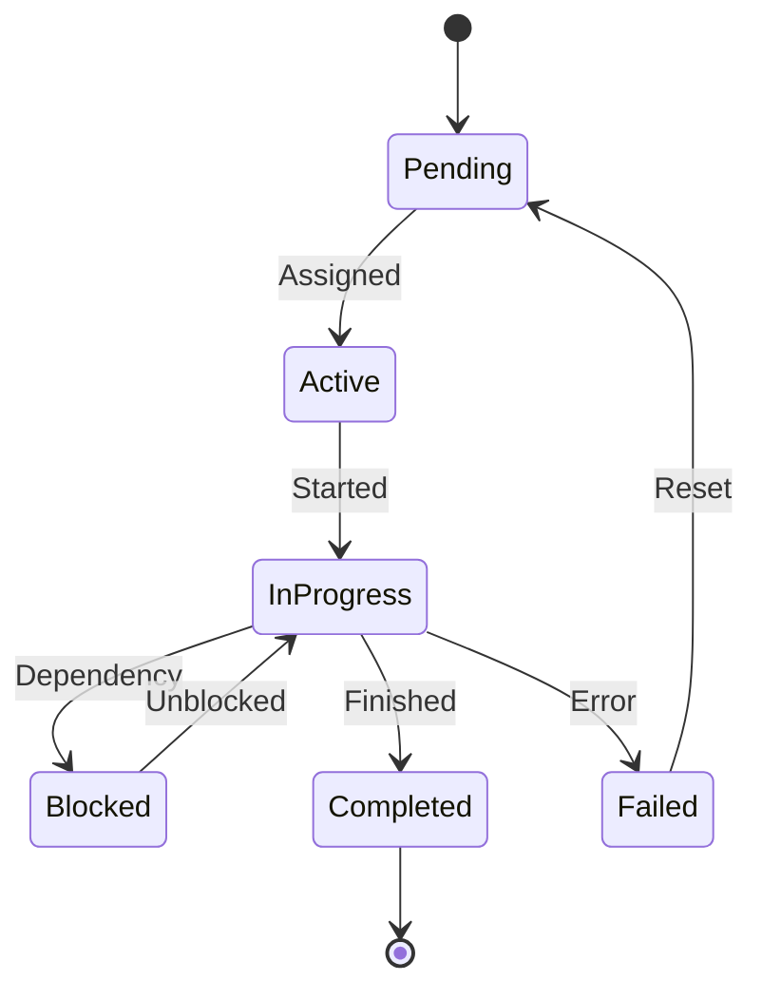

# Vespera Atelier V2 Architecture

**Version**: 2.0 Ground-Up Rewrite  
**Status**: Foundation Phase (Week 1-2)  
**Philosophy**: Clean Architecture + Domain-Driven Design + Executive Dysfunction Awareness

## 🏛️ Architectural Principles

### Clean Architecture Layers

```
┌─────────────────────────────────────────────────┐
│                    UI Layer                     │
│        (Obsidian Plugin, VS Code Extension)     │
├─────────────────────────────────────────────────┤
│               Application Layer                 │
│     (Use Cases, Orchestration, Workflows)      │
├─────────────────────────────────────────────────┤
│                 Domain Layer                    │
│         (Business Logic, Entities)              │
├─────────────────────────────────────────────────┤
│              Infrastructure Layer               │
│    (Databases, External APIs, File System)     │
└─────────────────────────────────────────────────┘
```

### Domain-Driven Design

**Core Domains:**
- **Task Orchestration**: Hierarchical task management with role-based execution
- **Document Intelligence**: Semantic organization and automatic linking
- **Creative Workflows**: Multi-modal project coordination
- **Agent Coordination**: LLM role management with capability restrictions

**Bounded Contexts:**
- `vespera-scriptorium`: Core orchestration and task management
- `vespera-atelier`: Platform services and integrations
- `vespera-utilities`: Shared domain concepts and utilities

## 🗃️ Database Architecture

### Triple Database Ecosystem

#### 1. SQLite - Operational Data Store
**Purpose**: Core application data, transactions, sessions
```sql
-- Task management
tasks (id, title, description, status, parent_id, created_at, ...)
sessions (id, name, status, metadata, created_at, ...)
artifacts (id, task_id, type, content, file_path, ...)

-- User management  
users (id, name, preferences, ...)
roles (id, name, capabilities, restrictions, ...)
```

#### 2. KuzuDB - Graph Database
**Purpose**: Relationships, dependencies, project structure
```cypher
// Task relationships
(task1)-[:DEPENDS_ON]->(task2)
(task)-[:CREATES]->(artifact)
(artifact)-[:REFERENCES]->(document)

// Document relationships
(doc1)-[:IMPLEMENTS]->(spec)
(test)-[:VALIDATES]->(code)
(doc)-[:INSPIRES]->(creative_work)
```

#### 3. Chroma - Vector Database
**Purpose**: Semantic search, document discovery, context building
```python
# Document embeddings for semantic search
documents = chroma_client.get_collection("project_documents")
similar_docs = documents.query(
    query_texts=["task description"],
    n_results=5
)
```

### Database Integration Patterns

**Single Source of Truth**: SQLite for operational queries
**Enriched Queries**: KuzuDB for complex relationships
**Discovery**: Chroma for semantic similarity and context suggestions

## 🔧 Package Architecture

### packages/vespera-scriptorium
**Role**: Core orchestration engine
```
vespera-scriptorium/
├── core/
│   ├── database/          # Triple database management
│   ├── orchestrator/      # Task coordination engine
│   └── session/          # Session management
├── roles/
│   ├── definitions/       # Role templates and schemas
│   ├── capabilities/      # Permission and restriction system
│   └── execution/        # Role-based LLM spawning
├── tasks/
│   ├── hierarchy/        # Parent-child task management
│   ├── lifecycle/        # Task state management
│   └── scheduling/       # Dependency resolution
└── api/
    ├── rest/             # HTTP API for plugins
    ├── mcp/              # MCP server implementation
    └── websocket/        # Real-time updates
```

### packages/vespera-atelier
**Role**: Platform coordination and intelligence
```
vespera-atelier/
├── automation/
│   ├── hooks/            # File type and event hooks
│   ├── workflows/        # Template-driven automation
│   └── triggers/         # Event detection system
├── intelligence/
│   ├── vector/           # Chroma integration
│   ├── graph/            # KuzuDB integration
│   └── semantic/         # Context engineering
└── integration/
    ├── creative-tools/   # ComfyUI, Blender, DAWs
    ├── editors/          # VS Code, Obsidian
    └── llm-providers/    # Ollama, Claude, GPT
```

### packages/vespera-utilities
**Role**: Shared utilities and types
```
vespera-utilities/
├── shared/
│   ├── validation/       # Input validation
│   ├── serialization/    # Data transformation
│   └── configuration/    # Config management
└── types/
    ├── domain/           # Domain entity types
    ├── api/              # API contract types
    └── integration/      # External system types
```

## 🤖 Role System Architecture

### Capability-Based Permissions (Roo Code Inspired)

```yaml
# Role definition example
coder:
  display_name: "Code Implementation Specialist"
  description: "Implements code following specifications"
  preferred_llm: "local:ollama:llama3"
  fallback_llms: ["claude-3-5-sonnet", "gpt-4"]
  capabilities:
    - "file_read"
    - "file_write" 
    - "code_execution"
    - "spawn_tasks"
  restrictions:
    - "max_file_changes: 5"
    - "single_codeblock_only: true"
    - "no_database_modifications"
  context_requirements:
    - "coding_standards"
    - "api_documentation"
    - "existing_patterns"
  validation_rules:
    - "code_compiles"
    - "tests_pass"
    - "follows_style_guide"
```

### Role Hierarchy and Inheritance

```
orchestrator (root)
├── researcher
│   ├── code_researcher
│   └── market_researcher
├── implementer  
│   ├── coder
│   ├── designer
│   └── writer
├── validator
│   ├── tester
│   ├── reviewer  
│   └── security_auditor
└── coordinator
    ├── project_manager
    └── release_manager
```

## 🔄 Task Management Architecture

### Hierarchical Task System

**Replaces sessions with recursive task breakdown:**

```
Meta-Task: "Implement user authentication"
├── Task: "Design authentication architecture"
│   ├── Subtask: "Research OAuth 2.0 patterns"
│   └── Subtask: "Design database schema"
├── Task: "Implement backend authentication"
│   ├── Subtask: "Create user model"
│   ├── Subtask: "Implement JWT handling"
│   └── Subtask: "Add password hashing"
└── Task: "Create frontend integration"
    ├── Subtask: "Design login component"
    └── Subtask: "Implement auth state management"
```

### Task Lifecycle States



## 🔌 Plugin Architecture

### Dual Plugin Strategy

#### Obsidian Plugin
- **Current**: Active development in `plugins/Obsidian/Vespera-Scriptorium/`
- **Focus**: Document-centric workflows, knowledge management
- **Communication**: REST API + WebSocket for real-time updates

#### VS Code Extension  
- **Status**: Planned for Phase 3
- **Focus**: Development workflows, code management
- **Communication**: Language Server Protocol + Custom extension API

### Plugin Communication Protocol

```typescript
interface PluginAPI {
  // Task management
  createTask(task: TaskDefinition): Promise<Task>
  queryTasks(filters: TaskFilters): Promise<Task[]>
  
  // Document intelligence
  findRelatedDocuments(content: string): Promise<Document[]>
  createDocumentLinks(from: string, to: string, type: LinkType): Promise<void>
  
  // Real-time updates
  subscribeToTasks(callback: (task: Task) => void): Subscription
  subscribeToDocuments(callback: (doc: Document) => void): Subscription
}
```

## 🎨 Creative Workflows Architecture

### Multi-Modal Project Support

**Supported Creative Modalities:**
- **Writing**: Novels, screenplays, technical documentation
- **Visual**: Concept art, 3D models, animations
- **Audio**: Music production, sound design, podcasts
- **Interactive**: Games, web applications, user experiences

### Asset Management System

```
creative_project/
├── assets/
│   ├── audio/           # Music, sound effects, voiceovers
│   ├── visual/          # Images, 3D models, textures
│   ├── documents/       # Scripts, specs, notes
│   └── code/            # Interactive elements
├── workflows/
│   ├── production/      # Creation workflows
│   ├── review/          # Feedback and iteration
│   └── publishing/      # Output and distribution
└── metadata/
    ├── relationships/   # Asset dependencies (KuzuDB)
    ├── versions/        # Version history (SQLite)
    └── semantics/       # Content analysis (Chroma)
```

## 🔒 Security Architecture

### Capability-Based Security

**Principle**: Each role has explicit, minimal permissions
**Implementation**: Whitelist-based capability system
**Validation**: Runtime permission checks before each operation

### Data Protection

**Embedded Databases**: No external service dependencies
**Local Processing**: Sensitive content never leaves user's machine
**Encryption**: At-rest encryption for sensitive artifacts
**Audit Trail**: Complete operation logging for security analysis

## 🚀 Deployment Architecture

### Single-Binary Distribution

**Target**: Embedded executable with all databases included
**Dependencies**: Minimal external requirements
**Platforms**: Windows, macOS, Linux (desktop focus)
**Installation**: Single installer with guided setup

### Development vs Production

#### Development Mode
- Hot-reload enabled
- Detailed logging
- Debug interfaces
- Performance profiling

#### Production Mode  
- Optimized performance
- Minimal logging
- User-friendly interfaces
- Automatic error recovery

## 📊 Performance Considerations

### Database Optimization

**SQLite**: WAL mode, connection pooling, prepared statements
**KuzuDB**: Optimized for embedded use, NetworkX integration
**Chroma**: Persistent storage, efficient embedding updates

### Memory Management

**Target**: 2-8GB for large creative projects
**Strategy**: Lazy loading, intelligent caching, cleanup routines
**Monitoring**: Memory usage tracking and optimization

### Concurrency

**Model**: Actor-based concurrency for task execution
**Coordination**: Event-driven architecture for loose coupling
**Scaling**: Horizontal scaling through task distribution

## 🔮 Future Architecture Evolution

### Phase 2: Intelligence Layer
- Advanced semantic analysis
- Automated workflow discovery  
- Predictive task suggestions

### Phase 3: Collaboration Layer
- Real-time multi-user coordination
- Conflict resolution systems
- Distributed project management

### Phase 4: Extensibility Layer
- Plugin marketplace
- Custom role definitions
- Third-party integrations

---

**Architecture Status**: ✅ **Planned and Ready for Implementation**
**Next Phase**: Begin foundation development with modular microservices approach