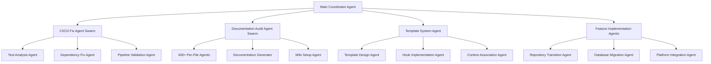
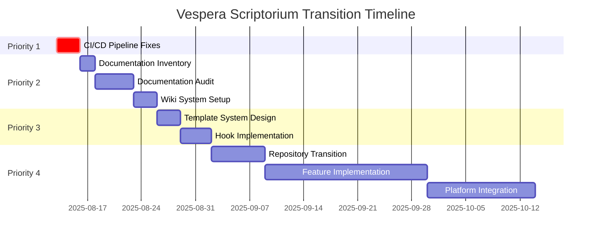

# Vespera Scriptorium Complete Transition Meta-PRP

**Meta-PRP ID**: `VESPERA_SCRIPTORIUM_COMPLETE_TRANSITION_2025`  
**Type**: Multi-Agent Coordination with Full Orchestrator Integration  
**Priority**: Critical - Platform Direction with Immediate CI/CD Priority  
**Estimated Total Effort**: 8-12 weeks (with priority phases)  
**Created**: 2025-08-13  
**Status**: [IN-PROGRESS]  
**Orchestrator Session**: `session_8c076580_1755088946`  
**Parent Task ID**: `task_65480`

## Foundational Philosophy: Executive Dysfunction as Design Principle

**CRITICAL INSIGHT**: Vespera Scriptorium is fundamentally a **disability aid for executive dysfunction**, designed around the pressure-lid metaphor with vents. This philosophy must inform EVERY design decision throughout the transition.

### Core Design Principles
- **Momentum Preservation**: Combat sleep resets and cognitive interruptions
- **Lid Weight Reduction**: Minimize barriers to task initiation
- **Pressure Delegation**: Use agents when human capacity is compromised
- **Damage Prevention**: Graceful degradation that preserves dignity
- **Universal Accessibility**: Tools that work on "barely functional" days

## Executive Summary

This meta-PRP coordinates the complete transformation of **MCP Task Orchestrator** into **Vespera Scriptorium**, merging:
1. **Executive dysfunction design philosophy** as the foundational principle
2. The evolution plan from the original meta-PRP
3. Comprehensive documentation audit and remediation requirements
4. V2.0 release components and orchestrator integration patterns
5. Template system with built-in hooks for agent coordination

## Priority Structure

### Priority 0: Database Persistence Critical Issue (BLOCKING)

**Status**: CRITICAL - BLOCKING ALL DEVELOPMENT  
**Issue**: Task orchestrator creates tasks but they don't persist in database queries  
**Root Cause**: Task handlers using mock objects instead of actual database persistence  
**Progress**: Routing fixes complete, DI container configured, need comprehensive database audit  
**Next**: Create dedicated PRP for complete database architecture audit and remediation  
**Estimated**: 1-2 days for audit and fixes  

### Priority 1: CI/CD Pipeline Fixes (Immediate)

**Location**: [01-cicd-pipeline-fixes/](../01-cicd-pipeline-fixes/index.md)  
**Status**: URGENT - Blocking validation  
**Orchestrator Tasks**: `task_65481` through `task_65490`  
**Issue**: Over 50% of tests failing in CI/CD pipeline

### Priority 2: Documentation Audit & Remediation  

**Location**: [02-documentation-audit/](../02-documentation-audit/index.md)  
**Status**: Critical - Professional impact  
**Orchestrator Tasks**: `task_65491` through `task_65890` (400+ file tasks)  
**Approach**: Archive everything in docs/, start fresh with Vespera-aware documentation

### Priority 3: Template System Implementation

**Location**: [03-template-system/](../03-template-system/index.md)  
**Status**: Foundation for automation  
**Orchestrator Tasks**: `task_65891` through `task_65920`  
**Features**: Built-in hooks for spawning agents with specific contexts

### Priority 4: Feature Implementation

**Location**: [04-feature-implementation/](../04-feature-implementation/index.md)  
**Status**: Post-foundation work  
**Orchestrator Tasks**: `task_65921` through `task_66000`  
**Scope**: Full Vespera Scriptorium feature set

## Documentation Strategy

### GitHub Wiki-like Documentation

We're looking to implement **GitHub Pages with Jekyll** or **MkDocs with Material theme** for automatic wiki-like documentation:

```yaml
documentation_system:
  options:
    - github_pages:
        technology: Jekyll
        location: docs/ folder
        url: https://vespera-scriptorium.github.io
        features: 
          - Automatic navigation
          - Search functionality
          - Version tracking
          
    - mkdocs:
        technology: MkDocs + Material
        config: mkdocs.yml
        features:
          - Better search
          - Code highlighting
          - API documentation
          - Multi-version support
```

## Multi-Agent Coordination Structure

### Agent Hierarchy



## Orchestrator Integration

### Session Management

- **Main Session**: `session_8c076580_1755088946`
- **Task Hierarchy**: 1 meta-task → 4 major tasks → 500+ subtasks
- **Artifact Storage**: All work stored via `orchestrator_complete_task`
- **Progress Tracking**: Real-time via `orchestrator_get_status`

### Custom Specialist Roles

Located in `.task_orchestrator/roles/`:
- `cicd_specialist.json` - CI/CD pipeline expertise
- `documentation_specialist.json` - Documentation audit and generation
- `template_specialist.json` - Template system design
- `migration_specialist.json` - Platform migration expertise

## Template System Vision

### Feature Implementation Template with Hooks

```yaml
feature_implementation_template:
  pre_hooks:
    - github_branch_creation:
        agent: "GitHub Workflow Agent"
        action: "Create feature branch"
        
  phases:
    research:
      agent: "Research Specialist"
      context: ["related_docs", "existing_code"]
      
    implementation:
      agent: "Implementation Specialist"
      context: ["architecture_docs", "api_specs"]
      
    documentation:
      agents:
        - "Developer Docs Agent"
        - "User Docs Agent"
      auto_update: true
      
  post_hooks:
    - commit_and_push:
        agent: "Git Integration Agent"
        action: "Commit, push, create PR"
```

## Document Association System

### Context Auto-Loading

```yaml
task_context_association:
  task_id: "task_12345"
  associated_documents:
    - path: "docs/architecture/feature-x.md"
      type: "reference"
    - path: "PRPs/feature-x-design.md"
      type: "specification"
    - path: "tests/feature-x-tests.py"
      type: "validation"
      
  auto_load_behavior:
    on_task_start: true
    include_in_specialist_context: true
    update_on_completion: true
```

## Navigation Structure

### Main Index Files

- [00-main-coordination/index.md](index.md) - This file (main entry)
- [01-cicd-pipeline-fixes/index.md](../01-cicd-pipeline-fixes/index.md) - CI/CD coordination
- [02-documentation-audit/index.md](../02-documentation-audit/index.md) - Documentation tasks
- [03-template-system/index.md](../03-template-system/index.md) - Template implementation
- [04-feature-implementation/index.md](../04-feature-implementation/index.md) - Feature rollout

### Tracking Files

Each major task directory contains:
- `tracking/checklist.md` - Task completion tracking
- `tracking/progress.json` - Orchestrator progress export
- `tracking/artifacts.md` - Links to stored artifacts

## Implementation Timeline



## Next Immediate Actions

1. **Fix CI/CD Pipeline** (Priority 1)
   - Navigate to: [01-cicd-pipeline-fixes/index.md](../01-cicd-pipeline-fixes/index.md)
   - Execute test analysis and fixes

2. **Start Documentation Audit** (Priority 2)
   - Navigate to: [02-documentation-audit/index.md](../02-documentation-audit/index.md)
   - Archive existing docs, start fresh

3. **Design Template System** (Priority 3)
   - Navigate to: [03-template-system/index.md](../03-template-system/index.md)
   - Implement hook-based automation

## Success Metrics

- ✅ CI/CD pipeline: 100% tests passing
- ✅ Documentation: Zero markdownlint violations, wiki-like system active
- ✅ Templates: 10+ templates with automated hooks
- ✅ Platform: Complete transition to Vespera Scriptorium identity
- ✅ Orchestrator: 500+ tasks successfully coordinated

---

*This is the main coordination index for the complete Vespera Scriptorium transition. Navigate to specific task
directories for detailed implementation plans.*
