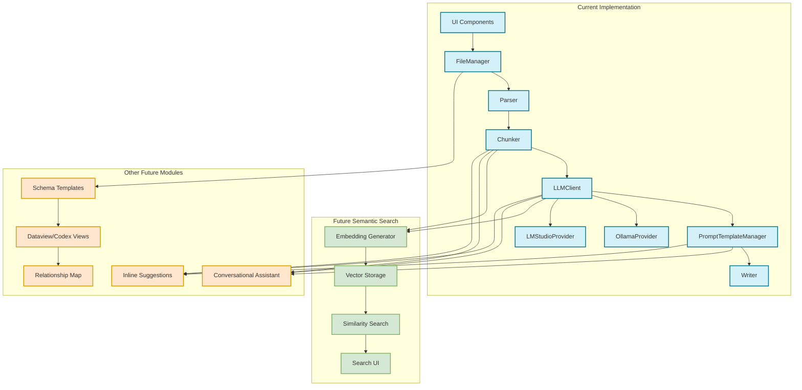
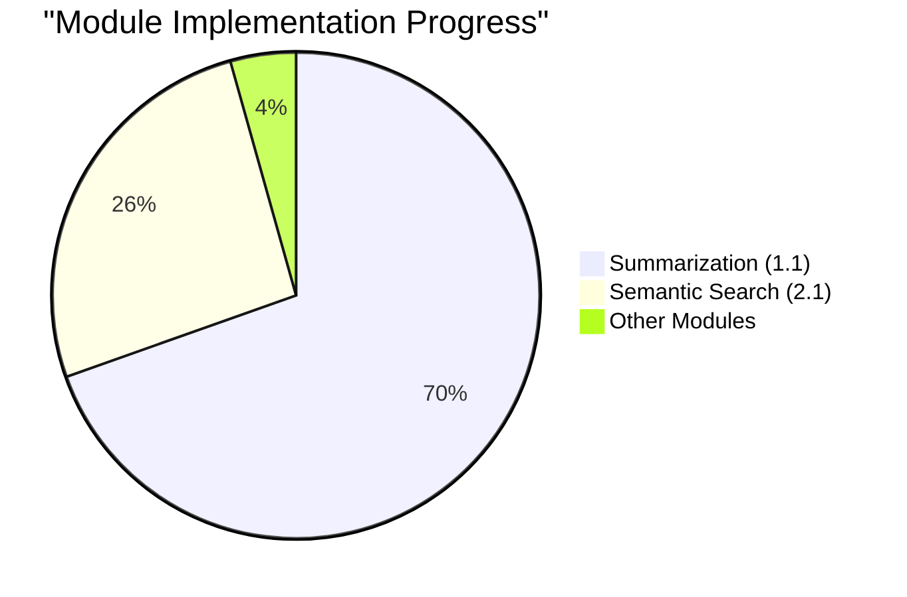
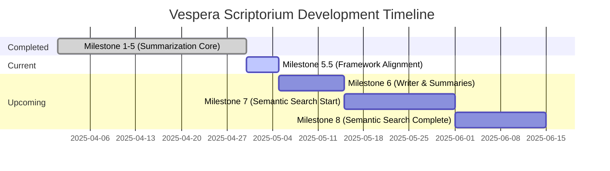
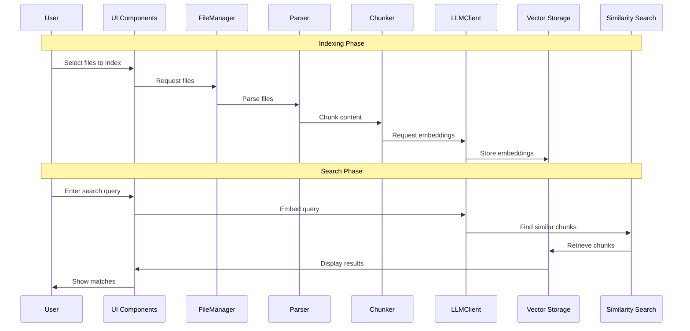

# Vespera Scriptorium Module Relationships

## Core Architecture Diagram

## Implementation Progress

## Milestone Timeline

## Semantic Search Data Flow

These diagrams illustrate how our current implementation provides the foundation for future semantic search capabilities and other modules in the expanded Vespera Scriptorium vision.