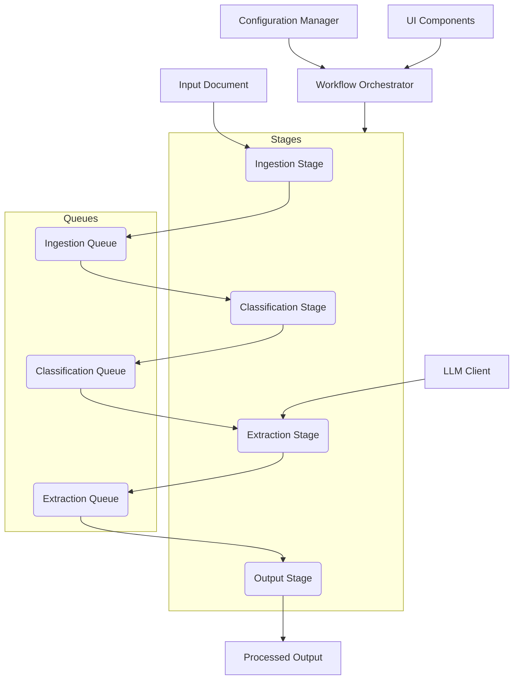

# N8n-Inspired Document Processing Pipeline Architecture

## Context

This document outlines the architecture for the refactored document processing pipeline in Vespera Scriptorium, inspired by the modular and workflow-based approach of n8n. The goal is to create a flexible, robust, and extensible system for extracting information, particularly stories, from various document types. This new architecture replaces the previous system, addressing its limitations and providing a foundation for future enhancements, including complex workflows and user-configurable pipelines.

## Architecture Overview

The new processing pipeline is designed as a series of interconnected stages, or "nodes," where data flows through a defined workflow. Each stage performs a specific task, and the output of one stage becomes the input for the next. File-based queues are used to manage the flow of data between stages, providing persistence and enabling asynchronous processing. A central orchestrator manages the execution of the workflow.

## Component Design

### 1. Workflow Orchestrator

The central component responsible for defining, managing, and executing processing workflows. It reads workflow definitions, monitors the queues, and triggers the execution of individual processing stages (nodes).

**Key Responsibilities:**

*   Loading and validating workflow definitions.
*   Monitoring the state of file-based queues.
*   Dispatching tasks to appropriate processing nodes based on the workflow and queue status.
*   Handling workflow-level errors and retries.
*   Managing the overall state and progress of document processing.

### 2. Processing Stages (Nodes)

Each stage represents a distinct processing step in the pipeline. These are modular components designed to perform a single, well-defined task. Examples include:

*   **Ingestion Stage:** Reads raw document content and prepares it for initial processing (e.g., basic cleaning, format conversion).
*   **Classification Stage:** Analyzes ingested content to categorize it or identify relevant sections. This might involve LLM calls or rule-based logic.
*   **Extraction Stage:** Performs detailed information extraction based on the document type and classification. This stage heavily utilizes LLM calls as "extraction nodes."
*   **Output Stage:** Formats and saves the extracted information according to the desired output specifications.

**Key Features:**

*   **Modularity:** Each stage is independent and can be developed, tested, and updated in isolation.
*   **Single Responsibility:** Each stage focuses on a specific task.
*   **Input/Output:** Stages consume data from an input queue and produce data for an output queue.
*   **Configurable:** Stage behavior can be configured via parameters defined in the workflow.

### 3. File-Based Queues

Simple, persistent queues implemented using the file system. Each stage reads from an input queue and writes to an output queue.

**Key Features:**

*   **Persistence:** Data is stored on disk, ensuring that processing state is not lost if the application restarts.
*   **Decoupling:** Stages are decoupled, allowing them to operate asynchronously.
*   **Simplicity:** Leverages existing file system capabilities for basic queue operations (add, remove, peek).
*   **Error Handling:** Failed items can be moved to a separate error queue for later inspection or reprocessing.

### 4. LLM Calls as Nodes

Interactions with Language Model providers are treated as specific types of processing nodes within the Extraction or Classification stages.

**Key Features:**

*   **Encapsulation:** LLM interaction logic (prompting, calling API, parsing response) is contained within a dedicated node.
*   **Flexibility:** Different LLM models or providers can be used by swapping out the specific LLM node implementation.
*   **Monitoring:** LLM calls can be monitored and logged individually for performance and error analysis.

### 5. Configuration Management

A system for managing the parameters and settings for the processing pipeline and individual stages.

**Key Features:**

*   **Centralized:** Configuration is managed from a single source.
*   **Hierarchical:** Configuration can apply globally, to specific workflows, or to individual stages/nodes.
*   **Dynamic:** Potential for updating configuration without restarting the application.

### 6. Error Handling and Recovery

Robust mechanisms are built into the architecture to handle errors at various levels.

**Key Features:**

*   **Node-Level Error Handling:** Individual nodes are responsible for handling errors during their specific task and reporting them to the orchestrator.
*   **Queue-Based Error Management:** Items that fail processing in a stage are moved to a dedicated error queue for that stage.
*   **Orchestrator-Level Recovery:** The orchestrator can detect failed workflows or stages, inspect error queues, and potentially trigger retries or alternative processing paths.
*   **Persistence for Recovery:** File-based queues and potential checkpointing allow the system to resume processing from a known state after a failure or restart.

## Principles

*   **Modularity:** The system is composed of small, independent, and interchangeable components.
*   **Extensibility:** New processing stages or LLM nodes can be added easily without modifying existing components.
*   **Flexibility:** Workflows can be easily reconfigured or new workflows created by rearranging stages and nodes.
*   **Observability:** The state of queues and the execution of stages can be monitored.

## Future Enhancements

*   **UI for Workflow Design:** A visual interface for users to design and configure their own processing workflows.
*   **Advanced Queueing:** Implementing more sophisticated queueing mechanisms for better performance and features (e.g., priority queues).
*   **Distributed Processing:** Extending the architecture to distribute processing across multiple threads or machines.
*   **More Node Types:** Adding a wider variety of built-in processing nodes for common tasks.