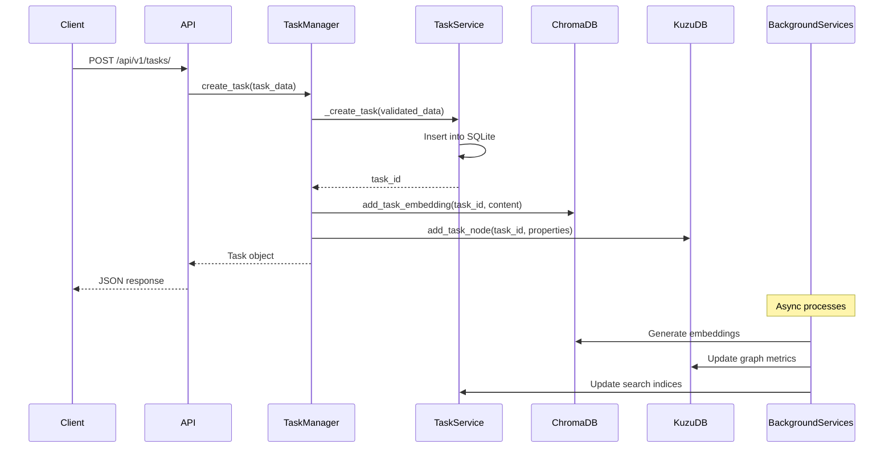
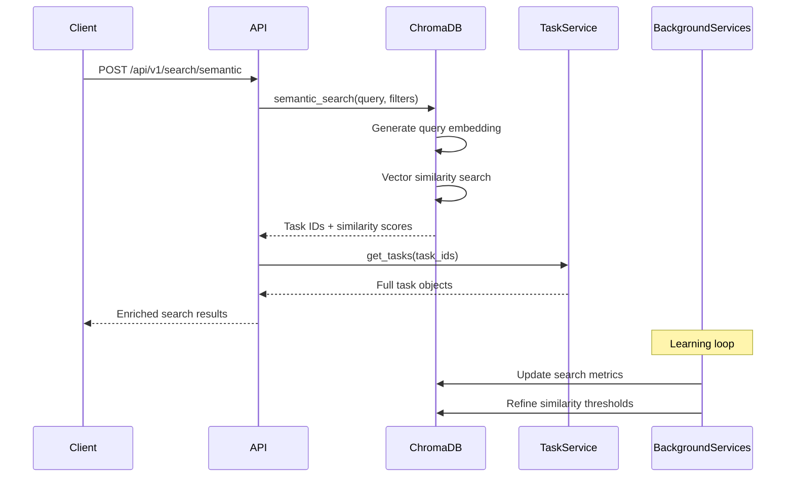
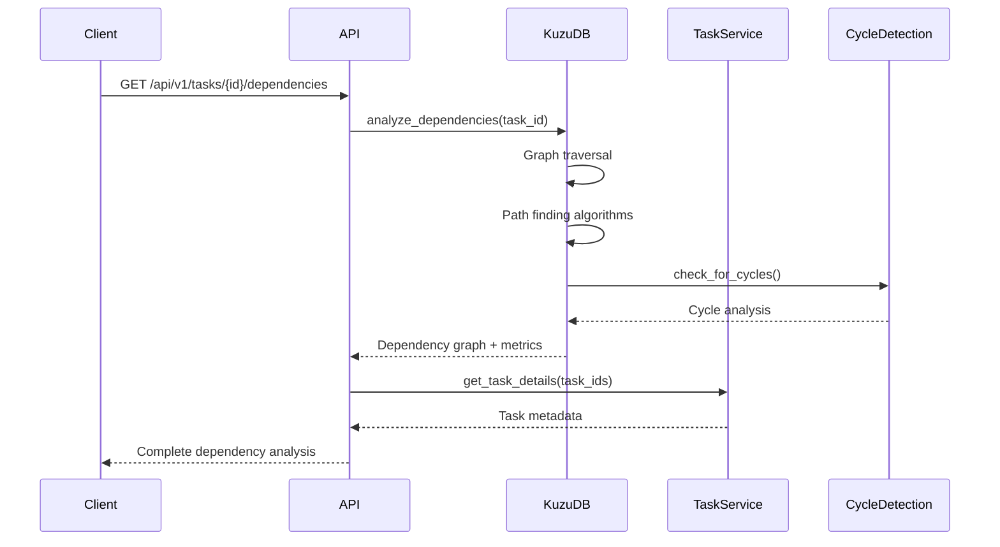

# Architecture Overview

**Deep dive into Vespera V2's sophisticated system architecture, designed for scalability, intelligence, and developer productivity.**

## 🎯 System Overview

Vespera V2 is a modular, AI-powered project orchestration system built with modern Python architecture principles. It combines hierarchical task management, semantic intelligence, and role-based execution in a unified platform.

### Core Principles

- **🧩 Modular Design**: Clean separation of concerns with well-defined interfaces
- **🤖 AI-First**: Semantic search and intelligent recommendations at the core
- **🔒 Security-Focused**: Role-based access control with capability restrictions
- **⚡ Performance-Optimized**: Background services and async processing
- **🔌 Integration-Ready**: Multiple API layers for diverse client needs
- **📊 Data-Driven**: Rich analytics and real-time project intelligence

## 🏗️ High-Level Architecture

```
┌─────────────────────────────────────────────────────────────────┐
│                        Client Layer                             │
├─────────────────┬─────────────────┬─────────────────────────────┤
│   Claude Code   │   VS Code       │   Obsidian      │ Custom    │
│   (MCP Client)  │   Extension     │   Plugin        │ Apps      │
└─────────────────┴─────────────────┴─────────────────┴───────────┘
         │                 │                 │             │
         │                 └─────────────────┼─────────────┘
         │                          │        │
┌─────────────────────────────────────────────────────────────────┐
│                      API Gateway Layer                          │
├─────────────────────────────┬───────────────────────────────────┤
│        MCP Server           │         REST API Server          │
│   (FastMCP Framework)       │      (FastAPI Framework)         │
│   • 14 specialized tools    │   • 50+ HTTP endpoints           │
│   • AI agent integration    │   • WebSocket real-time          │
│   • Pydantic validation     │   • Plugin authentication        │
└─────────────────────────────┴───────────────────────────────────┘
         │                                   │
         └─────────────────┬─────────────────┘
                          │
┌─────────────────────────────────────────────────────────────────┐
│                    Business Logic Layer                         │
├─────────────────┬─────────────────┬─────────────────────────────┤
│ Task Management │ Role System     │ Background Services         │
│ • Hierarchical  │ • Capabilities  │ • Auto-embedding           │
│ • Dependencies  │ • Validation    │ • Cycle detection          │
│ • Workflows     │ • Execution     │ • Sync coordination        │
└─────────────────┴─────────────────┴─────────────────────────────┘
         │                 │                         │
┌─────────────────────────────────────────────────────────────────┐
│                       Data Layer                                │
├─────────────────┬─────────────────┬─────────────────────────────┤
│    SQLite       │    ChromaDB     │        Kuzu                 │
│  (Primary DB)   │  (Vector Store) │   (Graph Database)         │
│  • Tasks        │  • Embeddings   │   • Dependencies           │
│  • Relations    │  • Semantic     │   • Analysis               │
│  • Metadata     │    Search       │   • Path finding           │
└─────────────────┴─────────────────┴─────────────────────────────┘
```

## 🧩 Core Components

### 1. Task Management System

**Location**: `tasks/`

The heart of Vespera V2, providing hierarchical task organization with rich metadata and relationship management.

```python
# Core components
tasks/
├── models.py          # Data models (Task, TaskStatus, TaskPriority, etc.)
├── service.py         # Data persistence and CRUD operations
├── manager.py         # High-level business logic and orchestration
└── executor.py        # Task execution with role integration
```

**Key Classes**:

```python
class Task:
    """Core task entity with full metadata"""
    task_id: str           # Unique identifier
    title: str            # Human-readable title
    description: str      # Detailed description
    status: TaskStatus    # Current state (pending/in_progress/completed/blocked)
    priority: TaskPriority # Importance level (low/normal/high/critical)
    project_id: Optional[str]  # Project grouping
    parent_id: Optional[str]   # Hierarchical parent
    role: Optional[str]        # Assigned role
    created_at: datetime       # Creation timestamp
    updated_at: datetime       # Last modification
    metadata: TaskMetadata     # Additional properties and tags

class TaskManager:
    """High-level task orchestration"""
    def create_task(self, title: str, **kwargs) -> Task
    def update_task(self, task_id: str, **updates) -> Task
    def delete_task(self, task_id: str, recursive: bool = True) -> bool
    def get_task(self, task_id: str) -> Task
    def list_tasks(self, **filters) -> List[Task]
    def get_children(self, task_id: str) -> List[Task]
    def get_dependencies(self, task_id: str) -> List[TaskRelation]
    def create_task_tree(self, root_task: dict, subtasks: List[dict]) -> Task

class TaskService:
    """Data persistence layer"""
    def _create_task(self, task_data: dict) -> str
    def _update_task(self, task_id: str, updates: dict) -> bool
    def _delete_task(self, task_id: str) -> bool
    def _get_task(self, task_id: str) -> Optional[dict]
    def _list_tasks(self, filters: dict) -> List[dict]
    def _add_dependency(self, task_id: str, depends_on: str) -> bool
    def _detect_cycles(self, task_id: str, depends_on: str) -> bool
```

**Architecture Patterns**:
- **Repository Pattern**: Clean separation between business logic and data access
- **Domain-Driven Design**: Rich domain models with behavior
- **CQRS**: Separate models for commands and queries where beneficial
- **Event Sourcing**: Change tracking for audit and analytics

### 2. Role-Based Security System

**Location**: `roles/`

Sophisticated capability-based access control ensuring tasks are executed by appropriate roles with proper permissions.

```python
roles/
├── definitions.py     # Core enums and capability definitions
├── manager.py         # Role management and assignment logic
├── execution.py       # Runtime capability validation
├── validation.py      # Role compatibility checking
└── templates/         # Pre-defined role configurations
    ├── enhanced_roles.yaml    # Production role definitions
    └── default_roles.yaml     # Basic role set
```

**Key Concepts**:

```python
class ToolGroup(Enum):
    """Capability categories"""
    CODE_WRITING = "code_writing"
    CODE_ANALYSIS = "code_analysis"  
    TESTING = "testing"
    DEPLOYMENT = "deployment"
    DOCUMENTATION = "documentation"
    PROJECT_MANAGEMENT = "project_management"
    DATA_ANALYSIS = "data_analysis"
    DESIGN = "design"

class RoleDefinition:
    """Complete role specification"""
    name: str                    # Role identifier
    description: str             # Human-readable description
    capabilities: List[ToolGroup] # What the role can do
    file_patterns: List[str]     # File access restrictions
    tools: List[str]             # Available tools/commands
    max_concurrent_tasks: int    # Workload limits
    restrictions: dict           # Additional constraints

class RoleManager:
    """Role system orchestration"""
    def list_roles(self) -> List[RoleDefinition]
    def get_role(self, name: str) -> Optional[RoleDefinition]
    def validate_assignment(self, task_id: str, role_name: str) -> ValidationResult
    def assign_role(self, task_id: str, role_name: str) -> bool
    def get_workload(self, role_name: str) -> WorkloadInfo
    def find_suitable_roles(self, requirements: List[ToolGroup]) -> List[str]
```

**Security Features**:
- **Capability-Based Access**: Roles define what actions are permitted
- **File Pattern Restrictions**: Limit file access based on role
- **Workload Management**: Prevent overallocation of role capacity
- **Validation Pipeline**: Multi-stage compatibility checking
- **Audit Trail**: Complete role assignment history

### 3. AI Intelligence Layer

**Location**: `databases/`

Multi-database architecture providing semantic search, dependency analysis, and intelligent recommendations.

```python
databases/
├── triple_db_service.py    # Orchestrates all three databases
├── chroma_service.py       # Vector embeddings and semantic search
├── kuzu_service.py         # Graph analysis and path finding
├── sqlite_service.py       # Primary relational data
├── sync_coordinator.py     # Inter-database synchronization
├── background_services.py  # Automated maintenance
└── service_config.py       # Configuration management
```

**Database Architecture**:

```
┌─────────────────────────────────────────────────────────────────┐
│                    Triple Database System                       │
├─────────────────┬─────────────────┬─────────────────────────────┤
│     SQLite      │    ChromaDB     │         Kuzu                │
│  (Primary DB)   │ (Vector Store)  │   (Graph Database)          │
│                 │                 │                             │
│ • Tasks         │ • Embeddings    │ • Task nodes               │
│ • Metadata      │ • Semantic      │ • Dependency edges         │
│ • Relations     │   vectors       │ • Path analysis           │
│ • Users/Roles   │ • Search index  │ • Cycle detection         │
│ • Projects      │ • Similarity    │ • Critical paths          │
│                 │   scoring       │ • Graph metrics           │
└─────────────────┴─────────────────┴─────────────────────────────┘
         │                 │                         │
         └─────────────────┼─────────────────────────┘
                          │
              ┌─────────────────────┐
              │  Sync Coordinator   │
              │  • Change tracking  │
              │  • Consistency      │
              │  • Real-time sync   │
              │  • Conflict res.    │
              └─────────────────────┘
```

**Key Services**:

```python
class TripleDbService:
    """Orchestrates all database operations"""
    def __init__(self):
        self.sqlite = SqliteService()      # Primary data store
        self.chroma = ChromaService()      # Semantic search
        self.kuzu = KuzuService()          # Graph analysis
        self.sync = SyncCoordinator()      # Consistency management
    
    def create_task(self, task_data: dict) -> str:
        # 1. Store in SQLite
        task_id = self.sqlite.create_task(task_data)
        # 2. Generate embeddings in ChromaDB
        self.chroma.add_task_embedding(task_id, task_data)
        # 3. Create graph node in Kuzu
        self.kuzu.add_task_node(task_id, task_data)
        # 4. Sync across databases
        self.sync.coordinate_creation(task_id)
        return task_id

class ChromaService:
    """Vector embeddings and semantic search"""
    def generate_embedding(self, text: str) -> List[float]
    def add_task_embedding(self, task_id: str, task_data: dict) -> bool
    def semantic_search(self, query: str, n_results: int = 10) -> List[dict]
    def find_similar_tasks(self, task_id: str, n_results: int = 5) -> List[dict]
    def cluster_tasks(self, project_id: str, n_clusters: int = 5) -> dict

class KuzuService:
    """Graph analysis and dependency management"""
    def add_task_node(self, task_id: str, properties: dict) -> bool
    def add_dependency_edge(self, from_task: str, to_task: str) -> bool
    def detect_cycles(self, task_id: str, depends_on: str) -> bool
    def find_critical_path(self, project_id: str) -> List[str]
    def analyze_dependencies(self, task_id: str) -> dict
    def get_task_impact(self, task_id: str) -> dict
```

### 4. Background Services Architecture

**Location**: `databases/background_services.py`

Automated maintenance and optimization services that keep the system running smoothly without user intervention.

```python
class BackgroundServiceManager:
    """Orchestrates all background services"""
    def __init__(self):
        self.services = {
            'auto_embedding': AutoEmbeddingService(),
            'cycle_detection': CycleDetectionService(), 
            'sync_coordinator': SyncCoordinatorService(),
            'index_optimization': IndexOptimizationService()
        }
    
    def start_all_services(self) -> dict
    def stop_all_services(self) -> dict
    def get_service_status(self) -> dict
    def restart_service(self, service_name: str) -> bool

class AutoEmbeddingService(BackgroundService):
    """Automatic embedding generation for new/updated tasks"""
    triggers = ['task_created', 'task_updated', 'description_changed']
    
    def process_task_creation(self, task_id: str, task_data: dict):
        # Generate embeddings for title and description
        embedding = self.embedding_model.encode(
            f"{task_data['title']} {task_data['description']}"
        )
        # Store in ChromaDB
        self.chroma_service.add_embedding(task_id, embedding)
    
    def process_task_update(self, task_id: str, changes: dict):
        if 'title' in changes or 'description' in changes:
            self.regenerate_embedding(task_id)

class CycleDetectionService(BackgroundService):
    """Automatic dependency cycle detection and prevention"""
    triggers = ['dependency_added', 'task_moved']
    
    def process_dependency_addition(self, task_id: str, depends_on: str):
        if self.kuzu_service.would_create_cycle(task_id, depends_on):
            self.reject_dependency_with_explanation(task_id, depends_on)
        else:
            self.approve_dependency(task_id, depends_on)
```

**Service Categories**:
1. **Auto-Embedding**: Generates embeddings for semantic search
2. **Cycle Detection**: Prevents dependency cycles in real-time
3. **Sync Coordination**: Maintains consistency across databases
4. **Index Optimization**: Optimizes database performance
5. **Health Monitoring**: Tracks system performance and issues

### 5. API Gateway Layer

**Location**: `api/` and `mcp_server_v2.py`

Dual API architecture providing both RESTful HTTP access and MCP protocol integration for AI agents.

```python
api/
├── server.py              # FastAPI application and routing
├── routers/               # Endpoint implementations
│   ├── tasks.py          # Task management endpoints
│   ├── search.py         # Semantic search endpoints
│   ├── projects.py       # Project intelligence endpoints
│   ├── roles.py          # Role management endpoints
│   └── plugins.py        # Plugin integration endpoints
├── middleware/            # Request/response processing
│   ├── auth.py           # Authentication and authorization
│   ├── cors.py           # Cross-origin resource sharing
│   └── error_handler.py  # Error handling and formatting
├── models/                # API data models
│   ├── requests.py       # Request validation models
│   ├── responses.py      # Response formatting models
│   └── common.py         # Shared model components
├── utils/                 # Utility functions
│   ├── mcp_bridge.py     # Bridge to MCP tools
│   └── plugin_helpers.py # Plugin-specific utilities
└── websocket.py          # Real-time WebSocket handling
```

**MCP Server Architecture**:

```python
# mcp_server_v2.py - FastMCP-based server
from mcp.server.fastmcp import FastMCP

mcp = FastMCP("vespera-v2-tasks")

@mcp.tool()
async def create_task(task_input: TaskCreateInput) -> Dict[str, Any]:
    """Create a new task with full validation and integration"""
    task_manager, role_manager = get_managers()
    
    # Validate input
    validated_input = TaskCreateInput.model_validate(task_input)
    
    # Create task through business layer
    task = task_manager.create_task(
        title=validated_input.title,
        description=validated_input.description,
        # ... other properties
    )
    
    # Return standardized response
    return {
        "status": "success",
        "task": task.to_dict(),
        "message": "Task created successfully"
    }

# 14 total MCP tools with consistent patterns:
# - Input validation with Pydantic
# - Business logic delegation
# - Comprehensive error handling
# - Standardized response formats
```

**API Features**:
- **RESTful Design**: Standard HTTP methods and status codes
- **Real-time Updates**: WebSocket support for live notifications
- **Plugin Authentication**: Token-based auth with capability checking
- **Input Validation**: Pydantic models for request/response validation
- **Error Handling**: Comprehensive error responses with details
- **Rate Limiting**: Protection against abuse and overload
- **CORS Support**: Cross-origin access for web applications

## 🔄 Data Flow Architecture

### Task Creation Flow



### Semantic Search Flow



### Dependency Analysis Flow



## 🧪 Testing Architecture

**Location**: `tests/`

Comprehensive testing strategy covering unit, integration, and system-level testing.

```python
tests/
├── unit/                  # Unit tests for individual components
│   ├── test_task_models.py
│   ├── test_role_manager.py
│   ├── test_chroma_service.py
│   └── test_api_endpoints.py
├── integration/           # Integration tests for component interactions
│   ├── test_task_workflow.py
│   ├── test_mcp_integration.py
│   └── test_database_sync.py
├── system/                # End-to-end system tests
│   ├── test_complete_workflows.py
│   ├── test_performance.py
│   └── test_scalability.py
└── utils/                 # Testing utilities and fixtures
    ├── fixtures.py
    ├── mock_services.py
    └── test_data.py
```

**Testing Patterns**:

```python
# Unit Testing Example
class TestTaskManager:
    def setup_method(self):
        self.task_manager = TaskManager(test_db_path)
        self.role_manager = MagicMock()
    
    def test_create_task_success(self):
        task = self.task_manager.create_task("Test Task", "Description")
        assert task.title == "Test Task"
        assert task.status == TaskStatus.PENDING
    
    def test_create_task_with_invalid_role_fails(self):
        with pytest.raises(ValidationError):
            self.task_manager.create_task("Test", role="invalid_role")

# Integration Testing Example  
class TestTaskWorkflow:
    def setup_method(self):
        self.triple_db = TripleDbService(test_config)
        self.task_manager = TaskManager(self.triple_db)
    
    def test_complete_task_creation_workflow(self):
        # Create task
        task = self.task_manager.create_task("Integration Test")
        
        # Verify in all databases
        assert self.triple_db.sqlite.get_task(task.task_id) is not None
        assert self.triple_db.chroma.has_embedding(task.task_id)
        assert self.triple_db.kuzu.has_node(task.task_id)
        
        # Test search functionality
        results = self.triple_db.chroma.search("Integration Test")
        assert task.task_id in [r['task_id'] for r in results]

# System Testing Example
class TestSystemPerformance:
    def test_bulk_task_creation_performance(self):
        start_time = time.time()
        
        # Create 1000 tasks
        tasks = []
        for i in range(1000):
            task = self.task_manager.create_task(f"Task {i}")
            tasks.append(task)
        
        creation_time = time.time() - start_time
        assert creation_time < 30  # Should complete in under 30 seconds
        
        # Test search performance
        start_time = time.time()
        results = self.chroma_service.search("Task", n_results=100)
        search_time = time.time() - start_time
        assert search_time < 1  # Sub-second search
```

## 📊 Performance Architecture

### Optimization Strategies

1. **Database Optimization**:
   ```python
   # SQLite optimizations
   PRAGMA journal_mode = WAL;        # Write-ahead logging
   PRAGMA synchronous = NORMAL;      # Balanced durability/performance
   PRAGMA cache_size = 10000;        # 10MB cache
   PRAGMA temp_store = MEMORY;       # In-memory temp tables
   
   # ChromaDB optimizations
   BATCH_SIZE = 100                  # Embedding batch processing
   INDEX_TYPE = "HNSW"              # Hierarchical Navigable Small World
   DISTANCE_METRIC = "cosine"        # Optimized for text similarity
   
   # Kuzu optimizations
   BUFFER_POOL_SIZE = "512MB"        # Memory allocation
   NUM_THREADS = 4                   # Parallel query processing
   ```

2. **Caching Strategy**:
   ```python
   class CacheManager:
       def __init__(self):
           self.role_cache = TTLCache(maxsize=100, ttl=3600)    # 1 hour
           self.task_cache = LRUCache(maxsize=1000)             # LRU eviction
           self.search_cache = TTLCache(maxsize=500, ttl=300)   # 5 minutes
       
       @cached(cache=role_cache)
       def get_role(self, role_name: str) -> RoleDefinition:
           return self.role_manager.load_role(role_name)
       
       @cached(cache=search_cache, key=lambda q, n: f"{q}:{n}")
       def semantic_search(self, query: str, n_results: int) -> List[dict]:
           return self.chroma_service.search(query, n_results)
   ```

3. **Background Processing**:
   ```python
   class AsyncTaskProcessor:
       def __init__(self):
           self.embedding_queue = asyncio.Queue(maxsize=1000)
           self.sync_queue = asyncio.Queue(maxsize=500)
           self.workers = []
       
       async def start_workers(self, num_workers: int = 4):
           for i in range(num_workers):
               worker = asyncio.create_task(self.worker_loop())
               self.workers.append(worker)
       
       async def worker_loop(self):
           while True:
               try:
                   task_data = await self.embedding_queue.get()
                   await self.process_embedding_async(task_data)
                   self.embedding_queue.task_done()
               except Exception as e:
                   logger.error(f"Worker error: {e}")
   ```

### Scalability Considerations

1. **Horizontal Scaling**:
   - SQLite → PostgreSQL migration path
   - ChromaDB clustering support
   - Kuzu distributed graph processing
   - Load balancer configuration

2. **Vertical Scaling**:
   - Memory optimization strategies
   - CPU utilization monitoring
   - Database connection pooling
   - Background service tuning

3. **Data Partitioning**:
   ```python
   class PartitionStrategy:
       def get_partition_key(self, task_data: dict) -> str:
           # Partition by project for locality
           return task_data.get('project_id', 'default')
       
       def get_shard_for_search(self, query: str) -> List[str]:
           # Search across relevant shards only
           return self.determine_relevant_shards(query)
   ```

## 🔐 Security Architecture

### Authentication & Authorization

```python
class SecurityManager:
    def __init__(self):
        self.jwt_secret = os.getenv('VESPERA_JWT_SECRET')
        self.token_expiry = timedelta(hours=24)
        self.capability_checker = CapabilityChecker()
    
    def authenticate_plugin(self, plugin_info: dict) -> str:
        # Validate plugin registration
        if not self.validate_plugin_info(plugin_info):
            raise AuthenticationError("Invalid plugin information")
        
        # Generate JWT token with capabilities
        token_payload = {
            'plugin_id': plugin_info['id'],
            'plugin_type': plugin_info['type'],
            'capabilities': plugin_info['capabilities'],
            'exp': datetime.utcnow() + self.token_expiry
        }
        
        return jwt.encode(token_payload, self.jwt_secret, algorithm='HS256')
    
    def authorize_operation(self, token: str, operation: str, resource: str) -> bool:
        try:
            payload = jwt.decode(token, self.jwt_secret, algorithms=['HS256'])
            return self.capability_checker.check_permission(
                payload['capabilities'], operation, resource
            )
        except jwt.InvalidTokenError:
            return False

class CapabilityChecker:
    def check_permission(self, capabilities: List[str], operation: str, resource: str) -> bool:
        required_capability = self.get_required_capability(operation, resource)
        return required_capability in capabilities
    
    def get_required_capability(self, operation: str, resource: str) -> str:
        capability_map = {
            ('create', 'task'): 'task_creation',
            ('read', 'task'): 'task_reading',
            ('update', 'task'): 'task_modification',
            ('delete', 'task'): 'task_deletion',
            ('search', 'semantic'): 'search',
            ('analyze', 'file'): 'file_context'
        }
        return capability_map.get((operation, resource), 'unknown')
```

### Data Protection

1. **Encryption at Rest**:
   ```python
   class DataEncryption:
       def __init__(self):
           self.key = Fernet.generate_key()  # In production: use KMS
           self.cipher_suite = Fernet(self.key)
       
       def encrypt_sensitive_data(self, data: str) -> str:
           return self.cipher_suite.encrypt(data.encode()).decode()
       
       def decrypt_sensitive_data(self, encrypted_data: str) -> str:
           return self.cipher_suite.decrypt(encrypted_data.encode()).decode()
   ```

2. **Input Validation**:
   ```python
   class InputValidator:
       @staticmethod
       def validate_task_input(task_data: dict) -> dict:
           # Sanitize HTML/XSS
           task_data['title'] = bleach.clean(task_data['title'])
           task_data['description'] = bleach.clean(task_data['description'])
           
           # Validate SQL injection
           if any(keyword in task_data['title'].lower() 
                  for keyword in ['drop', 'delete', 'update', 'insert']):
               raise ValidationError("Potentially malicious input detected")
           
           # Length limits
           if len(task_data['title']) > 200:
               raise ValidationError("Title too long")
           
           return task_data
   ```

3. **Audit Logging**:
   ```python
   class AuditLogger:
       def __init__(self):
           self.audit_log = logging.getLogger('vespera.audit')
       
       def log_operation(self, user_id: str, operation: str, resource: str, 
                        result: str, metadata: dict = None):
           audit_entry = {
               'timestamp': datetime.utcnow().isoformat(),
               'user_id': user_id,
               'operation': operation,
               'resource': resource, 
               'result': result,
               'metadata': metadata or {},
               'ip_address': self.get_client_ip(),
               'user_agent': self.get_user_agent()
           }
           self.audit_log.info(json.dumps(audit_entry))
   ```

## 🔍 Monitoring & Observability

### Metrics Collection

```python
class MetricsCollector:
    def __init__(self):
        self.task_counter = Counter('vespera_tasks_total', 'Total tasks created')
        self.search_duration = Histogram('vespera_search_duration_seconds', 
                                        'Time spent on searches')
        self.role_utilization = Gauge('vespera_role_utilization', 
                                     'Role utilization percentage', ['role'])
    
    def record_task_creation(self, project_id: str, role: str):
        self.task_counter.labels(project=project_id, role=role).inc()
    
    def record_search_duration(self, duration: float, search_type: str):
        self.search_duration.labels(type=search_type).observe(duration)
    
    def update_role_utilization(self, role: str, utilization: float):
        self.role_utilization.labels(role=role).set(utilization)

class HealthChecker:
    async def check_system_health(self) -> dict:
        health_status = {
            'status': 'healthy',
            'timestamp': datetime.utcnow().isoformat(),
            'components': {}
        }
        
        # Check database connections
        health_status['components']['sqlite'] = await self.check_sqlite()
        health_status['components']['chroma'] = await self.check_chroma()
        health_status['components']['kuzu'] = await self.check_kuzu()
        
        # Check background services
        health_status['components']['background_services'] = (
            await self.check_background_services()
        )
        
        # Overall health determination
        component_health = [c['status'] for c in health_status['components'].values()]
        if all(status == 'healthy' for status in component_health):
            health_status['status'] = 'healthy'
        elif any(status == 'critical' for status in component_health):
            health_status['status'] = 'critical'
        else:
            health_status['status'] = 'degraded'
        
        return health_status
```

### Distributed Tracing

```python
from opentelemetry import trace
from opentelemetry.exporter.jaeger.thrift import JaegerExporter
from opentelemetry.sdk.trace import TracerProvider
from opentelemetry.sdk.trace.export import BatchSpanProcessor

class TracingManager:
    def __init__(self):
        trace.set_tracer_provider(TracerProvider())
        tracer = trace.get_tracer(__name__)
        
        jaeger_exporter = JaegerExporter(
            agent_host_name="localhost",
            agent_port=6831
        )
        
        span_processor = BatchSpanProcessor(jaeger_exporter)
        trace.get_tracer_provider().add_span_processor(span_processor)
    
    @trace.trace_method("task_creation")
    async def trace_task_creation(self, task_data: dict) -> str:
        with trace.get_tracer(__name__).start_as_current_span("create_task") as span:
            span.set_attribute("task.title", task_data['title'])
            span.set_attribute("task.project_id", task_data.get('project_id', ''))
            
            try:
                task_id = await self.task_manager.create_task(**task_data)
                span.set_attribute("task.id", task_id)
                span.set_status(trace.Status(trace.StatusCode.OK))
                return task_id
            except Exception as e:
                span.set_status(trace.Status(trace.StatusCode.ERROR, str(e)))
                raise
```

## 🚀 Deployment Architecture

### Container Strategy

```dockerfile
# Multi-stage Docker build
FROM python:3.11-slim as builder

WORKDIR /app
COPY requirements.txt .
RUN pip install --no-cache-dir -r requirements.txt

FROM python:3.11-slim as runtime

RUN groupadd -r vespera && useradd -r -g vespera vespera

WORKDIR /app
COPY --from=builder /usr/local/lib/python3.11/site-packages /usr/local/lib/python3.11/site-packages
COPY --from=builder /usr/local/bin /usr/local/bin

COPY . .
RUN chown -R vespera:vespera /app

USER vespera

EXPOSE 8000
CMD ["uvicorn", "api.server:app", "--host", "0.0.0.0", "--port", "8000"]
```

### Kubernetes Deployment

```yaml
apiVersion: apps/v1
kind: Deployment
metadata:
  name: vespera-api
spec:
  replicas: 3
  selector:
    matchLabels:
      app: vespera-api
  template:
    metadata:
      labels:
        app: vespera-api
    spec:
      containers:
      - name: vespera-api
        image: vespera/api:v2.0.0
        ports:
        - containerPort: 8000
        env:
        - name: VESPERA_DATA_DIR
          value: "/data"
        - name: CHROMA_PERSIST_DIRECTORY
          value: "/data/chroma"
        volumeMounts:
        - name: vespera-data
          mountPath: /data
        livenessProbe:
          httpGet:
            path: /health
            port: 8000
          initialDelaySeconds: 30
          periodSeconds: 10
        readinessProbe:
          httpGet:
            path: /health
            port: 8000
          initialDelaySeconds: 5
          periodSeconds: 5
      volumes:
      - name: vespera-data
        persistentVolumeClaim:
          claimName: vespera-data-pvc
```

---

**🎉 You now understand Vespera V2's complete architecture!**

*Next: Explore [Development Setup](development-setup.md) to start contributing, or dive into [Component Guides](component-guides/) for detailed technical documentation.*