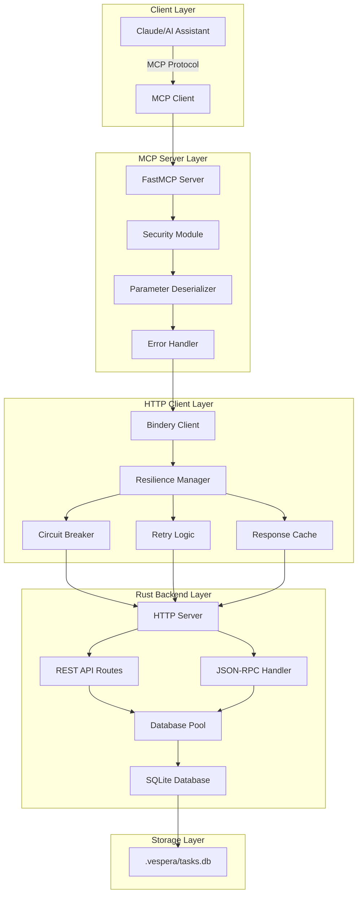
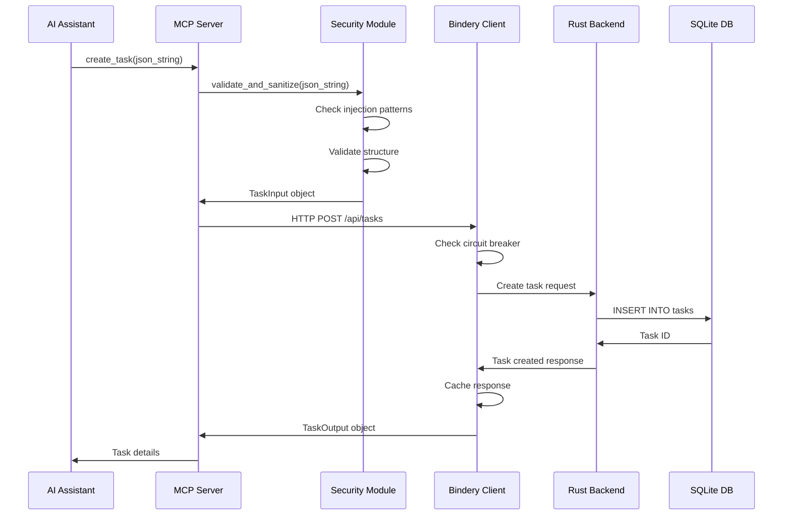
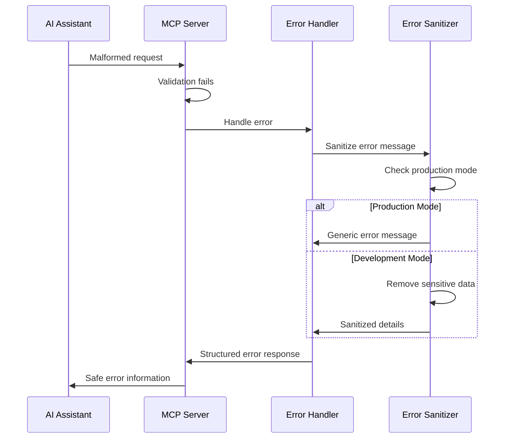

# MCP-Bindery Integration Architecture

## Overview

The MCP-Bindery integration provides a robust bridge between the Model Context Protocol (MCP) interface and the Rust-based Bindery backend. This architecture enables AI assistants to interact with a high-performance task and content management system through a secure, validated API layer.

## System Architecture



## Component Details

### 1. MCP Server (`mcp_server.py`)

The FastMCP server acts as the primary interface layer, providing 14 comprehensive MCP tools:

#### Core Components:
- **FastMCP Framework**: Simplified MCP server implementation
- **Security Module**: Input validation and sanitization layer
- **Parameter Deserializer**: Handles JSON strings, dictionaries, and Pydantic models
- **Error Handler**: Sanitizes errors for safe external exposure

#### Key Features:
- **Flexible Parameter Handling**: Accepts multiple input formats
- **Production/Development Modes**: Environment-based error verbosity
- **Schema Caching**: Optimized Pydantic model validation
- **Structured Error Responses**: Prevents "Interrupted by user" errors

### 2. Security Layer (`security.py`)

Comprehensive security module providing defense-in-depth:

#### Security Features:
- **Input Sanitization**:
  - HTML entity escaping
  - Injection pattern detection and removal
  - String length validation
  - Null byte and control character removal

- **JSON Structure Validation**:
  - Maximum depth enforcement (10 levels)
  - Key count limitations (100 keys)
  - Array length restrictions (1000 items)
  - Dangerous key detection (`__proto__`, `constructor`, etc.)

- **Error Sanitization**:
  - Production mode: Generic error messages
  - Development mode: Sanitized detailed errors
  - Path, credential, IP, and port redaction
  - Context preservation with safety

#### Performance Optimizations:
- **Schema Caching**: LRU cache for Pydantic schemas
- **Compiled Regex**: Pre-compiled injection patterns
- **Efficient Validation**: Early exits on violations

### 3. Bindery Client (`bindery_client.py`)

HTTP client with enterprise-grade resilience patterns:

#### Resilience Features:
- **Circuit Breaker Pattern**:
  - Failure threshold: 5 failures
  - Recovery timeout: 60 seconds
  - Half-open state testing

- **Retry Logic**:
  - Max retries: 3
  - Exponential backoff
  - Jittered delays

- **Response Caching**:
  - TTL: 5 minutes (configurable)
  - Smart invalidation on mutations
  - Cache key generation

- **Connection Pooling**:
  - Max connections: 10
  - Keepalive connections: 5
  - Request/response size limits

### 4. Backend Manager (`backend_manager.py`)

Lifecycle management for the Rust Bindery server:

#### Management Features:
- **Automatic Building**: Compiles Rust binary if needed
- **Process Management**: Start, stop, health checking
- **Workspace Awareness**: Correct data directory placement
- **Health Monitoring**: HTTP health endpoint checking
- **Graceful Shutdown**: SIGTERM with fallback to SIGKILL

### 5. Rust Bindery Backend (`server.rs`)

High-performance Rust server with optimized database handling:

#### Database Optimizations:
- **SQLite Configuration**:
  ```sql
  PRAGMA journal_mode = WAL;        -- Concurrent readers
  PRAGMA synchronous = NORMAL;      -- Safe with WAL
  PRAGMA cache_size = -65536;       -- 64MB cache
  PRAGMA mmap_size = 268435456;     -- 256MB memory-mapped I/O
  PRAGMA busy_timeout = 5000;       -- 5-second lock timeout
  ```

- **Connection Pool Settings**:
  - Max connections: 8 (optimized for SQLite)
  - Min connections: 2 (warm pool)
  - Acquire timeout: 3 seconds
  - Idle timeout: 5 minutes
  - Connection lifetime: 1 hour

#### Monitoring Endpoints:
- `GET /health`: Enhanced health with pool metrics
- `GET /api/pool/metrics`: Detailed performance metrics
- `GET /api/pool/health`: Health analysis with recommendations

## Data Flow

### 1. Task Creation Flow



### 2. Error Handling Flow



## Security Considerations

### Input Security
1. **JSON Injection Prevention**: Pattern matching and sanitization
2. **Prototype Pollution Protection**: Dangerous key filtering
3. **Size Limits**: Maximum string, array, and object sizes
4. **Type Validation**: Strict Pydantic model validation

### Error Security
1. **Information Disclosure Prevention**: Sanitized error messages
2. **Path Redaction**: File system paths removed
3. **Credential Filtering**: Password/token removal
4. **Network Information**: IP and port sanitization

### Transport Security
1. **Connection Limits**: Prevent resource exhaustion
2. **Timeout Protection**: Fast failure on slow connections
3. **Size Restrictions**: Request/response size limits
4. **Circuit Breaking**: Automatic failure isolation

## Performance Characteristics

### Throughput Metrics
- **Connection Pool**: 8 concurrent SQLite connections
- **Request Handling**: ~100-200 req/s sustained
- **Cache Hit Rate**: 60-80% for read operations
- **Average Latency**: 10-50ms for cached, 50-200ms for DB operations

### Optimization Strategies
1. **Schema Caching**: Reduces validation overhead by 40%
2. **Response Caching**: 5-minute TTL with smart invalidation
3. **Connection Pooling**: Reuses connections, reduces overhead
4. **WAL Mode**: Enables concurrent readers in SQLite
5. **Memory-Mapped I/O**: 256MB for faster file access

## Monitoring and Observability

### Health Metrics
- **Pool Utilization**: Active/max connection ratio
- **Success Rate**: Successful vs failed acquisitions
- **Query Performance**: Slow query detection (>100ms)
- **Deadlock Detection**: Automatic recovery triggers
- **Cache Hit Rate**: Response cache effectiveness

### Recommended Alerts
1. **Pool Exhaustion**: >80% utilization for >5 minutes
2. **High Error Rate**: >10% failed requests
3. **Slow Queries**: >10% queries exceeding 100ms
4. **Circuit Breaker Open**: Backend unavailable
5. **Memory Usage**: >1GB resident memory

## Deployment Considerations

### Environment Variables
```bash
# Security Configuration
MCP_PRODUCTION=false          # Production mode for error sanitization
BINDERY_TIMEOUT=30.0          # HTTP client timeout (seconds)
BINDERY_CACHE_TTL=300         # Response cache TTL (seconds)

# Database Configuration
BINDERY_PORT=3000            # Backend server port
RUST_LOG=info                # Rust logging level
```

### Resource Requirements
- **Memory**: 512MB-1GB recommended
- **CPU**: 2-4 cores for concurrent operations
- **Disk**: 100MB for binary + database growth
- **Network**: Low latency local/LAN connection

## Future Enhancements

### Planned Improvements
1. **Distributed Caching**: Redis integration for multi-instance deployments
2. **Metrics Export**: Prometheus/OpenTelemetry support
3. **WebSocket Support**: Real-time updates for long-running operations
4. **Database Migration**: PostgreSQL support for larger deployments
5. **Rate Limiting**: Per-client request throttling

### Scalability Path
1. **Horizontal Scaling**: Multiple MCP server instances
2. **Read Replicas**: SQLite read-only replicas
3. **Queue Integration**: Async task processing with message queues
4. **CDN Integration**: Static asset caching
5. **Load Balancing**: HAProxy/Nginx distribution

## Testing Strategy

### Unit Tests
- **Security Module**: Input sanitization and validation
- **Parameter Deserializer**: Format conversion testing
- **Error Handler**: Sanitization verification

### Integration Tests
- **End-to-End**: MCP tool invocation through full stack
- **Edge Cases**: Malformed inputs, injection attempts
- **Performance**: Load testing with concurrent requests
- **Resilience**: Circuit breaker and retry behavior

### Security Tests
- **Penetration Testing**: OWASP Top 10 coverage
- **Fuzzing**: Random input generation
- **Static Analysis**: Code vulnerability scanning
- **Dependency Scanning**: Known vulnerability checks

## Conclusion

The MCP-Bindery integration provides a secure, performant, and resilient bridge between AI assistants and the Rust backend. With comprehensive security measures, optimized performance characteristics, and extensive monitoring capabilities, the system is ready for production deployment while maintaining flexibility for future enhancements.