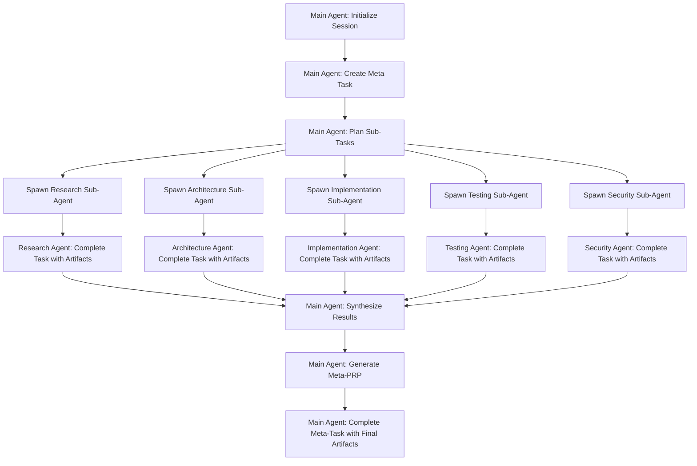

# Create META-PRP with Orchestrator Multi-Agent Coordination

Create comprehensive meta-PRPs that coordinate complex multi-step plans using the task orchestrator's full orchestration
capabilities with sub-agent coordination, git worktree isolation, and executive dysfunction design principles.

## Meta-PRP Concept: $ARGUMENTS

## Template Reference

**CRITICAL**: Refer to `PRPs/templates/meta_prp_structure.md` for the complete hierarchical structure template with
executive dysfunction design patterns and git worktree strategy.

## Pre-Execution Orchestrator Health Check

**MANDATORY FIRST STEP:**

```bash
# Verify orchestrator connection and full functionality
claude mcp list | grep task-orchestrator || (echo "ORCHESTRATOR NOT CONNECTED - Fixing..." && claude mcp restart task-orchestrator)

# Test orchestrator health before meta-coordination
# This is critical for multi-agent workflows
```

If orchestrator fails, STOP and spawn fix agent per CLAUDE.md protocol.

## Enhanced Context References

**CRITICAL**: Load and reference these enhanced AI documentation files:

```yaml
required_context:
  - file: PRPs/v2.0-release-meta-prp/meta-coordination-orchestrator.md
    why: "Meta-PRP coordination patterns and orchestrator integration examples"
    sections: ["Orchestrator Tools Integration", "Phase Structure", "Testing Matrix"]

  - file: PRPs/ai_docs/context-engineering-guide.md
    why: "Context engineering for multi-agent coordination"
    sections: ["Multi-Agent Patterns", "Orchestrator Integration"]

  - file: PRPs/ai_docs/mcp-protocol-patterns.md
    why: "MCP server coordination and task management patterns"
    sections: ["Task Orchestration", "Specialist Assignment"]

  - file: PRPs/ai_docs/systematic-testing-framework.md
    why: "Multi-agent testing and validation frameworks"
    sections: ["Orchestrator Testing", "Complex Workflow Validation"]

  - file: CLAUDE.md
    why: "Project-specific orchestrator integration requirements"
    sections: ["Task Orchestrator Failure Protocol", "Clean Architecture"]
```

## Meta-PRP Design Principles

**Key Characteristics:**
- **Main Orchestrator Agent**: Creates and manages task breakdown using orchestrator_plan_task
- **Sub-Agent Coordination**: Each sub-agent gets specific orchestrator tasks with specialist contexts
- **Automatic Artifact Storage**: Task completion via orchestrator_complete_task stores detailed work
- **Result Synthesis**: orchestrator_synthesize_results aggregates sub-agent outputs
- **No Manual Summaries**: Orchestrator artifacts replace traditional result aggregation

## Enhanced Discovery Process with Multi-Agent Coordination

**Use Orchestrator for Meta-Coordination:**

```yaml
orchestrator_meta_session:
  session_name: "meta-prp-{concept}-creation"
  working_directory: "/current/project/path"
  expected_duration: "varies by complexity"
  
orchestrator_meta_task:
  title: "Meta-PRP Creation: {concept}"
  description: "Create comprehensive multi-agent coordination PRP for {concept}"
  complexity: "very_complex"
  task_type: "breakdown"
  specialist_type: "architect"
  
sub_task_coordination:
  - orchestrator_plan_task: "Research and analysis coordination"
  - orchestrator_plan_task: "Architecture design coordination"
  - orchestrator_plan_task: "Implementation planning coordination"
  - orchestrator_plan_task: "Testing strategy coordination"
  - orchestrator_get_status: "Track all coordination progress"
```

1. **Enhanced Concept Analysis with Sub-Agents**
   - **Main Agent**: Use orchestrator_plan_task to create research coordination
   - **Research Sub-Agent**: Gets orchestrator task with "researcher" specialist type
   - **Architecture Sub-Agent**: Gets orchestrator task with "architect" specialist type
   - **Security Sub-Agent**: Gets orchestrator task with specialist focus on security analysis
   - **Context Engineering**: Each sub-agent references relevant PRPs/ai_docs/ patterns

2. **Multi-Phase Planning with Orchestrator Breakdown**
   - **Phase Structure**: Mirror meta-coordination-orchestrator.md patterns
   - **Task Hierarchy**: Use nested orchestrator tasks for complex breakdowns
   - **Specialist Assignment**: Assign appropriate specialist types to sub-tasks
   - **Dependency Management**: Use orchestrator task dependencies for workflow coordination

3. **User Research & Validation with Coordinator Pattern**
   - **Main Coordinator**: Synthesizes research from all sub-agents
   - **Validation Sub-Agent**: Specifically assigned to validate assumptions
   - **Requirements Sub-Agent**: Focuses on gathering comprehensive requirements
   - **Risk Assessment Sub-Agent**: Dedicated to risk analysis and mitigation

## Git Worktree Strategy for Multi-Agent Coordination

### Executive Dysfunction-Aware Worktree Management

**Problem**: Agent work conflicts create overwhelm and lost progress  
**Solution**: Isolated worktrees with automated coordination patterns

```bash
# Create Meta-PRP with worktree structure
PRPs/{project-name}-transition/
├── README.md                    # Navigation and overview
├── 00-main-coordination/        # Central hub (main branch)
├── 01-priority-1/              # Worktree: feature/priority-1
├── 02-priority-2/              # Worktree: feature/priority-2
└── tracking/                   # Shared progress tracking

# Agent isolation strategy
main-repo/                      # Main repository
worktrees/
├── agent-priority-1/          # git worktree for priority 1
├── agent-priority-2/          # git worktree for priority 2
└── agent-coordination/        # git worktree for main coordination
```

### Worktree Creation Pattern

```bash
# Create worktrees for each priority area
git worktree add ../worktrees/agent-{priority-name} -b feature/{priority-name}

# Agent auto-preservation (executive dysfunction support)
cd ../worktrees/agent-{priority-name}
git add -A && git commit -m "WIP: Auto-save $(date +%Y%m%d-%H%M%S)"

# When agent completes work
git add -A && git commit -m "feat({scope}): {agent task completion}"

# Merge back to main when ready
cd ../../main-repo
git merge feature/{priority-name}
git worktree remove ../worktrees/agent-{priority-name}
```

### Agent Spawning with Worktree Context

```yaml
agent_spawning_with_worktrees:
  research_agent:
    worktree: "../worktrees/agent-research"
    branch: "feature/research-phase"
    specialist_context_retrieval:
      action: orchestrator_execute_task
      working_directory: "../worktrees/agent-research"
      
    sub_agent_instructions: |
      You are working in an ISOLATED WORKTREE for executive dysfunction support
      
      WORKTREE INTEGRATION:
      - Working directory: ../worktrees/agent-research
      - Branch: feature/research-phase  
      - Auto-preservation: WIP commits every 30 minutes
      - No conflicts with other agents
      
      ORCHESTRATOR INTEGRATION:
      - Use orchestrator_execute_task to get your context
      - Store ALL work in orchestrator artifacts
      - Reference meta-PRP structure template
      
      EXECUTIVE DYSFUNCTION SUPPORT:
      - Pre-created directory structure reduces decisions
      - Isolated environment prevents overwhelm
      - Progress automatically preserved via git
      - Clear single focus area
```

## Meta-PRP Generation with Orchestrator Integration

### Hierarchical Structure Creation

```yaml
meta_prp_structure_creation:
  step_1_template_application:
    action: "Apply PRPs/templates/meta_prp_structure.md template"
    output: "Complete directory hierarchy"
    
  step_2_worktree_setup:
    create_worktrees_for_priorities:
      priority_1: "git worktree add ../worktrees/agent-priority-1 -b feature/priority-1"
      priority_2: "git worktree add ../worktrees/agent-priority-2 -b feature/priority-2"
      coordination: "git worktree add ../worktrees/agent-coordination -b feature/coordination"
    
  step_3_executive_dysfunction_optimizations:
    pre_created_structure: "All directories exist, no decision paralysis"
    clear_naming: "Numbered priorities eliminate choice overhead"
    working_directories: "Auto-generated vs manual content clearly marked"
    progress_visibility: "Multiple tracking mechanisms at different granularities"

### Session and Task Structure

```yaml
orchestrator_session_structure:
  meta_task_creation:
    title: "Meta-PRP: {concept}"
    description: "Multi-agent coordination for {concept} implementation"
    complexity: "very_complex"
    task_type: "breakdown"
    specialist_type: "coordinator"
    estimated_effort: "varies"

  sub_task_breakdown:
    research_coordination:
      specialist_type: "researcher"
      dependencies: []
      deliverables: "Research artifacts via orchestrator_complete_task"
      
    architecture_design:
      specialist_type: "architect" 
      dependencies: ["research_coordination"]
      deliverables: "Architecture artifacts via orchestrator_complete_task"
      
    implementation_planning:
      specialist_type: "coder"
      dependencies: ["architecture_design"]
      deliverables: "Implementation artifacts via orchestrator_complete_task"
      
    testing_strategy:
      specialist_type: "tester"
      dependencies: ["implementation_planning"]
      deliverables: "Testing artifacts via orchestrator_complete_task"
      
    security_validation:
      specialist_type: "reviewer"
      dependencies: ["all_above"]
      deliverables: "Security artifacts via orchestrator_complete_task"
```

### Multi-Agent Workflow Pattern



### Orchestrator Tool Usage Matrix

| Tool | Main Agent Usage | Sub-Agent Usage | Purpose |
|------|-----------------|----------------|---------|
| orchestrator_initialize_session | ✓ | - | Session setup |
| orchestrator_plan_task | ✓ | ✓ | Task creation and breakdown |
| orchestrator_execute_task | ✓ | ✓ | Get specialist context |
| orchestrator_complete_task | ✓ | ✓ | Store detailed artifacts |
| orchestrator_get_status | ✓ | - | Progress monitoring |
| orchestrator_query_tasks | ✓ | - | Task coordination |
| orchestrator_synthesize_results | ✓ | - | Result aggregation |
| orchestrator_maintenance_coordinator | ✓ | - | Cleanup coordination |

## Meta-PRP Template Structure

### Meta-PRP Header with Orchestrator Integration

```yaml
meta_prp_header:
  title: "Meta-PRP: {concept}"
  meta_prp_id: "{CONCEPT}_META_ORCHESTRATOR"
  type: "Multi-Agent Coordination"
  priority: "varies"
  estimated_total_effort: "varies by complexity"
  orchestrator_session_id: "generated by orchestrator"
  
orchestrator_integration:
  session_management: "orchestrator_initialize_session"
  task_coordination: "orchestrator_plan_task breakdown"
  specialist_assignment: "automatic via task types"
  result_aggregation: "orchestrator_synthesize_results"
  artifact_storage: "orchestrator_complete_task"
```

### Enhanced Sub-Agent Spawning with Context Detection

**Intelligent Agent Spawning Mode Detection:**

```yaml
agent_spawning_intelligence:
  execution_context_detection:
    if_claude_code_context:
      agent_tool: "Claude Code Task tool"
      coordination_method: "Orchestrator artifact storage + Claude Code execution"
      session_management: "Orchestrator maintains session state"
      hot_reload_capability: "/mcp reconnect for orchestrator changes"
      
    if_orchestrator_native_context:
      agent_tool: "Orchestrator native agent-to-agent"
      coordination_method: "Full orchestrator coordination"
      session_management: "Orchestrator session context passing"
      history_feature: "Automated 'undo' capabilities via orchestrator history"
      
sub_agent_spawning_claude_code_mode:
  research_agent:
    spawning_method: "Task tool with general-purpose agent"
    specialist_context_retrieval:
      action: orchestrator_execute_task
      task_id: "[research_task_id]"
      
    sub_agent_instructions: |
      You are a RESEARCH SPECIALIST working on orchestrator task: [research_task_id]
      
      CRITICAL ORCHESTRATOR INTEGRATION: 
      - FIRST: Use orchestrator_execute_task to get your specialist context
      - Work ONLY on the specific task assigned to you
      - Use orchestrator_complete_task when finished with detailed artifacts
      - ALL work stored in orchestrator artifacts, not manual summaries
      - Maintain orchestrator session throughout your work
      
      HOOKS INTEGRATION AWARENESS:
      - Consider what hooks would prevent problems in this research domain
      - Design validation hooks for research quality assurance
      - Apply lessons learned from git hooks success patterns
      
      Expected deliverable: Complete research artifacts stored via orchestrator_complete_task
```

### Phase Structure with Sub-Agent Coordination and Worktrees

```yaml
phase_structure:
  phase_1_research:
    duration: "varies"
    orchestrator_session: "Research Coordination"
    worktree_strategy:
      main_branch: "main (coordination hub)"
      agent_worktrees:
        - "../worktrees/agent-market-research (feature/market-research)"
        - "../worktrees/agent-technical-research (feature/technical-research)"
        - "../worktrees/agent-security-research (feature/security-research)"
    hooks_integration: "Research validation and quality assurance hooks"
    sub_agents:
      - market_research_agent: 
          specialist_type: "researcher"
          worktree: "../worktrees/agent-market-research"
          isolation: "No conflicts with other research agents"
      - technical_research_agent: 
          specialist_type: "architect" 
          worktree: "../worktrees/agent-technical-research"
          isolation: "Independent technical analysis"
      - security_research_agent: 
          specialist_type: "reviewer"
          worktree: "../worktrees/agent-security-research"
          isolation: "Isolated security assessment"
    executive_dysfunction_support:
      auto_preservation: "WIP commits every 30 minutes in each worktree"
      conflict_prevention: "Isolated worktrees prevent merge conflicts"
      momentum_preservation: "Work survives sleep resets via git"
    deliverables: "Research artifacts in orchestrator storage with hook validation"
    
  phase_2_design:
    duration: "varies"
    orchestrator_session: "Design Coordination"
    sub_agents:
      - architecture_agent: "specialist_type: architect"
      - api_design_agent: "specialist_type: coder"
      - security_design_agent: "specialist_type: reviewer"
    deliverables: "Design artifacts in orchestrator storage with automated validation"
    hooks_integration: "Design quality and consistency validation hooks"
    
  phase_3_implementation:
    duration: "varies"
    orchestrator_session: "Implementation Coordination"
    sub_agents:
      - core_implementation_agent: "specialist_type: coder"
      - testing_implementation_agent: "specialist_type: tester"
      - documentation_agent: "specialist_type: documenter"
    deliverables: "Implementation artifacts in orchestrator storage with code quality hooks"
    hooks_integration: "Code quality, testing, and documentation validation hooks"
    
  phase_4_validation:
    duration: "varies"
    orchestrator_session: "Validation Coordination"
    sub_agents:
      - integration_testing_agent: "specialist_type: tester"
      - security_validation_agent: "specialist_type: reviewer"
      - performance_testing_agent: "specialist_type: tester"
    deliverables: "Validation artifacts in orchestrator storage with comprehensive testing hooks"
    hooks_integration: "Testing completeness and quality assurance validation hooks"
```

## Enhanced Multi-Stage Validation

### Stage 1: Meta-PRP Structure Validation

```bash
# Validate meta-PRP orchestrator integration
python scripts/validate_meta_prp_structure.py PRPs/{concept}-meta-prp.md

# Orchestrator session health check
python scripts/validate_orchestrator_session.py

# Multi-agent coordination validation
python scripts/validate_multi_agent_coordination.py PRPs/{concept}-meta-prp.md
```

### Stage 2: Sub-Agent Assignment Validation

```bash
# Verify specialist type assignments
python scripts/validate_specialist_assignments.py PRPs/{concept}-meta-prp.md

# Task dependency validation
python scripts/validate_task_dependencies.py PRPs/{concept}-meta-prp.md

# Orchestrator tool coverage validation
python scripts/validate_orchestrator_tool_coverage.py PRPs/{concept}-meta-prp.md
```

### Stage 3: Context Engineering Validation

```bash
# Enhanced context integration validation
python scripts/validate_meta_context_engineering.py PRPs/{concept}-meta-prp.md

# Multi-agent context sharing validation
grep -r "PRPs/ai_docs/" PRPs/{concept}-meta-prp.md || echo "Missing enhanced context references"

# Orchestrator integration pattern validation
python scripts/validate_orchestrator_patterns.py PRPs/{concept}-meta-prp.md
```

### Stage 4: Workflow Coordination Validation

```bash
# Multi-agent workflow validation
python scripts/validate_multi_agent_workflow.py PRPs/{concept}-meta-prp.md

# Artifact storage strategy validation
python scripts/validate_artifact_storage.py PRPs/{concept}-meta-prp.md

# Result synthesis pattern validation
python scripts/validate_result_synthesis.py PRPs/{concept}-meta-prp.md
```

### Stage 5: Production Readiness Validation

```bash
# Complete orchestrator tool testing
python scripts/test_orchestrator_tools.py --meta-prp PRPs/{concept}-meta-prp.md

# Multi-agent coordination testing
python scripts/test_multi_agent_coordination.py PRPs/{concept}-meta-prp.md

# End-to-end meta-PRP workflow testing
python scripts/test_meta_prp_workflow.py PRPs/{concept}-meta-prp.md
```

## Success Criteria for Meta-PRPs

### Core Meta-PRP Requirements

- [ ] **Orchestrator session** properly initialized and managed
- [ ] **Task breakdown** using orchestrator_plan_task hierarchy
- [ ] **Sub-agent coordination** with appropriate specialist assignments
- [ ] **Artifact storage** via orchestrator_complete_task for all sub-agents
- [ ] **Result synthesis** via orchestrator_synthesize_results
- [ ] **Multi-phase structure** with proper dependencies

### Multi-Level Subtask Structure Requirements

- [ ] **Category-based organization** of subtasks for clarity
- [ ] **Local LLM readiness classification** (✅🟡❌) for all tasks
- [ ] **Structured prompt templates** for high-readiness tasks
- [ ] **Clear input/output specifications** for automation
- [ ] **Progressive automation paths** from manual to automated execution

### Context Engineering Integration

- [ ] **Enhanced context references** from PRPs/ai_docs/ for all sub-agents
- [ ] **Meta-coordination patterns** from meta-coordination-orchestrator.md applied
- [ ] **Context engineering guide** principles applied to multi-agent coordination
- [ ] **Systematic testing framework** applied to complex workflow validation

### Security-First Multi-Agent Design

- [ ] **Security sub-agent** assigned for dedicated security analysis
- [ ] **Threat modeling** integrated into multi-agent workflow
- [ ] **Security validation** at each phase with appropriate specialist
- [ ] **Secure artifact storage** via orchestrator with proper access controls

### Implementation Readiness

- [ ] **All orchestrator tools** properly integrated and tested
- [ ] **Sub-agent workflows** clearly defined with execution contexts
- [ ] **Dependencies** properly managed through orchestrator task system
- [ ] **All 5 validation stages** executable for meta-PRP structure
- [ ] **Ready for meta-prp-execute** command execution

### Executive Dysfunction Design Requirements

- [ ] **Template structure applied** from PRPs/templates/meta_prp_structure.md
- [ ] **Pre-created directories** eliminate decision paralysis at task initiation
- [ ] **Clear numbering system** (00-99) removes naming decisions
- [ ] **Working directories marked** with README files explaining auto-generated vs manual
- [ ] **Progress tracking** at multiple granularities for momentum preservation
- [ ] **Git worktree strategy** documented for agent isolation
- [ ] **Automated coordination** patterns defined to reduce manual overhead

### Git Worktree Integration Requirements

- [ ] **Worktree strategy** documented for each priority area
- [ ] **Agent isolation** prevents conflicts and overwhelm
- [ ] **Auto-preservation** commands specified for WIP commits
- [ ] **Merge coordination** strategy defined for agent work integration
- [ ] **Working directory management** clear for distributed agent work

### Orchestrator Integration Requirements

- [ ] **Session management** properly configured for multi-agent coordination
- [ ] **Task coordination** using full orchestrator tool suite
- [ ] **Specialist assignment** automatic via task types and specialist_type
- [ ] **Progress tracking** via orchestrator_get_status integration
- [ ] **Maintenance coordination** via orchestrator_maintenance_coordinator

## Completion Protocol

**After completing the Meta-PRP:**

1. **Initialize orchestrator session** for meta-coordination
2. **Run all 5 validation stages** for meta-PRP structure
3. **Test orchestrator tool integration** for multi-agent workflows
4. **Verify sub-agent coordination** patterns and specialist assignments
5. **COMMIT CHANGES**: Always commit the completed Meta-PRP
6. **Context Engineering Score Target**: 10/10 (enhanced for multi-agent)
7. **Security Integration Score Target**: 10/10 (dedicated security sub-agent)
8. **Orchestrator Integration Score Target**: 10/10 (full tool suite usage)

Save as: `PRPs/{concept}-meta-prp.md`

## Git Integration Requirements

- [ ] **COMMIT ENFORCEMENT**: Changes must be committed after completion
- [ ] **Orchestrator session preservation**: Maintain session state through git operations
- [ ] **Failure protocol**: CLAUDE.md orchestrator protocol if issues arise
- [ ] **Multi-agent artifact tracking**: All sub-agent outputs committed

Remember: Meta-PRPs with orchestrator multi-agent coordination enable systematic execution of complex, multi-phase
projects with professional quality and comprehensive validation through specialized sub-agents working in coordinated harmony.
