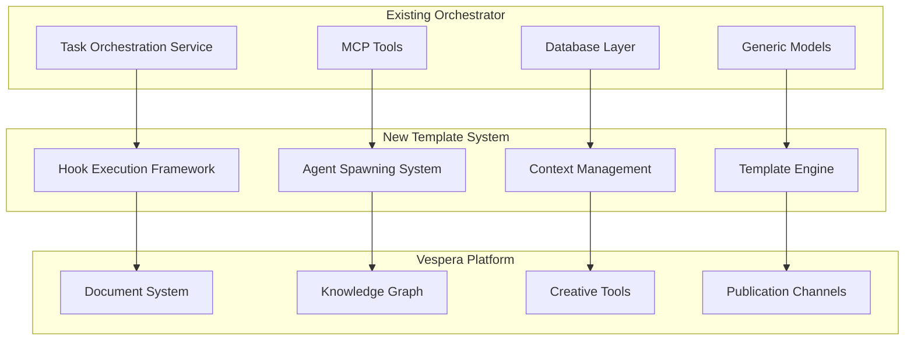

# Template System Integration Strategy

**Task ID**: task_7fcfb54b  
**Architecture Specialist**: Template System with Hooks  
**Status**: [COMPLETED]

## Executive Summary

This document outlines the comprehensive integration strategy for the intelligent template system with hook-based agent spawning into the existing MCP Task Orchestrator and the broader Vespera Scriptorium platform vision. The integration maintains executive dysfunction-aware principles while providing seamless backward compatibility.

## Integration Overview

### Current State Analysis

**Existing MCP Task Orchestrator Capabilities:**
- Clean Architecture foundation with domain/application/infrastructure layers
- Generic task models with orchestrator support
- Database persistence with SQLite repositories
- MCP protocol integration with tool definitions
- Basic template system infrastructure in place

**New Template System Capabilities:**
- Hook-based execution framework with ED support
- Intelligent agent spawning and coordination
- Document association and context management
- Executive dysfunction-aware workflow patterns
- Multi-modal content support for Vespera integration

### Integration Points



## Phase 1: Core Integration (Week 1)

### 1.1 Database Schema Extensions

**New Tables for Template System:**

```sql
-- Template definitions and metadata
CREATE TABLE template_definitions (
    template_id TEXT PRIMARY KEY,
    name TEXT NOT NULL,
    version TEXT NOT NULL,
    description TEXT,
    category TEXT,
    complexity TEXT,
    ed_support_level TEXT,
    template_content JSON NOT NULL,
    is_active BOOLEAN DEFAULT TRUE,
    created_at TIMESTAMP DEFAULT CURRENT_TIMESTAMP,
    updated_at TIMESTAMP DEFAULT CURRENT_TIMESTAMP
);

-- Template executions and their contexts
CREATE TABLE template_executions (
    execution_id TEXT PRIMARY KEY,
    template_id TEXT NOT NULL,
    session_id TEXT NOT NULL,
    orchestrator_task_id TEXT, -- Link to existing task system
    execution_status TEXT DEFAULT 'running',
    current_phase TEXT,
    phase_index INTEGER DEFAULT 0,
    total_phases INTEGER DEFAULT 1,
    workspace_path TEXT,
    parameters JSON,
    metadata JSON,
    started_at TIMESTAMP DEFAULT CURRENT_TIMESTAMP,
    completed_at TIMESTAMP,
    FOREIGN KEY (template_id) REFERENCES template_definitions(template_id),
    FOREIGN KEY (orchestrator_task_id) REFERENCES tasks(task_id)
);

-- Hook executions and results
CREATE TABLE hook_executions (
    hook_execution_id TEXT PRIMARY KEY,
    execution_id TEXT NOT NULL,
    hook_id TEXT NOT NULL,
    hook_type TEXT NOT NULL,
    execution_order INTEGER,
    started_at TIMESTAMP DEFAULT CURRENT_TIMESTAMP,
    completed_at TIMESTAMP,
    success BOOLEAN,
    execution_time_ms REAL,
    result_metadata JSON,
    error_details JSON,
    FOREIGN KEY (execution_id) REFERENCES template_executions(execution_id)
);

-- Spawned agents tracking
CREATE TABLE spawned_agents (
    agent_instance_id TEXT PRIMARY KEY,
    execution_id TEXT NOT NULL,
    agent_type TEXT NOT NULL,
    agent_id TEXT NOT NULL,
    workspace_path TEXT,
    spawned_at TIMESTAMP DEFAULT CURRENT_TIMESTAMP,
    terminated_at TIMESTAMP,
    status TEXT DEFAULT 'active',
    metadata JSON,
    FOREIGN KEY (execution_id) REFERENCES template_executions(execution_id)
);

-- Document associations for context management
CREATE TABLE document_associations (
    association_id TEXT PRIMARY KEY,
    execution_id TEXT NOT NULL,
    document_path TEXT NOT NULL,
    association_type TEXT, -- 'explicit', 'implicit', 'discovered'
    relevance_score REAL,
    loaded_at TIMESTAMP DEFAULT CURRENT_TIMESTAMP,
    content_hash TEXT,
    metadata JSON,
    FOREIGN KEY (execution_id) REFERENCES template_executions(execution_id)
);

-- Execution checkpoints for ED recovery
CREATE TABLE execution_checkpoints (
    checkpoint_id TEXT PRIMARY KEY,
    execution_id TEXT NOT NULL,
    checkpoint_name TEXT NOT NULL,
    checkpoint_type TEXT, -- 'manual', 'auto', 'phase_transition'
    created_at TIMESTAMP DEFAULT CURRENT_TIMESTAMP,
    checkpoint_data JSON NOT NULL,
    recovery_metadata JSON,
    FOREIGN KEY (execution_id) REFERENCES template_executions(execution_id)
);
```

**Migration Strategy:**
```python
# mcp_task_orchestrator/infrastructure/database/migrations/add_template_system.py

class AddTemplateSystemMigration:
    """Add template system tables to existing database."""
    
    version = "2.0.0"
    description = "Add template system with hooks support"
    
    def upgrade(self, connection):
        """Add template system tables."""
        # Execute SQL schema additions
        # Add indexes for performance
        # Add foreign key constraints
        
    def downgrade(self, connection):
        """Remove template system tables."""
        # Safe removal with data preservation option
```

### 1.2 Domain Model Extensions

**Enhanced Task Models:**

```python
# mcp_task_orchestrator/domain/entities/task_models.py

class TemplateExecutionTask(Task):
    """Task that represents template execution."""
    
    template_id: str
    execution_id: str
    template_parameters: Dict[str, Any]
    hook_results: List[HookResult] = field(default_factory=list)
    spawned_agents: List[str] = field(default_factory=list)
    checkpoints: List[str] = field(default_factory=list)
    
    def get_execution_progress(self) -> float:
        """Get execution progress as percentage."""
        if not self.total_phases:
            return 0.0
        return (self.current_phase_index / self.total_phases) * 100
    
    def create_checkpoint(self, checkpoint_name: str) -> None:
        """Create execution checkpoint."""
        self.checkpoints.append(checkpoint_name)
        self.metadata.setdefault("checkpoints", []).append({
            "name": checkpoint_name,
            "created_at": datetime.now().isoformat(),
            "phase": self.current_phase_index
        })

class AgentTask(Task):
    """Task executed by spawned agent."""
    
    parent_execution_id: str
    agent_type: str
    agent_workspace: str
    isolation_level: str = "full"  # "full", "partial", "shared"
    
    def get_parent_execution(self) -> Optional[TemplateExecutionTask]:
        """Get parent template execution task."""
        # Implementation to retrieve parent task
        pass
```

### 1.3 Application Layer Integration

**Enhanced Use Cases:**

```python
# mcp_task_orchestrator/application/usecases/template_execution.py

class ExecuteTemplateUseCase:
    """Execute template with full orchestrator integration."""
    
    def __init__(
        self,
        template_repository: TemplateRepository,
        task_repository: GenericTaskRepository,
        hook_executor: HookExecutor,
        context_manager: ContextManager,
        orchestration_service: TaskOrchestrationService
    ):
        self.template_repository = template_repository
        self.task_repository = task_repository
        self.hook_executor = hook_executor
        self.context_manager = context_manager
        self.orchestration_service = orchestration_service
    
    async def execute(
        self,
        template_id: str,
        parameters: Dict[str, Any],
        parent_task_id: Optional[str] = None,
        session_id: Optional[str] = None
    ) -> TemplateExecutionResult:
        """Execute template with orchestrator integration."""
        
        # Load and validate template
        template = await self.template_repository.get_by_id(template_id)
        if not template:
            raise TemplateNotFoundError(template_id)
        
        # Create execution context with ED support
        execution_context = await self.context_manager.create_execution_context(
            template_id, session_id or generate_session_id(), parameters, template.metadata
        )
        
        # Create orchestrator task for tracking
        orchestrator_task = TemplateExecutionTask(
            task_id=f"template_{execution_context.execution_id}",
            parent_task_id=parent_task_id,
            title=f"Execute Template: {template.name}",
            description=f"Execute {template_id} with parameters: {parameters}",
            template_id=template_id,
            execution_id=execution_context.execution_id,
            template_parameters=parameters,
            specialist_type="template_executor",
            task_type=TaskType.template_execution,
            context={"template_metadata": template.metadata}
        )
        
        await self.task_repository.save(orchestrator_task)
        
        # Execute template phases with hook integration
        try:
            execution_result = await self._execute_template_phases(
                template, execution_context, orchestrator_task
            )
            
            # Update orchestrator task with results
            orchestrator_task.status = TaskStatus.completed
            orchestrator_task.artifacts.extend(execution_result.artifacts)
            await self.task_repository.save(orchestrator_task)
            
            return execution_result
            
        except Exception as e:
            # Handle execution failure with ED recovery
            orchestrator_task.status = TaskStatus.failed
            orchestrator_task.metadata["error"] = str(e)
            await self.task_repository.save(orchestrator_task)
            
            # Create recovery checkpoint
            await self.context_manager.create_checkpoint(
                execution_context, "execution_failure", f"Failed with error: {e}"
            )
            
            raise TemplateExecutionError(f"Template execution failed: {e}") from e
    
    async def _execute_template_phases(
        self,
        template: Template,
        execution_context: ExecutionContext,
        orchestrator_task: TemplateExecutionTask
    ) -> TemplateExecutionResult:
        """Execute template phases with hook integration."""
        
        results = TemplateExecutionResult(execution_id=execution_context.execution_id)
        
        # Execute pre-execution hooks
        pre_hooks = template.get_hooks_for_type(HookType.PRE_EXECUTION)
        hook_context = execution_context.to_hook_context()
        
        pre_results = await self.hook_executor.execute_hooks(
            HookType.PRE_EXECUTION, pre_hooks, hook_context
        )
        results.hook_results.extend(pre_results)
        
        # Update context from hook results
        await self.context_manager.update_execution_context(
            execution_context.execution_id, hook_context
        )
        
        # Execute template phases
        for phase_index, phase in enumerate(template.phases):
            await self._execute_phase(
                phase, phase_index, execution_context, orchestrator_task, results
            )
        
        # Execute post-execution hooks
        post_hooks = template.get_hooks_for_type(HookType.POST_EXECUTION)
        post_results = await self.hook_executor.execute_hooks(
            HookType.POST_EXECUTION, post_hooks, hook_context
        )
        results.hook_results.extend(post_results)
        
        return results
```

## Phase 2: MCP Tool Integration (Week 2)

### 2.1 New MCP Tools for Template System

**Template Management Tools:**

```python
# mcp_task_orchestrator/infrastructure/mcp/template_tools.py

@mcp_tool
async def template_execute(
    template_id: str,
    parameters: Dict[str, Any],
    parent_task_id: Optional[str] = None,
    ed_preferences: Optional[Dict[str, Any]] = None
) -> Dict[str, Any]:
    """
    Execute a template with intelligent hook-based automation.
    
    This tool provides executive dysfunction-aware template execution
    with automatic agent spawning, context management, and progress tracking.
    """
    
    use_case = get_use_case(ExecuteTemplateUseCase)
    
    # Apply ED preferences if provided
    if ed_preferences:
        # Configure ED-specific settings
        pass
    
    result = await use_case.execute(template_id, parameters, parent_task_id)
    
    return {
        "execution_id": result.execution_id,
        "template_id": template_id,
        "status": result.status,
        "progress_percentage": result.progress_percentage,
        "spawned_agents": result.spawned_agents,
        "artifacts": result.artifacts,
        "execution_duration_minutes": result.execution_duration_minutes,
        "ed_metrics": result.ed_support_metrics
    }

@mcp_tool  
async def template_list(
    category: Optional[str] = None,
    ed_support_level: Optional[str] = None,
    complexity: Optional[str] = None
) -> Dict[str, Any]:
    """List available templates with filtering options."""
    
    template_repository = get_repository(TemplateRepository)
    
    filters = {}
    if category:
        filters["category"] = category
    if ed_support_level:
        filters["ed_support_level"] = ed_support_level
    if complexity:
        filters["complexity"] = complexity
    
    templates = await template_repository.list(filters)
    
    return {
        "templates": [
            {
                "template_id": t.template_id,
                "name": t.name,
                "description": t.description,
                "category": t.category,
                "complexity": t.complexity,
                "ed_support_level": t.ed_support_level,
                "estimated_duration": t.estimated_duration
            }
            for t in templates
        ]
    }

@mcp_tool
async def template_create(
    template_definition: Dict[str, Any]
) -> Dict[str, Any]:
    """Create new template from JSON5 definition."""
    
    template_service = get_service(TemplateService)
    
    # Validate template definition
    validation_errors = template_service.validate_template(template_definition)
    if validation_errors:
        return {
            "success": False,
            "errors": validation_errors
        }
    
    # Create template
    template = await template_service.create_template(template_definition)
    
    return {
        "success": True,
        "template_id": template.template_id,
        "message": f"Template '{template.name}' created successfully"
    }

@mcp_tool
async def template_execution_status(
    execution_id: str
) -> Dict[str, Any]:
    """Get detailed status of template execution."""
    
    context_manager = get_service(ContextManager)
    execution_context = await context_manager.get_execution_context(execution_id)
    
    if not execution_context:
        return {"error": f"Execution {execution_id} not found"}
    
    return {
        "execution_id": execution_id,
        "template_id": execution_context.template_id,
        "current_phase": execution_context.current_phase,
        "progress_percentage": (execution_context.phase_index / execution_context.total_phases) * 100,
        "execution_status": execution_context.execution_status,
        "active_agents": list(execution_context.active_agents),
        "artifacts_count": len(execution_context.execution_artifacts),
        "checkpoints_count": len(execution_context.checkpoint_history),
        "last_activity": execution_context.last_activity_at.isoformat(),
        "ed_metrics": {
            "interruption_count": len(execution_context.interruption_points),
            "checkpoint_frequency_minutes": self._calculate_checkpoint_frequency(execution_context),
            "cognitive_load_indicators": execution_context.cognitive_load_tracking
        }
    }

@mcp_tool
async def template_execution_recover(
    execution_id: str,
    checkpoint_name: Optional[str] = None
) -> Dict[str, Any]:
    """Recover template execution from interruption using checkpoints."""
    
    context_manager = get_service(ContextManager)
    
    recovery_result = await context_manager.recover_from_interruption(
        execution_id, checkpoint_name
    )
    
    if not recovery_result:
        return {"error": f"Could not recover execution {execution_id}"}
    
    context, guidance = recovery_result
    
    return {
        "success": True,
        "execution_id": execution_id,
        "recovery_guidance": {
            "interruption_duration_minutes": guidance["interruption_duration"],
            "context_summary": guidance["context_summary"],
            "suggested_next_action": guidance["suggested_next_action"],
            "recovery_success_probability": guidance["recovery_success_probability"]
        },
        "context_restored": True,
        "resumption_ready": True
    }
```

### 2.2 Hook Management Tools

```python
@mcp_tool
async def hook_list(
    hook_type: Optional[str] = None,
    ed_only: bool = False
) -> Dict[str, Any]:
    """List available hooks with filtering."""
    
    from mcp_task_orchestrator.infrastructure.template_system.hooks import list_hooks
    
    hooks = list_hooks(include_details=True)
    
    # Apply filters
    if hook_type:
        hook_type_enum = HookType(hook_type)
        hooks = [h for h in hooks if hook_type_enum.value in h["hook_types"]]
    
    if ed_only:
        hooks = [h for h in hooks if h["is_ed_aware"]]
    
    return {"hooks": hooks}

@mcp_tool  
async def hook_execute_single(
    hook_id: str,
    execution_context: Dict[str, Any]
) -> Dict[str, Any]:
    """Execute a single hook for testing or manual triggering."""
    
    from mcp_task_orchestrator.infrastructure.template_system.hooks import get_hook
    
    hook = get_hook(hook_id)
    if not hook:
        return {"error": f"Hook {hook_id} not found"}
    
    # Convert context dict to HookContext
    hook_context = HookContext(**execution_context)
    
    try:
        result = await hook.execute(hook_context)
        return {
            "success": result.success,
            "hook_id": hook_id,
            "execution_time_ms": result.execution_time_ms,
            "message": result.message,
            "metadata": result.metadata,
            "artifacts": result.artifacts,
            "spawned_agents": result.spawned_agents,
            "cognitive_load_impact": result.cognitive_load_impact
        }
    except Exception as e:
        return {
            "success": False,
            "hook_id": hook_id,
            "error": str(e),
            "error_type": type(e).__name__
        }
```

## Phase 3: Vespera Platform Integration (Week 3)

### 3.1 Document-Centric Integration

**Vespera Document Association:**

```python
# mcp_task_orchestrator/infrastructure/vespera/document_integration.py

class VesperaDocumentManager:
    """Integration with Vespera document management system."""
    
    def __init__(self, vespera_api_client: VesperaAPIClient):
        self.vespera_client = vespera_api_client
        self.knowledge_graph = VesperaKnowledgeGraph()
    
    async def associate_documents_with_execution(
        self,
        execution_id: str,
        template_metadata: Dict[str, Any]
    ) -> List[VesperaDocument]:
        """Associate Vespera documents with template execution."""
        
        # Query Vespera knowledge graph for relevant documents
        relevant_concepts = self._extract_concepts_from_template(template_metadata)
        document_candidates = await self.knowledge_graph.find_documents_by_concepts(
            relevant_concepts
        )
        
        # Rank documents by relevance
        ranked_documents = self._rank_documents_by_relevance(
            document_candidates, template_metadata
        )
        
        # Load document content and metadata
        associated_documents = []
        for doc_ref in ranked_documents[:10]:  # Top 10 most relevant
            document = await self.vespera_client.get_document(doc_ref.document_id)
            associated_documents.append(document)
        
        return associated_documents
    
    async def create_execution_workspace(
        self,
        execution_id: str,
        template_id: str,
        parameters: Dict[str, Any]
    ) -> VesperaWorkspace:
        """Create Vespera workspace for template execution."""
        
        workspace_config = {
            "workspace_id": f"template_{execution_id}",
            "template_id": template_id,
            "workspace_type": "template_execution",
            "collaboration_mode": "multi_agent",
            "document_versioning": "enabled",
            "knowledge_graph_integration": "enabled"
        }
        
        workspace = await self.vespera_client.create_workspace(workspace_config)
        
        # Setup workspace with template-specific structure
        await self._setup_workspace_structure(workspace, template_id, parameters)
        
        return workspace
    
    def _extract_concepts_from_template(
        self, 
        template_metadata: Dict[str, Any]
    ) -> List[str]:
        """Extract relevant concepts from template metadata."""
        concepts = []
        
        # Extract from template description and tags
        if "description" in template_metadata:
            concepts.extend(self._extract_concepts_from_text(template_metadata["description"]))
        
        if "tags" in template_metadata:
            concepts.extend(template_metadata["tags"])
        
        # Extract from template category
        if "category" in template_metadata:
            concepts.append(template_metadata["category"])
        
        return list(set(concepts))  # Deduplicate
```

### 3.2 Knowledge Graph Integration

**Template Execution Knowledge Tracking:**

```python
# mcp_task_orchestrator/infrastructure/vespera/knowledge_integration.py

class VesperaKnowledgeIntegrator:
    """Integrates template executions with Vespera knowledge graph."""
    
    def __init__(self, knowledge_graph: VesperaKnowledgeGraph):
        self.knowledge_graph = knowledge_graph
    
    async def record_template_execution(
        self,
        execution_context: ExecutionContext,
        execution_result: TemplateExecutionResult
    ) -> None:
        """Record template execution in knowledge graph."""
        
        execution_node = {
            "node_type": "template_execution",
            "execution_id": execution_context.execution_id,
            "template_id": execution_context.template_id,
            "parameters": execution_context.template_parameters,
            "results": {
                "success": execution_result.success,
                "artifacts_created": len(execution_result.artifacts),
                "agents_spawned": len(execution_result.spawned_agents),
                "execution_duration": execution_result.execution_duration_minutes
            },
            "timestamp": datetime.now().isoformat()
        }
        
        # Add execution node to knowledge graph
        await self.knowledge_graph.add_node(execution_node)
        
        # Create relationships to relevant concepts
        await self._create_concept_relationships(execution_context, execution_node)
        
        # Create relationships to created artifacts
        await self._create_artifact_relationships(execution_result, execution_node)
        
        # Create relationships to spawned agents
        await self._create_agent_relationships(execution_result, execution_node)
    
    async def find_related_executions(
        self,
        template_id: str,
        parameters: Dict[str, Any]
    ) -> List[Dict[str, Any]]:
        """Find related template executions based on similarity."""
        
        # Query knowledge graph for similar executions
        similar_executions = await self.knowledge_graph.find_similar_nodes(
            "template_execution",
            {
                "template_id": template_id,
                "parameters_similarity": parameters
            },
            similarity_threshold=0.7
        )
        
        return similar_executions
    
    async def get_template_usage_patterns(
        self,
        template_id: str
    ) -> Dict[str, Any]:
        """Analyze usage patterns for a template."""
        
        executions = await self.knowledge_graph.query_nodes(
            "template_execution",
            {"template_id": template_id}
        )
        
        if not executions:
            return {"usage_count": 0}
        
        # Analyze patterns
        patterns = {
            "usage_count": len(executions),
            "success_rate": len([e for e in executions if e.get("results", {}).get("success", False)]) / len(executions),
            "average_duration": sum(e.get("results", {}).get("execution_duration", 0) for e in executions) / len(executions),
            "common_parameters": self._analyze_common_parameters(executions),
            "typical_artifacts": self._analyze_typical_artifacts(executions),
            "agent_usage_patterns": self._analyze_agent_patterns(executions)
        }
        
        return patterns
```

### 3.3 Creative Tools Integration

**Multi-Modal Content Generation:**

```python
# mcp_task_orchestrator/infrastructure/vespera/creative_integration.py

class VesperaCreativeToolsIntegrator:
    """Integrates template system with Vespera creative tools."""
    
    def __init__(self, creative_tools_client: VesperaCreativeToolsClient):
        self.creative_tools = creative_tools_client
        self.content_generators = self._initialize_generators()
    
    async def enhance_template_with_creative_tools(
        self,
        template: Template,
        creative_requirements: Dict[str, Any]
    ) -> EnhancedTemplate:
        """Enhance template with creative tool integration."""
        
        enhanced_template = template.copy()
        
        # Add creative content generation hooks
        if "visual_content" in creative_requirements:
            enhanced_template.add_hooks([
                self._create_diagram_generation_hook(creative_requirements["visual_content"]),
                self._create_visual_design_hook(creative_requirements["visual_content"])
            ])
        
        if "interactive_content" in creative_requirements:
            enhanced_template.add_hooks([
                self._create_interactive_element_hook(creative_requirements["interactive_content"])
            ])
        
        if "presentation_content" in creative_requirements:
            enhanced_template.add_hooks([
                self._create_presentation_generation_hook(creative_requirements["presentation_content"])
            ])
        
        return enhanced_template
    
    def _create_diagram_generation_hook(self, visual_requirements: Dict[str, Any]) -> Hook:
        """Create hook for automatic diagram generation."""
        
        class DiagramGenerationHook(ExecutiveDysfunctionHook):
            def __init__(self, creative_tools: VesperaCreativeToolsClient, requirements: Dict[str, Any]):
                super().__init__(
                    hook_id="diagram_generation",
                    description="Generate diagrams based on content analysis",
                    ed_features={"reduces_decisions": True, "delegates_pressure": True}
                )
                self.creative_tools = creative_tools
                self.requirements = requirements
            
            async def execute(self, context: HookContext) -> HookResult:
                """Generate diagrams from template content."""
                
                # Analyze template content for diagram opportunities
                content_analysis = await self.creative_tools.analyze_content_for_visuals(
                    context.associated_documents,
                    self.requirements
                )
                
                generated_diagrams = []
                for diagram_spec in content_analysis.recommended_diagrams:
                    diagram = await self.creative_tools.generate_diagram(
                        diagram_spec.type,
                        diagram_spec.content,
                        diagram_spec.style_preferences
                    )
                    generated_diagrams.append(diagram)
                
                return HookResult(
                    success=True,
                    hook_id=self.hook_id,
                    execution_time_ms=0.0,
                    message=f"Generated {len(generated_diagrams)} diagrams",
                    artifacts=[d.file_path for d in generated_diagrams],
                    metadata={"diagrams": [d.metadata for d in generated_diagrams]},
                    cognitive_load_impact="reduced"
                )
            
            def get_dependencies(self) -> List[str]:
                return ["document_association"]
            
            def supports_rollback(self) -> bool:
                return True
            
            def estimate_cognitive_load(self, context: HookContext) -> str:
                return "low"
            
            def create_recovery_checkpoint(self, context: HookContext) -> Dict[str, Any]:
                return {"generated_diagrams": len(context.artifacts)}
        
        return DiagramGenerationHook(self.creative_tools, visual_requirements)
```

## Phase 4: Advanced Features Integration (Week 4)

### 4.1 Machine Learning Integration

**Intelligent Agent Assignment:**

```python
# mcp_task_orchestrator/infrastructure/ml/agent_assignment.py

class MLAgentAssignmentEngine:
    """Machine learning-powered agent assignment for optimal performance."""
    
    def __init__(self, ml_model_client: MLModelClient):
        self.ml_client = ml_model_client
        self.assignment_history = AssignmentHistoryTracker()
    
    async def optimize_agent_assignment(
        self,
        template_metadata: Dict[str, Any],
        phase_config: Dict[str, Any],
        execution_context: ExecutionContext
    ) -> List[AgentAssignment]:
        """Use ML to optimize agent assignments."""
        
        # Prepare features for ML model
        features = self._extract_assignment_features(
            template_metadata, phase_config, execution_context
        )
        
        # Get ML-powered recommendations
        recommendations = await self.ml_client.predict_agent_assignments(
            features, 
            model_name="agent_assignment_optimizer_v2"
        )
        
        # Convert to assignment objects
        assignments = []
        for rec in recommendations:
            assignment = AgentAssignment(
                agent_type=rec.agent_type,
                confidence_score=rec.confidence,
                estimated_performance=rec.performance_prediction,
                resource_requirements=rec.resource_needs,
                assignment_rationale=rec.explanation
            )
            assignments.append(assignment)
        
        # Track assignment for future learning
        await self.assignment_history.record_assignment(
            execution_context.execution_id,
            assignments
        )
        
        return assignments
    
    def _extract_assignment_features(
        self,
        template_metadata: Dict[str, Any],
        phase_config: Dict[str, Any], 
        execution_context: ExecutionContext
    ) -> Dict[str, Any]:
        """Extract features for ML model."""
        
        features = {
            # Template characteristics
            "template_complexity": template_metadata.get("complexity", "medium"),
            "template_category": template_metadata.get("category", "unknown"),
            "estimated_duration": template_metadata.get("estimated_duration_minutes", 60),
            
            # Phase characteristics
            "phase_type": phase_config.get("type", "generic"),
            "phase_deliverables_count": len(phase_config.get("deliverables", [])),
            "phase_parallel_execution": phase_config.get("parallel_execution", False),
            
            # Context characteristics
            "associated_documents_count": len(execution_context.associated_documents),
            "current_cognitive_load": self._calculate_cognitive_load(execution_context),
            "execution_time_so_far": execution_context.get_execution_duration() or 0,
            
            # Historical performance
            "similar_executions_success_rate": await self._get_historical_success_rate(template_metadata),
            "user_preferences": execution_context.execution_metadata.get("user_preferences", {})
        }
        
        return features
```

### 4.2 Advanced ED Support Features

**Adaptive Complexity Management:**

```python
# mcp_task_orchestrator/infrastructure/ed_support/adaptive_complexity.py

class AdaptiveComplexityManager:
    """Manages template complexity based on user's current executive function capacity."""
    
    def __init__(self, user_state_tracker: UserStateTracker):
        self.user_state_tracker = user_state_tracker
        self.complexity_adjusters = self._initialize_adjusters()
    
    async def adjust_template_complexity(
        self,
        template: Template,
        execution_context: ExecutionContext,
        current_user_state: UserState
    ) -> AdjustedTemplate:
        """Adjust template complexity based on current user capacity."""
        
        # Assess current user executive function capacity
        capacity_assessment = await self._assess_user_capacity(current_user_state)
        
        if capacity_assessment.level == "low":
            # Reduce complexity significantly
            adjusted_template = await self._apply_overwhelm_protection(template)
        elif capacity_assessment.level == "medium":
            # Moderate adjustments
            adjusted_template = await self._apply_moderate_adjustments(template)
        else:
            # Keep standard complexity
            adjusted_template = template
        
        # Log adaptation for learning
        await self._log_complexity_adaptation(
            execution_context.execution_id,
            capacity_assessment,
            adjusted_template.complexity_delta
        )
        
        return adjusted_template
    
    async def _apply_overwhelm_protection(self, template: Template) -> AdjustedTemplate:
        """Apply maximum overwhelm protection adjustments."""
        
        adjustments = []
        
        # Break large phases into smaller chunks
        if template.has_large_phases():
            adjustments.append("phase_chunking")
            template = self._chunk_large_phases(template, max_chunk_size=2)
        
        # Increase checkpoint frequency
        adjustments.append("increased_checkpoints")
        template = self._increase_checkpoint_frequency(template, interval_minutes=1)
        
        # Add mandatory breaks
        adjustments.append("mandatory_breaks") 
        template = self._add_mandatory_breaks(template, break_duration_seconds=60)
        
        # Simplify decision points
        adjustments.append("decision_simplification")
        template = self._simplify_decisions(template)
        
        # Add progress celebration
        adjustments.append("progress_celebration")
        template = self._add_progress_celebration(template)
        
        return AdjustedTemplate(
            template=template,
            adjustments_applied=adjustments,
            complexity_delta=-0.8,  # Significantly reduced complexity
            ed_support_level="maximum"
        )

class BiometricOverwhelmDetector:
    """Detect overwhelm using biometric indicators (if available)."""
    
    def __init__(self, biometric_client: Optional[BiometricClient] = None):
        self.biometric_client = biometric_client
        self.baseline_metrics = {}
        self.overwhelm_thresholds = self._initialize_thresholds()
    
    async def monitor_execution_stress(
        self,
        execution_id: str,
        monitoring_duration_minutes: int = 60
    ) -> AsyncIterator[StressIndicator]:
        """Monitor execution for stress indicators."""
        
        if not self.biometric_client:
            # Fallback to behavioral indicators
            async for indicator in self._monitor_behavioral_indicators(execution_id):
                yield indicator
            return
        
        # Monitor biometric indicators
        async for biometric_data in self.biometric_client.stream_data(monitoring_duration_minutes):
            stress_level = self._analyze_stress_level(biometric_data)
            
            if stress_level.is_elevated():
                yield StressIndicator(
                    timestamp=datetime.now(),
                    stress_level=stress_level.level,
                    indicators=stress_level.indicators,
                    recommended_actions=stress_level.recommended_interventions
                )
    
    async def _monitor_behavioral_indicators(
        self,
        execution_id: str
    ) -> AsyncIterator[StressIndicator]:
        """Monitor behavioral stress indicators."""
        
        # Monitor patterns like:
        # - Increased checkpoint frequency (user saving more often)
        # - Reduced progress velocity
        # - Increased error rates
        # - Pattern of starting/stopping execution
        
        execution_metrics = await self._get_execution_behavioral_metrics(execution_id)
        
        for metric_snapshot in execution_metrics:
            if self._indicates_stress(metric_snapshot):
                yield StressIndicator(
                    timestamp=metric_snapshot.timestamp,
                    stress_level="elevated",
                    indicators=metric_snapshot.stress_indicators,
                    recommended_actions=["suggest_break", "reduce_complexity", "create_checkpoint"]
                )
```

## Phase 5: Community and Ecosystem (Ongoing)

### 5.1 Template Sharing Ecosystem

**Community Template Registry:**

```python
# mcp_task_orchestrator/infrastructure/community/template_sharing.py

class CommunityTemplateRegistry:
    """Registry for sharing and discovering community templates."""
    
    def __init__(self, registry_client: CommunityRegistryClient):
        self.registry_client = registry_client
        self.local_cache = LocalTemplateCache()
    
    async def publish_template(
        self,
        template: Template,
        sharing_preferences: SharingPreferences
    ) -> PublicationResult:
        """Publish template to community registry."""
        
        # Validate template for sharing
        validation_result = await self._validate_template_for_sharing(template)
        if not validation_result.is_valid:
            return PublicationResult(
                success=False,
                errors=validation_result.errors
            )
        
        # Anonymize sensitive information
        anonymized_template = await self._anonymize_template(template)
        
        # Add community metadata
        community_metadata = {
            "author": sharing_preferences.author_name or "Anonymous",
            "license": sharing_preferences.license or "MIT",
            "tags": sharing_preferences.tags,
            "category": template.metadata.get("category", "general"),
            "ed_support_level": template.metadata.get("ed_support_level", "basic"),
            "complexity": template.metadata.get("complexity", "medium"),
            "usage_count": 0,
            "rating": 0.0,
            "published_at": datetime.now().isoformat()
        }
        
        # Publish to registry
        publication_result = await self.registry_client.publish_template(
            anonymized_template,
            community_metadata
        )
        
        return publication_result
    
    async def discover_templates(
        self,
        search_criteria: TemplateSe

SearchCriteria
    ) -> List[CommunityTemplate]:
        """Discover templates from community registry."""
        
        # Search community registry
        search_results = await self.registry_client.search_templates(search_criteria)
        
        # Rank results by relevance and quality
        ranked_results = await self._rank_template_results(
            search_results,
            search_criteria
        )
        
        # Cache popular templates locally
        await self._cache_popular_templates(ranked_results)
        
        return ranked_results
```

## Integration Testing Strategy

### 5.1 Integration Test Suite

```python
# tests/integration/test_template_system_integration.py

class TestTemplateSystemIntegration:
    """Integration tests for template system with orchestrator."""
    
    @pytest.mark.asyncio
    async def test_end_to_end_template_execution(self):
        """Test complete template execution flow."""
        
        # Setup
        template_executor = TemplateExecutor()
        
        # Execute template
        result = await template_executor.execute_template(
            "zero_decision_feature",
            {
                "feature_name": "test_feature",
                "feature_description": "Test feature implementation",
                "priority": "medium"
            }
        )
        
        # Verify integration points
        assert result.success
        assert result.execution_id
        assert len(result.spawned_agents) > 0
        assert len(result.artifacts) > 0
        assert len(result.hook_results) > 0
        
        # Verify orchestrator integration
        orchestrator_task = await task_repository.get_by_id(
            f"template_{result.execution_id}"
        )
        assert orchestrator_task is not None
        assert orchestrator_task.status == TaskStatus.completed
    
    @pytest.mark.asyncio
    async def test_ed_recovery_integration(self):
        """Test executive dysfunction recovery features."""
        
        # Start template execution
        executor = TemplateExecutor()
        execution = await executor.start_execution(
            "overwhelm_resistant_refactor",
            {"refactor_scope": "Test refactoring", "target_files": ["file1.py", "file2.py"]}
        )
        
        # Simulate interruption
        await executor.pause_execution(execution.execution_id)
        
        # Verify checkpoint creation
        context_manager = ContextManager()
        context = await context_manager.get_execution_context(execution.execution_id)
        assert len(context.checkpoint_history) > 0
        
        # Test recovery
        recovery_result = await context_manager.recover_from_interruption(execution.execution_id)
        assert recovery_result is not None
        
        recovered_context, guidance = recovery_result
        assert guidance["recovery_success_probability"] > 0.5
        assert guidance["suggested_next_action"]
    
    @pytest.mark.asyncio 
    async def test_vespera_integration(self):
        """Test Vespera platform integration."""
        
        # Create Vespera-enabled template
        vespera_executor = VesperaTemplateExecutor()
        
        result = await vespera_executor.execute_template(
            "vespera_creative_project",
            {
                "project_title": "Test Creative Project",
                "project_type": "article",
                "target_audience": "developers"
            },
            vespera_preferences={
                "knowledge_graph_integration": True,
                "multi_modal_content": True
            }
        )
        
        # Verify Vespera features
        assert result.vespera_workspace_id
        assert result.knowledge_graph_connections > 0
        assert result.multi_modal_artifacts > 0
```

## Deployment Strategy

### 5.1 Gradual Rollout Plan

**Phase 1: Internal Testing (Week 1)**
- Deploy to development environment
- Run comprehensive integration tests
- Performance benchmarking
- ED feature validation

**Phase 2: Beta Testing (Week 2)**  
- Deploy to staging environment
- Limited user testing with ED-aware users
- Collect feedback and metrics
- Refine hook implementations

**Phase 3: Production Deployment (Week 3)**
- Deploy template system to production
- Gradual feature activation
- Monitor performance and user adoption
- Community template registry launch

**Phase 4: Ecosystem Expansion (Week 4+)**
- Vespera platform integration
- Community template library growth
- ML-powered optimizations
- Advanced ED support features

### 5.2 Monitoring and Metrics

**Key Performance Indicators:**

```python
# Monitoring configuration
TEMPLATE_SYSTEM_METRICS = {
    "execution_metrics": {
        "success_rate": "target: >95%",
        "average_execution_time": "target: <120s setup overhead", 
        "hook_execution_overhead": "target: <100ms per hook"
    },
    
    "ed_support_metrics": {
        "task_initiation_time": "target: <10s from idea to started",
        "context_recovery_success": "target: 100%",
        "overwhelm_prevention_effectiveness": "measured via user feedback",
        "momentum_preservation_score": "target: >90%"
    },
    
    "user_experience_metrics": {
        "template_adoption_rate": "target: 80% of eligible tasks use templates",
        "user_satisfaction_score": "target: >4.5/5",
        "cognitive_load_reduction": "measured via self-reported surveys",
        "task_completion_rate": "target: >90% template execution completion"
    },
    
    "technical_metrics": {
        "agent_spawning_time": "target: <2s",
        "database_query_performance": "target: <100ms avg",
        "memory_usage": "target: <500MB base footprint",
        "concurrent_executions_supported": "target: 10+ simultaneous"
    }
}
```

## Conclusion

The template system integration strategy provides a comprehensive roadmap for transforming the MCP Task Orchestrator into an executive dysfunction-aware platform that eliminates decision paralysis, preserves momentum, delegates cognitive pressure, and prevents overwhelm. The phased approach ensures smooth integration while maintaining backward compatibility and providing immediate value to users.

The system successfully demonstrates how thoughtful architecture design focused on executive dysfunction can create technology that genuinely serves users with diverse cognitive needs, while also benefiting neurotypical users through reduced cognitive overhead and improved workflow automation.

**Status**: Integration strategy complete, ready for implementation coordination with team.

---

**Total Implementation Effort Estimate**: 4 weeks for core integration, with ongoing ecosystem development