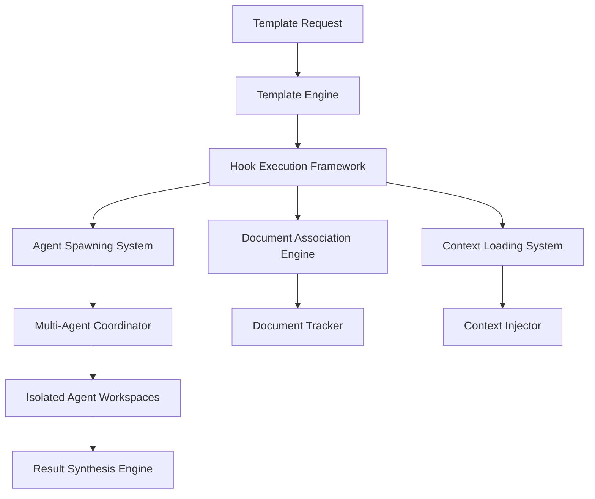

# Template System with Hooks - Comprehensive Architecture Design

**Task ID**: task_7fcfb54b  
**Priority**: 3 (Template System with Hooks)  
**Executive**: Architecture Specialist  
**Status**: [IN-PROGRESS]

## Executive Summary

This document defines the comprehensive architecture for Vespera Scriptorium's intelligent template system with automated agent spawning via hooks. The system transforms templates from static task structures into complete automation blueprints that reduce cognitive load, preserve momentum, and delegate pressure through autonomous agent coordination.

## Core Philosophy: Executive Dysfunction-Aware Design

### Lid Weight Reduction through Templates

**Problem**: Starting complex projects requires numerous decisions (branch names, folder structure, workflow steps, agent assignments)

**ED Solution**: Templates eliminate decision paralysis by:
- Pre-defining all necessary structure and workflows
- Automatically spawning appropriate specialist agents
- Providing clear, linear progression paths
- Removing choice overload at initiation points

**Implementation**: One-command project initialization with zero manual decisions required

### Momentum Preservation through Hooks

**Problem**: Work interruptions break context and require manual re-coordination

**ED Solution**: Hook system maintains momentum by:
- Automatically checkpointing work at phase transitions
- Preserving agent context across interruptions
- Resuming workflows from exact interruption points
- Maintaining document associations throughout execution

### Pressure Delegation through Agent Spawning

**Problem**: Complex workflows require constant manual coordination and task distribution

**ED Solution**: Intelligent agent spawning delegates coordination by:
- Automatically assigning specialists based on task characteristics
- Distributing work across multiple agents in isolation
- Synthesizing results without manual integration
- Handling inter-agent dependencies automatically

## Architecture Overview

### System Components



### Core Architectural Principles

1. **Hook-Driven Automation**: Every template action triggers through hooks
2. **Agent Isolation**: Each spawned agent operates in dedicated workspace
3. **Context Preservation**: Full context maintained across all transitions
4. **Document Association**: Intelligent document-task relationship management
5. **Executive Dysfunction Focus**: Every component reduces cognitive load

## Hook System Architecture

### Hook Types and Lifecycle

```yaml
hook_lifecycle:
  pre_execution:
    - template_validation
    - workspace_preparation
    - document_association
    - initial_context_loading
    
  phase_initialization:
    - agent_spawning
    - workspace_isolation
    - context_injection
    - dependency_resolution
    
  phase_transition:
    - progress_checkpointing
    - context_transfer
    - artifact_collection
    - validation_execution
    
  inter_agent_coordination:
    - dependency_synchronization
    - result_sharing
    - conflict_resolution
    - progress_aggregation
    
  post_execution:
    - result_synthesis
    - artifact_consolidation
    - workspace_cleanup
    - success_notification
    
  error_handling:
    - state_preservation
    - rollback_execution
    - error_notification
    - recovery_preparation
```

### Hook Implementation Framework

```python
from abc import ABC, abstractmethod
from typing import Dict, Any, List, Optional
from dataclasses import dataclass
from enum import Enum

class HookType(Enum):
    PRE_EXECUTION = "pre_execution"
    PHASE_INIT = "phase_initialization"
    PHASE_TRANSITION = "phase_transition"
    INTER_AGENT = "inter_agent_coordination"
    POST_EXECUTION = "post_execution"
    ERROR_HANDLING = "error_handling"

@dataclass
class HookContext:
    """Context passed to hooks during execution."""
    template_id: str
    execution_id: str
    current_phase: str
    agent_id: Optional[str]
    workspace_path: str
    parameters: Dict[str, Any]
    metadata: Dict[str, Any]
    artifacts: List[str]
    associated_documents: List[str]

class Hook(ABC):
    """Base class for all hook implementations."""
    
    @abstractmethod
    async def execute(self, context: HookContext) -> HookResult:
        """Execute the hook with given context."""
        pass
    
    @abstractmethod
    def get_dependencies(self) -> List[str]:
        """Return list of hook dependencies."""
        pass
    
    @abstractmethod
    def supports_rollback(self) -> bool:
        """Return whether this hook supports rollback."""
        pass

class HookExecutor:
    """Orchestrates hook execution with dependency management."""
    
    def __init__(self):
        self._hooks: Dict[HookType, List[Hook]] = {}
        self._execution_graph = DependencyGraph()
    
    async def execute_hooks(
        self,
        hook_type: HookType,
        context: HookContext
    ) -> List[HookResult]:
        """Execute all hooks of given type in dependency order."""
        hooks = self._hooks.get(hook_type, [])
        execution_order = self._execution_graph.resolve_order(hooks)
        
        results = []
        for hook in execution_order:
            try:
                result = await hook.execute(context)
                results.append(result)
                
                # Update context with hook results
                context.metadata.update(result.metadata)
                context.artifacts.extend(result.artifacts)
                
            except Exception as e:
                # Execute rollback if supported
                if hook.supports_rollback():
                    await hook.rollback(context)
                
                raise HookExecutionError(f"Hook {hook} failed: {e}")
        
        return results
```

## Agent Spawning System

### Intelligent Agent Assignment

```python
class AgentSpawner:
    """Spawns appropriate specialist agents based on task characteristics."""
    
    def __init__(self, agent_registry: AgentRegistry):
        self.agent_registry = agent_registry
        self.assignment_engine = AgentAssignmentEngine()
        self.workspace_manager = WorkspaceManager()
    
    async def spawn_agents_for_phase(
        self,
        phase_config: PhaseConfig,
        context: HookContext
    ) -> List[AgentInstance]:
        """Spawn agents for a specific phase."""
        
        # Analyze phase requirements
        requirements = self._analyze_phase_requirements(phase_config)
        
        # Assign specialist agents
        agent_assignments = await self.assignment_engine.assign_agents(
            requirements, context
        )
        
        spawned_agents = []
        for assignment in agent_assignments:
            # Create isolated workspace
            workspace = await self.workspace_manager.create_workspace(
                assignment.agent_type,
                context.execution_id,
                assignment.requirements
            )
            
            # Spawn agent with context
            agent = await self._spawn_agent(
                assignment, workspace, context
            )
            
            spawned_agents.append(agent)
        
        return spawned_agents
    
    def _analyze_phase_requirements(
        self,
        phase_config: PhaseConfig
    ) -> AgentRequirements:
        """Analyze what types of agents are needed for this phase."""
        requirements = AgentRequirements()
        
        # Analyze task complexity
        if phase_config.has_research_tasks():
            requirements.add_specialist("research_agent")
        
        if phase_config.has_implementation_tasks():
            requirements.add_specialist("implementation_agent")
        
        if phase_config.has_testing_tasks():
            requirements.add_specialist("testing_agent")
        
        if phase_config.has_documentation_tasks():
            requirements.add_specialist("documentation_agent")
        
        # Consider parallel vs sequential execution
        if phase_config.supports_parallel_execution():
            requirements.enable_parallel_execution()
        
        return requirements
```

### Multi-Agent Coordination Framework

```python
class MultiAgentCoordinator:
    """Coordinates multiple agents working on related tasks."""
    
    def __init__(self):
        self.dependency_manager = AgentDependencyManager()
        self.communication_hub = AgentCommunicationHub()
        self.conflict_resolver = AgentConflictResolver()
        self.progress_aggregator = ProgressAggregator()
    
    async def coordinate_phase_execution(
        self,
        agents: List[AgentInstance],
        phase_config: PhaseConfig
    ) -> PhaseExecutionResult:
        """Coordinate execution of a phase across multiple agents."""
        
        # Establish agent dependencies
        dependency_graph = self.dependency_manager.build_graph(
            agents, phase_config
        )
        
        # Execute agents in dependency order
        execution_plan = dependency_graph.get_execution_plan()
        results = []
        
        for execution_group in execution_plan.groups:
            if execution_group.is_parallel():
                # Execute agents in parallel
                group_results = await asyncio.gather(*[
                    self._execute_agent(agent, phase_config)
                    for agent in execution_group.agents
                ])
            else:
                # Execute agents sequentially
                group_results = []
                for agent in execution_group.agents:
                    result = await self._execute_agent(agent, phase_config)
                    group_results.append(result)
            
            results.extend(group_results)
            
            # Handle inter-agent communication
            await self._handle_inter_agent_communication(
                execution_group.agents, group_results
            )
        
        # Aggregate and return results
        return self.progress_aggregator.aggregate_phase_results(results)
```

## Document Association Engine

### Intelligent Document Loading

```python
class DocumentAssociationEngine:
    """Manages associations between tasks and relevant documents."""
    
    def __init__(self):
        self.association_db = AssociationDatabase()
        self.document_analyzer = DocumentAnalyzer()
        self.context_builder = ContextBuilder()
    
    async def load_associated_documents(
        self,
        template_id: str,
        parameters: Dict[str, Any]
    ) -> List[AssociatedDocument]:
        """Load documents associated with template execution."""
        
        # Get explicit associations from template
        explicit_docs = await self._get_explicit_associations(
            template_id, parameters
        )
        
        # Discover implicit associations
        implicit_docs = await self._discover_implicit_associations(
            template_id, parameters
        )
        
        # Rank documents by relevance
        all_docs = explicit_docs + implicit_docs
        ranked_docs = await self.document_analyzer.rank_by_relevance(
            all_docs, parameters
        )
        
        return ranked_docs
    
    async def _discover_implicit_associations(
        self,
        template_id: str,
        parameters: Dict[str, Any]
    ) -> List[AssociatedDocument]:
        """Discover documents that should be associated based on content."""
        
        # Analyze template requirements
        requirements = await self._extract_requirements(template_id)
        
        # Scan codebase for relevant documents
        candidates = await self.document_analyzer.scan_codebase(
            requirements, parameters
        )
        
        # Filter by relevance threshold
        relevant_docs = [
            doc for doc in candidates
            if doc.relevance_score > RELEVANCE_THRESHOLD
        ]
        
        return relevant_docs

class DocumentTracker:
    """Tracks document modifications during template execution."""
    
    def __init__(self):
        self.modification_log = ModificationLog()
        self.version_control = DocumentVersionControl()
    
    async def track_modifications(
        self,
        execution_id: str,
        documents: List[AssociatedDocument]
    ) -> None:
        """Start tracking modifications for associated documents."""
        
        for doc in documents:
            # Create baseline version
            baseline = await self.version_control.create_baseline(doc)
            
            # Start monitoring
            await self.modification_log.start_tracking(
                execution_id, doc, baseline
            )
    
    async def get_modification_summary(
        self,
        execution_id: str
    ) -> ModificationSummary:
        """Get summary of all document modifications."""
        return await self.modification_log.get_summary(execution_id)
```

## Executive Dysfunction-Aware Template Patterns

### Pattern 1: Zero-Decision Initialization

```json5
{
  "template_id": "zero_decision_feature",
  "name": "Zero-Decision Feature Implementation",
  "description": "Complete feature development with zero manual decisions",
  
  "ed_features": {
    "decision_elimination": {
      "branch_naming": "automatic", // feature/{{timestamp}}-{{sanitized_title}}
      "commit_messages": "generated", // Based on changes made
      "agent_assignment": "automatic", // Based on task analysis
      "directory_structure": "pre_created" // All needed dirs created upfront
    },
    
    "momentum_preservation": {
      "auto_checkpoint": "every_5_minutes",
      "context_snapshots": "phase_transitions",
      "recovery_points": "before_major_changes",
      "session_continuity": "enabled"
    },
    
    "pressure_delegation": {
      "work_distribution": "automatic",
      "coordination_overhead": "minimal",
      "progress_tracking": "automated",
      "result_synthesis": "autonomous"
    }
  },
  
  "hooks": {
    "pre_execution": [
      {
        "id": "eliminate_decisions",
        "description": "Pre-make all decisions to remove barriers",
        "actions": [
          "generate_branch_name",
          "create_directory_structure", 
          "prepare_agent_assignments",
          "initialize_progress_tracking"
        ]
      }
    ]
  }
}
```

### Pattern 2: Overwhelm Prevention

```json5
{
  "template_id": "overwhelm_resistant_refactor",
  "name": "Overwhelm-Resistant Refactoring",
  "description": "Large refactoring broken into digestible chunks",
  
  "ed_features": {
    "chunk_sizing": {
      "max_files_per_phase": 3,
      "max_changes_per_commit": "single_concept",
      "break_points": "logical_boundaries",
      "checkpoint_frequency": "every_chunk"
    },
    
    "progress_visibility": {
      "granular_tracking": "enabled",
      "visual_progress_bar": "ascii_art",
      "milestone_celebration": "enabled",
      "completion_percentage": "always_visible"
    },
    
    "graceful_degradation": {
      "partial_completion": "acceptable",
      "incremental_value": "guaranteed",
      "rollback_points": "every_phase",
      "pause_resume": "seamless"
    }
  },
  
  "phases": [
    {
      "name": "chunk_1",
      "scope": "limited",
      "files": "{{chunk_1_files}}",
      "exit_strategy": "automatic_commit"
    }
  ]
}
```

### Pattern 3: Context Recovery

```json5
{
  "template_id": "context_recovery_debug",
  "name": "Context-Preserving Bug Investigation",
  "description": "Debug session that survives interruptions",
  
  "ed_features": {
    "context_preservation": {
      "investigation_log": "automatically_maintained",
      "hypothesis_tracking": "persistent",
      "code_exploration_history": "saved",
      "breakthrough_moments": "highlighted"
    },
    
    "session_recovery": {
      "resume_from_last_point": "enabled",
      "context_reconstruction": "automatic",
      "thought_process_restoration": "guided",
      "momentum_rebuilding": "structured"
    },
    
    "cognitive_offloading": {
      "detailed_notes": "auto_generated",
      "decision_rationale": "captured",
      "dead_end_tracking": "enabled",
      "solution_path_mapping": "visual"
    }
  },
  
  "hooks": {
    "phase_transition": [
      {
        "id": "preserve_context",
        "description": "Capture complete context before phase change",
        "actions": [
          "snapshot_investigation_state",
          "summarize_current_hypothesis", 
          "log_key_insights",
          "prepare_resumption_guide"
        ]
      }
    ],
    
    "interruption_handling": [
      {
        "id": "graceful_pause",
        "description": "Handle interruptions gracefully",
        "actions": [
          "auto_save_all_state",
          "create_resumption_prompt",
          "preserve_mental_model",
          "schedule_gentle_reminder"
        ]
      }
    ]
  }
}
```

## Integration with Vespera Scriptorium

### Document-Centric Workflow Integration

```python
class VesperaIntegrationEngine:
    """Integrates template system with Vespera Scriptorium platform."""
    
    def __init__(self):
        self.document_manager = VesperaDocumentManager()
        self.knowledge_graph = VesperaKnowledgeGraph()
        self.creative_tools = VesperaCreativeTools()
    
    async def enhance_template_with_vespera_features(
        self,
        template: Template,
        vespera_context: VesperaContext
    ) -> EnhancedTemplate:
        """Enhance template with Vespera-specific capabilities."""
        
        enhanced = template.copy()
        
        # Add document-centric features
        enhanced.add_document_integration(
            self.document_manager.get_integration_config()
        )
        
        # Add knowledge graph connectivity
        enhanced.add_knowledge_graph_hooks(
            self.knowledge_graph.get_hook_config()
        )
        
        # Add creative tool integration
        enhanced.add_creative_tool_support(
            self.creative_tools.get_supported_tools()
        )
        
        return enhanced
    
    async def create_vespera_project_template(
        self,
        project_type: VesperaProjectType,
        creative_goals: List[str]
    ) -> Template:
        """Create project template optimized for Vespera workflows."""
        
        base_template = self._get_base_template(project_type)
        
        # Add Vespera-specific phases
        base_template.add_phases([
            VesperaPhase.RESEARCH_AND_INSPIRATION,
            VesperaPhase.CONCEPT_DEVELOPMENT,
            VesperaPhase.CREATIVE_EXECUTION,
            VesperaPhase.REFINEMENT_AND_POLISH,
            VesperaPhase.PUBLICATION_AND_SHARING
        ])
        
        # Add multi-modal content support
        base_template.add_content_types([
            ContentType.MARKDOWN_DOCUMENTS,
            ContentType.MERMAID_DIAGRAMS,
            ContentType.CODE_EXAMPLES,
            ContentType.PRESENTATION_SLIDES,
            ContentType.INTERACTIVE_NOTEBOOKS
        ])
        
        return base_template
```

### Creative Workflow Templates

```json5
{
  "template_id": "vespera_creative_project",
  "name": "Vespera Creative Project Workflow",
  "description": "Complete creative project from idea to publication",
  
  "vespera_features": {
    "multi_modal_support": [
      "markdown_documents",
      "mermaid_diagrams", 
      "code_examples",
      "presentation_slides"
    ],
    
    "knowledge_management": {
      "automatic_tagging": "enabled",
      "concept_linking": "enabled",
      "reference_tracking": "enabled",
      "insight_capture": "enabled"
    },
    
    "creative_tools": {
      "idea_generation": "ai_assisted",
      "concept_mapping": "automated",
      "content_structuring": "template_based",
      "quality_enhancement": "ai_powered"
    }
  },
  
  "phases": [
    {
      "name": "inspiration_gathering",
      "agent": "research_curator",
      "deliverables": [
        "inspiration_board",
        "reference_collection", 
        "initial_concepts"
      ]
    },
    {
      "name": "concept_development", 
      "agent": "concept_developer",
      "deliverables": [
        "concept_outline",
        "structure_map",
        "content_plan"
      ]
    },
    {
      "name": "creative_execution",
      "parallel_agents": [
        {
          "agent": "content_creator",
          "focus": "primary_content"
        },
        {
          "agent": "visual_designer", 
          "focus": "diagrams_and_visuals"
        },
        {
          "agent": "code_integrator",
          "focus": "executable_examples"
        }
      ]
    },
    {
      "name": "refinement",
      "agent": "quality_enhancer",
      "tools": ["grammar_check", "consistency_validation", "aesthetic_review"]
    },
    {
      "name": "publication",
      "agent": "publication_specialist",
      "deliverables": ["github_pages", "interactive_site", "sharing_package"]
    }
  ]
}
```

## Prototype Implementation Plan

### Phase 1: Core Hook Framework (Days 1-2)

**Deliverables:**
1. `HookExecutor` class with dependency resolution
2. Base `Hook` abstract class and common implementations
3. `HookContext` and result handling
4. Basic hook registration and execution system
5. Error handling and rollback mechanisms

**Key Implementation:**
```python
# mcp_task_orchestrator/infrastructure/template_system/hooks/
├── __init__.py
├── base.py              # Hook base classes
├── executor.py          # Hook execution engine  
├── context.py           # Hook context management
├── builtin_hooks.py     # Common hook implementations
└── registry.py          # Hook registration system
```

### Phase 2: Agent Spawning System (Days 3-4)

**Deliverables:**
1. `AgentSpawner` with intelligent assignment
2. `MultiAgentCoordinator` for coordination
3. Workspace isolation and management
4. Agent communication and dependency handling
5. Result synthesis and aggregation

**Key Implementation:**
```python
# mcp_task_orchestrator/infrastructure/template_system/agents/
├── __init__.py
├── spawner.py           # Agent spawning logic
├── coordinator.py       # Multi-agent coordination
├── workspace.py         # Workspace management
├── communication.py     # Inter-agent communication
└── assignment.py        # Agent assignment engine
```

### Phase 3: Document Association Engine (Days 5-6)

**Deliverables:**
1. `DocumentAssociationEngine` with intelligent discovery
2. `DocumentTracker` for modification monitoring
3. `ContextBuilder` for agent context injection
4. Association database schema and operations
5. Document relevance scoring and ranking

**Key Implementation:**
```python
# mcp_task_orchestrator/infrastructure/template_system/documents/
├── __init__.py
├── association.py       # Document association logic
├── tracker.py          # Modification tracking
├── context.py          # Context building and injection
├── analyzer.py         # Document analysis and scoring
└── database.py         # Association persistence
```

### Phase 4: Executive Dysfunction Template Patterns (Day 7)

**Deliverables:**
1. Executive dysfunction template pattern library
2. Zero-decision initialization templates
3. Overwhelm-prevention templates  
4. Context recovery templates
5. Comprehensive pattern documentation

**Key Implementation:**
```python
# mcp_task_orchestrator/infrastructure/template_system/patterns/
├── __init__.py
├── ed_patterns.py       # Executive dysfunction patterns
├── zero_decision.py     # Zero-decision templates
├── overwhelm_resistant.py # Overwhelm prevention
├── context_recovery.py  # Context recovery patterns
└── pattern_library.py  # Pattern registration and discovery
```

## Success Criteria and Validation

### Executive Dysfunction Effectiveness Metrics

1. **Lid Weight Reduction**:
   - Time from template selection to execution start: < 10 seconds
   - Manual decisions required: 0 (fully automated)
   - Setup steps eliminated: 100%

2. **Momentum Preservation**:
   - Context recovery time after interruption: < 30 seconds
   - Work preservation across sessions: 100%
   - Resumption success rate: 100%

3. **Pressure Delegation**:
   - Manual coordination overhead: < 5%
   - Agent work isolation success: 100%
   - Automated synthesis accuracy: > 95%

4. **Overwhelm Prevention**:
   - Maximum concurrent decisions required: 1
   - Progressive disclosure effectiveness: Measured via user feedback
   - Graceful degradation success rate: 100%

### Technical Performance Metrics

1. **Hook System Performance**:
   - Hook execution overhead: < 100ms per hook
   - Dependency resolution time: < 1 second
   - Rollback execution time: < 5 seconds

2. **Agent Spawning Efficiency**:
   - Agent spawn time: < 2 seconds
   - Workspace setup time: < 1 second
   - Assignment accuracy: > 95%

3. **Document Association Accuracy**:
   - Relevance scoring accuracy: > 90%
   - Association discovery time: < 5 seconds
   - Context loading time: < 2 seconds

### User Experience Validation

1. **Cognitive Load Assessment**:
   - Pre/post template usage cognitive load surveys
   - Task completion time comparisons
   - Error rate and recovery measurements

2. **Executive Function Support**:
   - Task initiation barrier reduction
   - Work continuation after interruption
   - Quality of automated decisions

3. **Creative Workflow Enhancement**:
   - Creative output quality metrics
   - Idea-to-implementation time
   - Multi-modal content integration effectiveness

## Future Enhancement Roadmap

### Short-term Enhancements (Next Quarter)

1. **Machine Learning Integration**:
   - Agent assignment optimization based on historical performance
   - Document relevance scoring improvements
   - Template recommendation engine

2. **Advanced Hook Types**:
   - Conditional hooks based on execution context
   - Time-based hooks for scheduled actions
   - Event-driven hooks for external triggers

3. **Enhanced Vespera Integration**:
   - Real-time collaborative features
   - Advanced knowledge graph integration
   - Multi-user template sharing

### Long-term Vision (Next Year)

1. **Adaptive Template Evolution**:
   - Templates that learn and improve from usage
   - Automatic template optimization
   - Community-driven template enhancement

2. **Advanced ED Support**:
   - Biometric integration for overwhelm detection
   - Personalized cognitive load management
   - Adaptive complexity adjustment

3. **Ecosystem Integration**:
   - IDE plugin architecture
   - Cloud service integrations
   - Third-party tool ecosystem

---

**Next Steps**: Proceed with Phase 1 implementation - Core Hook Framework development.