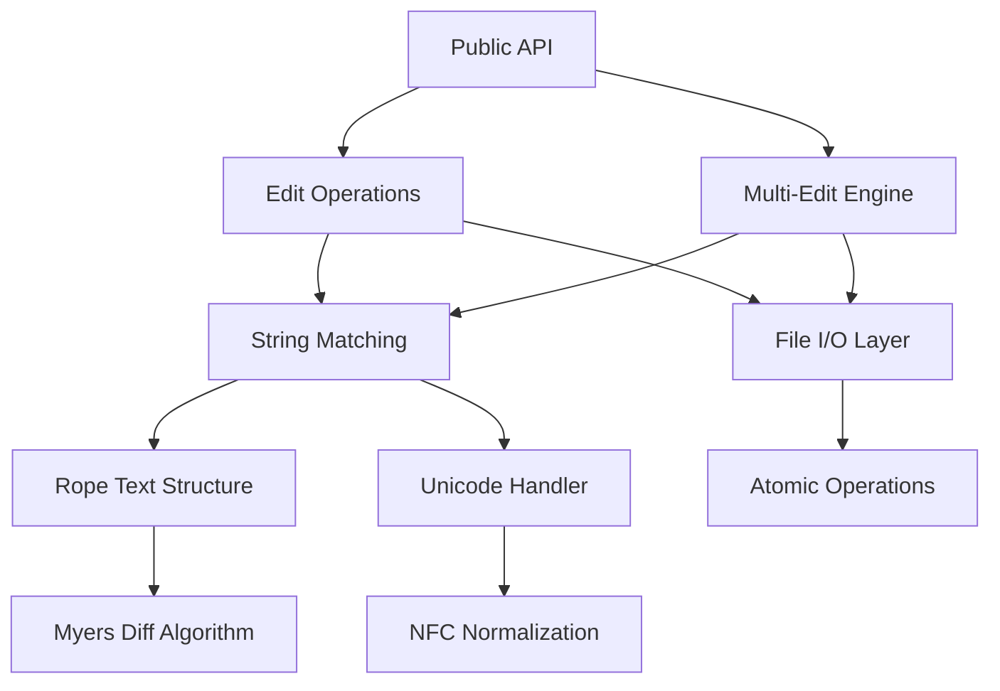

# Vespera File Operations Library - System Architecture

## Executive Summary

The `vespera-file-ops` library provides precise, Unicode-aware string replacement operations for file editing with exact whitespace preservation. Built as a high-performance Rust library, it serves as the core backend for multiple frontend systems including VS Code extensions, Obsidian plugins, and Python MCP servers.

## 1. System Overview

### 1.1 Architecture Principles

- **Library-First Design**: Pure library architecture with minimal public API surface
- **Zero-Copy Operations**: Efficient string processing with minimal allocations
- **Unicode Correctness**: Full UTF-8 support with NFC normalization and character boundary respect
- **Atomic File Operations**: Safe file modifications with rollback capability
- **Performance Optimized**: Memory mapping for large files, SIMD-accelerated searching
- **Extensible Design**: Clean separation of concerns enabling future enhancements

### 1.2 Core Components



## 2. Module Architecture

### 2.1 Directory Structure

```
src/
├── lib.rs              # Public API surface and re-exports
├── error.rs            # Comprehensive error types with thiserror
├── types.rs            # Core data structures (EditOperation, Results)
├── edit/               # Edit operation implementations
│   ├── mod.rs          # Edit module organization
│   ├── operation.rs    # EditOperation core logic
│   ├── single.rs       # Single string replacement
│   ├── multi.rs        # Sequential multi-edit processing
│   └── matcher.rs      # String matching engine with Myers diff
├── rope/               # Text representation and manipulation
│   ├── mod.rs          # Rope abstraction layer
│   ├── adapter.rs      # Rope<->String conversion utilities
│   └── operations.rs   # Rope-specific edit operations
├── unicode/            # Unicode handling and normalization
│   ├── mod.rs          # Unicode utilities interface
│   ├── normalize.rs    # NFC normalization implementation
│   ├── boundary.rs     # Character boundary detection
│   └── validation.rs   # UTF-8 validation and error reporting
├── io/                 # File system operations
│   ├── mod.rs          # File I/O interface
│   ├── reader.rs       # Efficient file reading strategies
│   ├── writer.rs       # Atomic file writing with temp files
│   └── memory_map.rs   # Memory-mapped file handling
└── perf/               # Performance optimization utilities
    ├── mod.rs          # Performance utilities interface
    ├── simd.rs         # SIMD-accelerated operations
    └── allocation.rs   # Memory management strategies
```

### 2.2 Module Responsibilities

#### 2.2.1 Public API (`lib.rs`)
- **Purpose**: Minimal, clean interface for library consumers
- **Responsibilities**:
  - Re-export core types (`EditOperation`, `EditResult`, `MultiEditResult`)
  - Re-export error types (`EditError`, `Result`)
  - Provide main entry points (`edit_file`, `multi_edit_file`)
  - Version and feature management

#### 2.2.2 Error Handling (`error.rs`)
- **Purpose**: Comprehensive error taxonomy with structured information
- **Responsibilities**:
  - Define all error variants with context
  - Implement `thiserror` traits for rich error messages
  - Provide error recovery information
  - Support error chaining and root cause analysis

#### 2.2.3 Core Types (`types.rs`)
- **Purpose**: Fundamental data structures shared across modules
- **Responsibilities**:
  - `EditOperation` definition and validation
  - Result types with detailed metadata
  - Performance and statistics tracking
  - Serialization support for cross-language bindings

#### 2.2.4 Edit Operations (`edit/`)
- **Purpose**: Core string replacement logic
- **Responsibilities**:
  - Single and multi-edit orchestration
  - String pattern matching with Myers diff
  - Sequential edit application with state management
  - Performance optimization for common patterns

#### 2.2.5 Text Structure (`rope/`)
- **Purpose**: Efficient text representation and manipulation
- **Responsibilities**:
  - Wrap `ropey` crate with domain-specific operations
  - Optimize for typical editing patterns
  - Handle large text efficiently
  - Provide conversion utilities

#### 2.2.6 Unicode Support (`unicode/`)
- **Purpose**: Correct Unicode handling across all operations
- **Responsibilities**:
  - UTF-8 validation and error reporting
  - NFC normalization for consistent representation
  - Character boundary detection and preservation
  - Grapheme cluster handling for complex scripts

#### 2.2.7 File I/O (`io/`)
- **Purpose**: Safe, efficient file system operations
- **Responsibilities**:
  - Atomic file updates with temp files
  - Memory mapping for large files (>8MB)
  - Streaming for very large files (>100MB)
  - Cross-platform file handling

#### 2.2.8 Performance (`perf/`)
- **Purpose**: Performance optimization utilities
- **Responsibilities**:
  - SIMD-accelerated string operations
  - Memory allocation strategies
  - Performance monitoring and metrics
  - Optimization heuristics

## 3. Public API Design

### 3.1 Core API Surface

```rust
//! Primary public interface
pub use edit::{EditOperation, EditResult, MultiEditResult};
pub use error::{EditError, Result};

/// Perform a single edit operation on a file
pub fn edit_file<P: AsRef<Path>>(
    path: P,
    operation: EditOperation
) -> Result<EditResult>;

/// Perform multiple sequential edit operations on a file
pub fn multi_edit_file<P: AsRef<Path>>(
    path: P,
    operations: Vec<EditOperation>
) -> Result<MultiEditResult>;

/// Perform edit operation on string content (for testing/in-memory)
pub fn edit_string(
    content: &str,
    operation: EditOperation
) -> Result<EditResult>;

/// Perform multiple edits on string content
pub fn multi_edit_string(
    content: &str,
    operations: Vec<EditOperation>
) -> Result<MultiEditResult>;
```

### 3.2 Core Data Structures

```rust
/// Configuration for a single string replacement operation
#[derive(Debug, Clone, PartialEq, Eq)]
pub struct EditOperation {
    /// The exact string to search for (literal matching, no regex)
    pub old_string: String,
    
    /// The replacement string
    pub new_string: String,
    
    /// If true, replace all occurrences; if false, replace only first
    pub replace_all: bool,
}

/// Result of a single edit operation
#[derive(Debug, Clone, PartialEq, Eq)]
pub struct EditResult {
    /// Number of replacements made
    pub replacements_made: usize,
    
    /// The modified text content
    pub content: String,
    
    /// Performance metrics
    pub metrics: PerformanceMetrics,
    
    /// Whether any changes were made
    pub changed: bool,
}

/// Result of multiple sequential edit operations  
#[derive(Debug, Clone, PartialEq, Eq)]
pub struct MultiEditResult {
    /// Total number of replacements across all operations
    pub total_replacements: usize,
    
    /// Number of operations that found matches
    pub successful_operations: usize,
    
    /// The final modified text content
    pub content: String,
    
    /// Detailed results for each operation
    pub operation_results: Vec<SingleOperationResult>,
    
    /// Combined performance metrics
    pub metrics: PerformanceMetrics,
    
    /// Whether any changes were made
    pub changed: bool,
}

/// Performance and diagnostic information
#[derive(Debug, Clone, PartialEq, Eq, Default)]
pub struct PerformanceMetrics {
    /// Time spent processing (microseconds)
    pub processing_time_micros: u64,
    
    /// Peak memory usage (bytes)
    pub peak_memory_bytes: usize,
    
    /// Number of string allocations made
    pub allocations_count: usize,
    
    /// Size of original content (bytes)
    pub original_size_bytes: usize,
    
    /// Size of final content (bytes) 
    pub final_size_bytes: usize,
}
```

### 3.3 Error Types

```rust
/// Comprehensive error types for all failure scenarios
#[derive(Error, Debug)]
pub enum EditError {
    /// Empty pattern provided (invalid operation)
    #[error("Empty search pattern is not allowed")]
    EmptyPattern,
    
    /// File system related errors
    #[error("File not found: {path}")]
    FileNotFound { path: String },
    
    #[error("Permission denied accessing file: {path}")]
    PermissionDenied { path: String },
    
    #[error("File too large for processing: {size} bytes (max: {max_size})")]
    FileTooLarge { size: u64, max_size: u64 },
    
    /// Text encoding errors
    #[error("Invalid UTF-8 encoding at byte position {position}: {details}")]
    InvalidUtf8 { position: usize, details: String },
    
    #[error("Unicode normalization failed: {details}")]
    UnicodeNormalization { details: String },
    
    /// Memory and resource errors
    #[error("Out of memory during operation (requested: {requested} bytes)")]
    OutOfMemory { requested: usize },
    
    #[error("Operation timeout after {seconds} seconds")]
    Timeout { seconds: u64 },
    
    /// Low-level I/O errors
    #[error("I/O error: {0}")]
    Io(#[from] std::io::Error),
    
    /// Internal consistency errors (should not occur in normal usage)
    #[error("Internal error: {details}")]
    Internal { details: String },
}

/// Specialized Result type for this library
pub type Result<T> = std::result::Result<T, EditError>;
```

## 4. Internal Implementation Strategy

### 4.1 String Matching Engine

#### 4.1.1 Myers Diff Algorithm Integration
- **Core Algorithm**: Myers O(ND) diff for finding optimal edit sequences
- **Implementation**: Custom Myers implementation optimized for substring replacement
- **Performance**: O(nm + d²) where n,m are string lengths, d is edit distance
- **Memory Usage**: O(d²) space complexity with path compression

```rust
// Conceptual internal API
struct MyersMatcher {
    /// Find exact string matches using Myers algorithm
    fn find_matches(&self, haystack: &str, needle: &str) -> Vec<Match>;
    
    /// Find single match (optimized path)
    fn find_first_match(&self, haystack: &str, needle: &str) -> Option<Match>;
    
    /// Compute edit sequence for replacement
    fn compute_replacement(&self, text: &str, pattern: &str, replacement: &str) -> EditSequence;
}
```

#### 4.1.2 SIMD Acceleration
- **Library**: `memchr` for fast byte-level operations
- **Use Cases**: Initial pattern scanning, character counting
- **Fallback**: Pure Rust implementation for unsupported platforms

### 4.2 Text Representation Strategy

#### 4.2.1 Rope Data Structure (Ropey)
- **Primary Text Structure**: `ropey::Rope` for efficient large text handling
- **Benefits**: O(log n) insertions/deletions, efficient slicing
- **UTF-8 Native**: All operations use char indices, not byte indices
- **Memory Efficiency**: 2-4x overhead vs raw strings, excellent for large texts

```rust
// Internal rope operations
struct TextBuffer {
    rope: Rope,
    original_size: usize,
    
    /// Apply single edit operation
    fn apply_edit(&mut self, edit: &EditOperation) -> Result<usize>;
    
    /// Convert to final string
    fn into_string(self) -> String;
    
    /// Get performance metrics
    fn metrics(&self) -> PerformanceMetrics;
}
```

#### 4.2.2 Small Text Optimization
- **Threshold**: Texts <1KB use direct String operations
- **Rationale**: Avoid rope overhead for small files
- **Implementation**: Automatic strategy selection based on content size

### 4.3 Unicode Handling Strategy

#### 4.3.1 Normalization Pipeline
- **Form**: NFC (Canonical Decomposition followed by Canonical Composition)
- **Library**: `unicode-normalization` crate
- **Application**: All input strings normalized before processing
- **Performance**: Lazy normalization only when needed

#### 4.3.2 Character Boundary Safety
- **Validation**: All string operations validate UTF-8 character boundaries
- **Error Recovery**: Detailed error reporting with byte positions
- **Grapheme Awareness**: Handle complex grapheme clusters (emojis, combining chars)

```rust
// Internal Unicode utilities
struct UnicodeHandler {
    /// Normalize string to NFC form
    fn normalize_nfc(&self, s: &str) -> Cow<str>;
    
    /// Validate and find safe character boundaries
    fn safe_char_boundary(&self, s: &str, byte_pos: usize) -> usize;
    
    /// Check if position is safe for splitting
    fn is_char_boundary(&self, s: &str, pos: usize) -> bool;
}
```

### 4.4 File I/O Strategy

#### 4.4.1 Size-Based Strategy Selection
- **Small Files** (<8MB): Read entirely into memory
- **Medium Files** (8-100MB): Memory mapping with `memmap2`
- **Large Files** (>100MB): Streaming processing with chunking
- **Atomic Updates**: All modifications use temporary files with atomic rename

#### 4.4.2 Cross-Platform Considerations
- **Line Endings**: Preserve original line ending style (Unix/Windows/Mac)
- **Permissions**: Maintain original file permissions and metadata
- **Encoding**: UTF-8 only with BOM preservation where present

```rust
// Internal I/O strategy
enum FileStrategy {
    InMemory(String),
    MemoryMapped(Mmap),
    Streaming(StreamingReader),
}

impl FileStrategy {
    /// Select optimal strategy based on file size
    fn for_file(path: &Path) -> Result<Self>;
    
    /// Apply edits using chosen strategy
    fn apply_edits(&mut self, operations: &[EditOperation]) -> Result<String>;
}
```

## 5. Error Handling Philosophy

### 5.1 Error Design Principles

#### 5.1.1 Structured Error Information
- **Context Preservation**: Every error includes relevant context
- **Recovery Guidance**: Errors suggest possible recovery actions
- **Programmatic Handling**: Library consumers can handle specific error types
- **Human Readable**: Clear error messages for debugging and logging

#### 5.1.2 Error Propagation Strategy
- **No Panics**: Library never panics on invalid input
- **Early Validation**: Input validation at API boundaries
- **Error Chaining**: Preserve underlying error causes
- **Performance**: Error handling adds minimal overhead to success path

### 5.2 Error Categorization

```rust
impl EditError {
    /// Check if error indicates a transient condition
    pub fn is_retryable(&self) -> bool;
    
    /// Get user-facing error message
    pub fn user_message(&self) -> String;
    
    /// Get detailed technical information
    pub fn technical_details(&self) -> String;
    
    /// Extract file path if error is file-related
    pub fn file_path(&self) -> Option<&str>;
}
```

## 6. Performance Characteristics

### 6.1 Time Complexity

| Operation | Best Case | Average Case | Worst Case | Notes |
|-----------|-----------|--------------|------------|-------|
| Single Edit | O(n) | O(n) | O(nm) | n=text, m=pattern |
| Multi Edit | O(kn) | O(kn) | O(knm) | k=operations |
| Large File | O(n/B) | O(n) | O(n²) | B=block size |
| Unicode Norm | O(n) | O(n) | O(n) | Linear in chars |

### 6.2 Space Complexity

| Scenario | Memory Usage | Notes |
|----------|--------------|-------|
| Small Text (<1KB) | O(n) | Direct string operations |
| Medium Text (1KB-8MB) | O(n) | In-memory processing |
| Large Text (8-100MB) | O(log n) | Memory mapping |
| Very Large (>100MB) | O(B) | Streaming, B=buffer size |

### 6.3 Performance Optimizations

#### 6.3.1 Algorithm Optimizations
- **Early Termination**: Stop processing when no more patterns possible
- **String Interning**: Reuse common pattern strings
- **Batch Operations**: Group operations to minimize string allocations
- **Lazy Evaluation**: Defer expensive operations until necessary

#### 6.3.2 Memory Optimizations
- **Capacity Pre-allocation**: Reserve space based on content analysis
- **Buffer Reuse**: Recycle temporary buffers across operations
- **Copy-on-Write**: Use `Cow<str>` to avoid unnecessary allocations
- **Memory Mapping**: Leverage OS virtual memory for large files

#### 6.3.3 SIMD Acceleration
- **Pattern Scanning**: Use `memchr` for initial pattern detection
- **Character Counting**: SIMD-accelerated line/character counting
- **Validation**: Fast UTF-8 validation using SIMD instructions
- **Fallback Support**: Graceful degradation on unsupported platforms

## 7. Extension Points and Future Features

### 7.1 Designed Extensibility

#### 7.1.1 Plugin Architecture
- **Matching Strategies**: Pluggable string matching algorithms
- **Text Formats**: Support for non-UTF-8 encodings via traits
- **Preprocessing**: Hooks for text transformation before editing
- **Postprocessing**: Hooks for text validation after editing

#### 7.1.2 Feature Flags
```toml
[features]
default = ["std", "simd"]
std = []
simd = ["memchr/std"]
unicode-normalization = ["dep:unicode-normalization"]
regex-support = ["dep:regex"]
streaming = ["dep:tokio"]
python-bindings = ["dep:pyo3"]
node-bindings = ["dep:neon"]
```

### 7.2 Planned Future Features

#### 7.2.1 Phase 2: Document Chunking
- **Smart Chunking**: Content-aware text segmentation
- **Parallel Processing**: Multi-threaded editing of large documents
- **Syntax Awareness**: Language-specific chunking strategies
- **Memory Streaming**: Process arbitrarily large files

#### 7.2.2 Phase 3: Advanced Features
- **Regex Support**: Optional regex pattern matching
- **Undo/Redo**: Edit history and reversal capability
- **Collaborative Editing**: CRDT-compatible operations
- **Incremental Updates**: Efficient re-processing of changed content

### 7.3 Binding Strategy

#### 7.3.1 Language Bindings
- **Python**: PyO3-based bindings with async support
- **Node.js**: Neon-based bindings with N-API
- **WebAssembly**: Browser-compatible WASM bindings
- **C/C++**: FFI-compatible interface for native integration

#### 7.3.2 Cross-Language Considerations
- **Error Serialization**: JSON-serializable error information
- **Progress Callbacks**: Support for progress reporting across FFI
- **Memory Management**: Safe memory handling across language boundaries
- **Unicode Consistency**: Consistent Unicode handling across all bindings

## 8. Testing and Validation Strategy

### 8.1 Testing Architecture

#### 8.1.1 Test Categories
- **Unit Tests**: Individual function and module testing
- **Integration Tests**: Public API testing with real files
- **Property Tests**: Invariant verification with `proptest`
- **Fuzz Tests**: Coverage-guided testing with `cargo-fuzz`
- **Benchmark Tests**: Performance regression detection with `criterion`

#### 8.1.2 Test Organization
```
tests/
├── unit/               # Unit tests by module
├── integration/        # End-to-end API tests
├── property/           # Property-based invariant tests
├── regression/         # Specific bug reproduction tests
└── common/            # Shared test utilities

benches/               # Performance benchmarks
fuzz/                  # Fuzzing targets and corpus
```

### 8.2 Quality Assurance

#### 8.2.1 Invariant Testing
```rust
// Key invariants verified by property tests
prop_assert!(edit_twice_idempotent(text, pattern, replacement));
prop_assert!(unicode_boundaries_preserved(text, edit_result));
prop_assert!(content_size_bounded(text, operations));
prop_assert!(replacement_count_accurate(text, pattern, count));
```

#### 8.2.2 Edge Case Coverage
- **Unicode Edge Cases**: All Unicode categories, normalization forms
- **File System Edge Cases**: Permissions, large files, concurrent access
- **Memory Edge Cases**: Out-of-memory, allocation failures
- **Performance Edge Cases**: Pathological inputs, resource exhaustion

#### 8.2.3 Continuous Validation
- **CI Pipeline**: Automated testing on multiple platforms
- **Memory Safety**: Miri testing for undefined behavior detection
- **Performance Monitoring**: Benchmark tracking and regression alerts
- **Coverage Tracking**: Code coverage with detailed branch analysis

## 9. Security Considerations

### 9.1 Input Validation
- **Pattern Validation**: Reject empty patterns, oversized inputs
- **File Path Validation**: Prevent path traversal attacks
- **Memory Bounds**: Protect against memory exhaustion attacks
- **UTF-8 Validation**: Reject malformed Unicode sequences

### 9.2 Safe Defaults
- **No Network Operations**: Library operates only on local files
- **No Code Execution**: No evaluation of dynamic code or expressions
- **Memory Safety**: All operations memory-safe by construction
- **Atomic Operations**: File operations are atomic or rollback cleanly

## 10. Conclusion

The `vespera-file-ops` library architecture provides a robust foundation for precise text editing operations. The design balances performance, correctness, and maintainability while providing a clean API for multiple frontend systems.

Key architectural strengths:
- **Clean Separation**: Modular design with clear responsibilities
- **Performance Optimized**: Multiple strategies for different file sizes
- **Unicode Correct**: Full UTF-8 support with proper normalization
- **Extensively Tested**: Comprehensive testing strategy with multiple approaches
- **Future Extensible**: Clear extension points for advanced features

The architecture satisfies all 133+ behavioral scenarios identified in the specifications while maintaining the flexibility to evolve with future requirements. The implementation plan that follows this architecture will deliver a production-ready library suitable for integration into diverse software ecosystems.