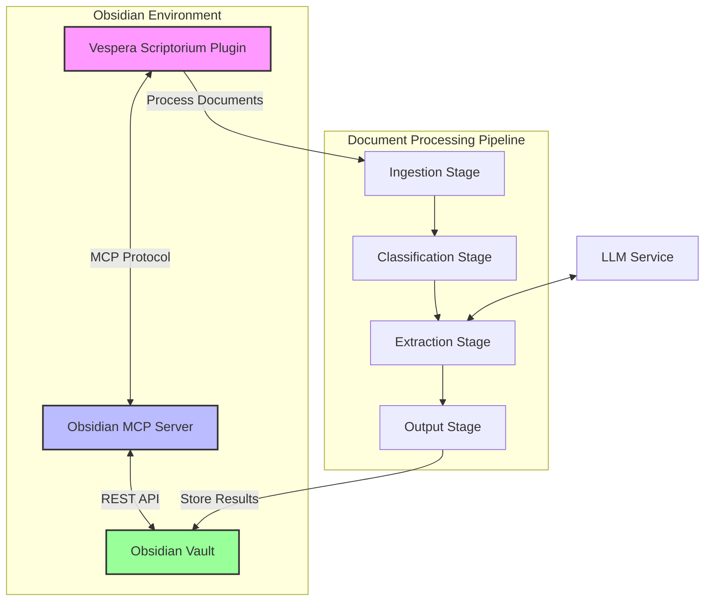

# MCP Server Integration Architecture

## Overview

This document describes the architecture for integrating Model Context Protocol (MCP) servers into the Vespera Scriptorium plugin, focusing on the Obsidian MCP server for enhanced document processing and interaction capabilities.

## Architecture Diagram



## Components

### 1. MCP Adapter Layer

**Purpose**: Provides a unified interface for interacting with different MCP server implementations.

**Key Components**:

- `MCPService`: Main service class that routes requests to the appropriate MCP server
- `ObsidianMCPServer`: Implementation for Obsidian's MCP server
- `MCPClient`: Low-level client for MCP protocol communication
- `SchemaValidator`: Validates requests and responses against MCP schemas

### 2. MCP Server (Obsidian)

**Responsibilities**:

- File system operations within Obsidian vault
- Document search and retrieval
- Content modification with Obsidian's API
- Plugin interaction

**Key Features**:

- Secure API access with authentication
- File watching and change notifications
- Batch operations for better performance
- Error handling and recovery

### 3. Integration with Document Processing Pipeline

**Ingestion Stage**:

- Uses MCP to read source documents
- Handles different document formats
- Pre-processes content for further analysis

**Extraction Stage**:

- Leverages MCP for document queries
- Uses LLM services via MCP when available
- Processes and structures extracted data

**Output Stage**:

- Writes results back via MCP
- Maintains document relationships
- Handles versioning and backups

## Data Flow

1. **Document Retrieval**:
   - Plugin requests documents via MCP Service
   - MCP Service routes to Obsidian MCP Server
   - Documents are retrieved and cached

2. **Processing**:
   - Documents flow through processing pipeline
   - MCP is used for any file operations
   - Results are prepared for storage

3. **Storage**:
   - Processed data is stored via MCP
   - Metadata is updated
   - Indexes are refreshed

## Security Considerations

1. **Authentication**:
   - API key management
   - Secure storage of credentials
   - Token rotation

2. **Authorization**:
   - Fine-grained permissions
   - Operation whitelisting
   - Rate limiting

3. **Data Protection**:
   - Encryption in transit
   - Input validation
   - Audit logging

## Performance Considerations

1. **Caching**:
   - Document content caching
   - Query result caching
   - Invalidation strategies

2. **Batching**:
   - Batch file operations
   - Parallel processing
   - Background operations

3. **Monitoring**:
   - Performance metrics
   - Error tracking
   - Usage statistics

## Error Handling

1. **Retry Logic**:
   - Exponential backoff
   - Circuit breaker pattern
   - Fallback mechanisms

2. **Recovery**:
   - Transaction support
   - State management
   - Recovery procedures

## Configuration

```yaml
mcp:
  enabled: true
  server: obsidian
  obsidian:
    apiKey: ${OBSIDIAN_API_KEY}
    host: http://localhost:27124
    vaultPath: ${OBSIDIAN_VAULT_PATH}
  cache:
    enabled: true
    ttl: 3600
  rateLimit:
    enabled: true
    requests: 100
    interval: 60
```

## Future Extensions

1. **Additional MCP Servers**:
   - Support for other MCP implementations
   - Custom MCP server development
   - Protocol extensions

2. **Advanced Features**:
   - Real-time collaboration
   - Offline support
   - Plugin ecosystem

3. **Performance Optimizations**:
   - Request batching
   - Background processing
   - Smart caching

## Implementation Notes

1. **Dependencies**:
   - Obsidian REST API plugin
   - MCP protocol libraries
   - Authentication providers

2. **Testing Strategy**:
   - Unit tests for MCP client
   - Integration tests with Obsidian
   - Performance testing
   - Security testing

3. **Deployment**:
   - Plugin packaging
   - Configuration management
   - Update mechanism
