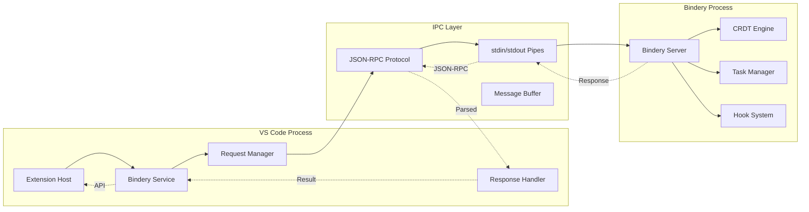
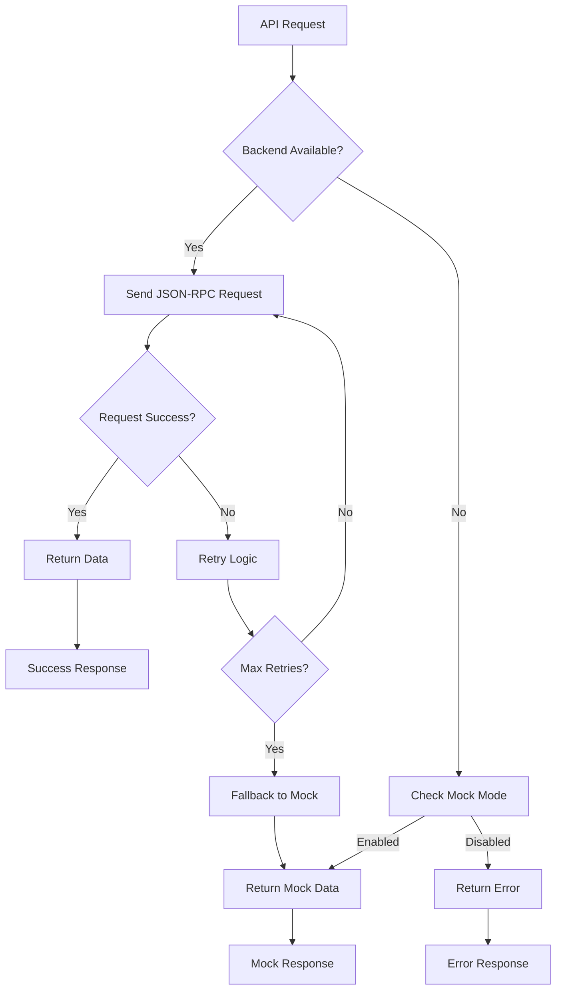

# Bindery Integration Layer Architecture

## Overview

The Bindery Integration Layer provides seamless communication between the VS Code extension (TypeScript) and the Rust Bindery backend, enabling AI-enhanced task orchestration and collaborative CRDT editing.

## Integration Strategy Deep Dive

### Communication Architecture



### Process Management

The Bindery Service manages the lifecycle of the Rust backend process:

```typescript
class BinderyService extends EventEmitter {
  private process: ChildProcess | null = null;
  private connectionInfo: BinderyConnectionInfo;
  private pendingRequests = new Map<number, PendingRequest>();
  
  async initialize(): Promise<BinderyResult<VersionInfo>> {
    // 1. Locate Bindery executable
    const binderyPath = await this.findBinderyExecutable();
    
    // 2. Start subprocess with JSON-RPC args  
    await this.startBinderyProcess(binderyPath);
    
    // 3. Establish communication
    const versionInfo = await this.getVersionInfo();
    
    // 4. Set up event handlers
    this.setupEventHandlers();
  }
}
```

### Executable Discovery Strategy

The service locates the Bindery executable using a priority-based search:

```typescript
private async findBinderyExecutable(): Promise<string | null> {
  const searchPaths = [
    // 1. User-configured path from settings
    this.config.binderyPath,
    
    // 2. Monorepo relative paths (development)
    '../../../packages/vespera-utilities/vespera-bindery/target/debug/bindery-server',
    '../../../packages/vespera-utilities/vespera-bindery/target/release/bindery-server',
    
    // 3. System PATH lookup (production)
    'bindery-server'
  ].filter(Boolean);

  for (const path of searchPaths) {
    if (await this.isExecutable(path)) {
      return path;
    }
  }
  
  // Fallback to mock mode
  return null;
}
```

## JSON-RPC Protocol Implementation

### Message Format

**Request Structure**:
```json
{
  "method": "create_task",
  "params": {
    "task_input": {
      "title": "Implement feature X",
      "description": "Detailed description...", 
      "priority": "High",
      "tags": ["feature", "backend"]
    }
  },
  "id": 123
}
```

**Response Structure**:
```json
{
  "id": 123,
  "result": {
    "task_id": "codex_abc123def456"
  }
}
```

**Error Structure**:
```json
{
  "id": 123,
  "error": {
    "code": -1,
    "message": "Task creation failed: Invalid parent task"
  }
}
```

### Request/Response Handling

```typescript
private async sendRequest<T>(method: string, params?: any): Promise<BinderyResult<T>> {
  const requestId = ++this.requestId;
  const request: BinderyRequest = { method, params, id: requestId };

  return new Promise((resolve) => {
    // Set up timeout handling
    const timeout = setTimeout(() => {
      this.pendingRequests.delete(requestId);
      resolve({ success: false, error: { code: -1, message: 'Request timeout' } });
    }, this.config.connectionTimeout);

    // Store pending request
    this.pendingRequests.set(requestId, {
      resolve: (result: T) => resolve({ success: true, data: result }),
      reject: (error: BinderyError) => resolve({ success: false, error }),
      timeout
    });

    // Send JSON-RPC request
    this.process!.stdin!.write(JSON.stringify(request) + '\n');
  });
}
```

### Buffer Management

The service handles streaming JSON-RPC responses with proper buffering:

```typescript
private handleProcessData(data: Buffer): void {
  this.buffer += data.toString();
  
  // Process complete JSON lines
  const lines = this.buffer.split('\n');
  this.buffer = lines.pop() || ''; // Keep incomplete line
  
  for (const line of lines) {
    if (line.trim()) {
      try {
        const response: BinderyResponse = JSON.parse(line);
        this.handleResponse(response);
      } catch (error) {
        this.log('Failed to parse response:', line, error);
      }
    }
  }
}
```

## API Surface Mapping

### Task Management Operations

| VS Code API | JSON-RPC Method | Bindery Operation |
|-------------|-----------------|-------------------|
| `createTask(input)` | `create_task` | Task creation with hierarchy |
| `getTask(id)` | `get_task` | Single task retrieval |
| `updateTask(input)` | `update_task` | Task modification |
| `deleteTask(id)` | `delete_task` | Task removal |
| `listTasks(filters)` | `list_tasks` | Filtered task queries |
| `getTaskDashboard()` | `get_task_dashboard` | Analytics and metrics |

### Task Tree Operations

```typescript
// Create hierarchical task structure
async createTaskTree(
  treeTitle: string,
  treeDescription: string, 
  subtasks: TaskInput[],
  projectId?: string
): Promise<BinderyResult<CodexId>> {
  return this.sendRequest('create_task_tree', {
    tree_title: treeTitle,
    tree_description: treeDescription,
    subtasks,
    project_id: projectId || null
  });
}

// Get complete tree with relationships
async getTaskTree(taskId: CodexId, maxDepth = 5): Promise<BinderyResult<TaskTree>> {
  return this.sendRequest('get_task_tree', {
    task_id: taskId,
    max_depth: maxDepth
  });
}
```

### Role-Based Execution

```typescript
// Assign role with capability restrictions
async assignRoleToTask(taskId: CodexId, roleName: string): Promise<BinderyResult<void>> {
  return this.sendRequest('assign_role_to_task', {
    task_id: taskId,
    role_name: roleName
  });
}

// Execute task with role validation
async executeTask(taskId: CodexId, dryRun = false): Promise<BinderyResult<TaskExecutionResult>> {
  return this.sendRequest('execute_task', {
    task_id: taskId,
    dry_run: dryRun
  });
}
```

## Error Handling & Recovery

### Connection State Management

```typescript
enum BinderyConnectionStatus {
  Disconnected = 'disconnected',
  Connecting = 'connecting', 
  Connected = 'connected',
  Error = 'error'
}

interface BinderyConnectionInfo {
  status: BinderyConnectionStatus;
  version?: VersionInfo;
  connected_at?: string;
  process_id?: number;
  last_error?: string;
}
```

### Graceful Degradation Strategy



### Process Recovery

```typescript
private setupProcessRecovery(): void {
  this.process?.on('exit', (code, signal) => {
    this.log(`Bindery process exited: code=${code}, signal=${signal}`);
    
    // Cancel pending requests
    this.cancelPendingRequests('Process terminated');
    
    // Update connection status
    this.connectionInfo.status = BinderyConnectionStatus.Disconnected;
    this.emit('statusChanged', this.connectionInfo);
    
    // Attempt reconnection after delay
    if (this.config.autoReconnect) {
      setTimeout(() => {
        this.attemptReconnection();
      }, this.config.reconnectDelay);
    }
  });
}
```

## Mock Development Mode

### Purpose & Benefits

Mock mode enables full extension functionality without the Rust backend:

- **Development Velocity**: No compilation or backend setup required
- **Testing Reliability**: Consistent, predictable responses
- **Demo Capability**: Working extension for demonstrations
- **CI/CD Integration**: Automated testing without external dependencies

### Mock Service Implementation

```typescript
private async handleMockRequest<T>(method: string, params?: any): Promise<BinderyResult<T>> {
  // Simulate realistic network delay
  await this.simulateDelay();
  
  switch (method) {
    case 'create_task':
      return this.mockCreateTask(params);
      
    case 'list_tasks':
      return this.mockListTasks(params);
      
    case 'get_task_dashboard':
      return this.mockGetDashboard(params);
      
    default:
      return {
        success: false,
        error: { code: -1, message: `Mock: Method ${method} not implemented` }
      };
  }
}

private async simulateDelay(): Promise<void> {
  const delay = 100 + Math.random() * 200; // 100-300ms
  return new Promise(resolve => setTimeout(resolve, delay));
}
```

### Mock Data Generation

```typescript
private mockCreateTask(params: any): BinderyResult<CodexId> {
  const taskId = `mock_task_${Date.now()}_${Math.random().toString(36).substr(2, 9)}`;
  
  // Store in mock cache for consistency
  this.mockTaskCache.set(taskId, {
    id: taskId,
    title: params.task_input.title,
    description: params.task_input.description,
    status: TaskStatus.Todo,
    priority: params.task_input.priority || TaskPriority.Normal,
    created_at: new Date().toISOString(),
    updated_at: new Date().toISOString(),
    tags: params.task_input.tags || [],
    child_count: 0
  });
  
  return { success: true, data: taskId };
}
```

## Performance Optimization

### Connection Pooling

Single persistent connection with request multiplexing:

```typescript
class BinderyService {
  private connectionPool = {
    maxConcurrentRequests: 10,
    requestQueue: [] as PendingRequest[],
    activeRequests: new Map<number, PendingRequest>()
  };
  
  private async sendRequest<T>(method: string, params?: any): Promise<BinderyResult<T>> {
    // Queue management for high-concurrency scenarios
    if (this.connectionPool.activeRequests.size >= this.connectionPool.maxConcurrentRequests) {
      return this.queueRequest(method, params);
    }
    
    return this.executeRequest(method, params);
  }
}
```

### Caching Strategy

```typescript
interface CacheEntry<T> {
  data: T;
  timestamp: number;
  ttl: number;
}

class ResponseCache {
  private cache = new Map<string, CacheEntry<any>>();
  
  get<T>(key: string): T | null {
    const entry = this.cache.get(key);
    if (!entry) return null;
    
    // Check TTL
    if (Date.now() - entry.timestamp > entry.ttl) {
      this.cache.delete(key);
      return null;
    }
    
    return entry.data;
  }
  
  set<T>(key: string, data: T, ttl = 30000): void {
    this.cache.set(key, {
      data,
      timestamp: Date.now(), 
      ttl
    });
  }
}
```

### Memory Management

```typescript
class BinderyService {
  private cleanup(): void {
    // Clear expired cache entries
    this.responseCache.cleanup();
    
    // Limit task cache size
    if (this.taskCache.size > 1000) {
      this.trimTaskCache();
    }
    
    // Cancel stale requests
    this.cancelStaleRequests();
  }
  
  private trimTaskCache(): void {
    const entries = Array.from(this.taskCache.entries());
    entries.sort((a, b) => a[1].updated_at.localeCompare(b[1].updated_at));
    
    // Keep most recent 800 entries
    const toKeep = entries.slice(-800);
    this.taskCache.clear();
    toKeep.forEach(([id, task]) => this.taskCache.set(id, task));
  }
}
```

## Type Safety & Validation

### Interface Definitions

```typescript
// Comprehensive type definitions for API surface
export interface TaskInput {
  title: string;
  description: string;
  parent_id?: CodexId;
  priority?: TaskPriority;
  due_date?: string;
  tags: string[];
  labels: Record<string, string>;
  subtasks: TaskInput[];
}

export interface TaskSummary {
  id: CodexId;
  title: string;
  description: string;
  status: TaskStatus;
  priority: TaskPriority;
  assignee?: string;
  due_date?: string;
  created_at: string;
  updated_at: string;
  tags: string[];
  child_count: number;
  parent_id?: CodexId;
}
```

### Runtime Validation

```typescript
function validateTaskInput(input: any): TaskInput | null {
  if (!input || typeof input !== 'object') return null;
  if (!input.title || typeof input.title !== 'string') return null;
  if (!Array.isArray(input.tags)) return null;
  
  return {
    title: input.title,
    description: input.description || '',
    parent_id: input.parent_id || undefined,
    priority: input.priority || TaskPriority.Normal,
    tags: input.tags,
    labels: input.labels || {},
    subtasks: input.subtasks || []
  };
}
```

## Security Considerations

### Process Isolation

- **Separate Address Space**: Backend runs in isolated process
- **Resource Limits**: Memory and CPU limits configurable
- **Crash Isolation**: Backend crashes don't affect VS Code
- **Privilege Separation**: Minimal permissions required

### Input Validation

```typescript
class SecurityValidator {
  static validateTaskTitle(title: string): boolean {
    // Length limits
    if (title.length > 200) return false;
    
    // Character whitelist
    const allowedPattern = /^[a-zA-Z0-9\s\-_.()[\]{}!@#$%^&*+=:;'"<>?/\\|~`]+$/;
    return allowedPattern.test(title);
  }
  
  static sanitizeJsonInput(input: any): any {
    // Remove potentially dangerous properties
    const dangerous = ['__proto__', 'constructor', 'prototype'];
    
    return JSON.parse(JSON.stringify(input, (key, value) => 
      dangerous.includes(key) ? undefined : value
    ));
  }
}
```

### Communication Security

- **Local IPC Only**: No network exposure by default
- **JSON-RPC Validation**: All messages validated against schema
- **Process Authentication**: Process spawned by extension only
- **Error Information**: Sensitive info not leaked in errors

---

The Bindery Integration Layer provides a robust, type-safe, and performant bridge between VS Code and Rust backend services, enabling sophisticated task orchestration while maintaining excellent developer experience and system reliability.