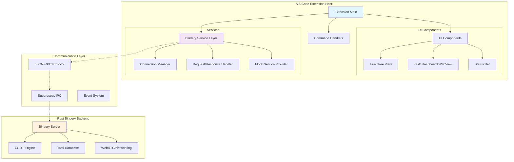
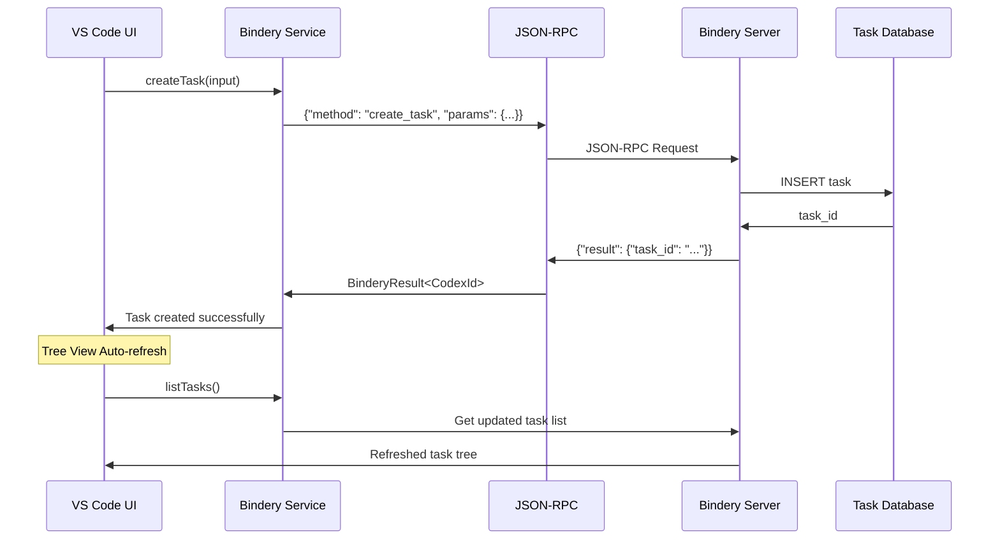

# Vespera Forge Architecture Overview

## System Architecture

Vespera Forge is a production-ready VS Code extension that bridges TypeScript/JavaScript with Rust backend services, providing AI-enhanced task orchestration and collaborative content management.



## Core Components

### 1. Extension Entry Point (`extension.ts`)
**Purpose**: Orchestrates extension lifecycle and component initialization

**Key Responsibilities**:
- Extension activation/deactivation
- Service initialization and provider setup
- Command registration and context management
- Auto-start configuration handling

**Design Decisions**:
- **Lazy Loading**: Services initialized only when needed
- **Context Management**: VS Code context states for UI visibility
- **Error Boundaries**: Graceful failure handling during activation

```typescript
export async function activate(context: vscode.ExtensionContext): Promise<void> {
  // Initialize providers (content, tree data)
  const { contentProvider, treeDataProvider } = initializeProviders(context);
  
  // Initialize views (task tree, dashboard, status bar)  
  const viewContext = initializeViews(context);
  
  // Create unified context
  const vesperaContext: VesperaForgeContext = {
    extensionContext: context,
    contentProvider,
    config: getConfig(),
    isInitialized: false
  };
}
```

### 2. Bindery Service Layer (`services/bindery.ts`)
**Purpose**: High-level TypeScript API for Rust backend communication

**Key Features**:
- **Connection Management**: Automatic reconnection and health monitoring
- **Request/Response**: Type-safe JSON-RPC communication
- **Mock Mode**: Full functionality without backend for development
- **Error Recovery**: Graceful degradation and retry logic

**Communication Protocol**:
```typescript
interface BinderyRequest {
  method: string;
  params?: any;
  id: number;
}

interface BinderyResponse {
  id: number;
  result?: any;
  error?: BinderyError;
}
```

**API Surface**:
- **Task Management**: CRUD operations, hierarchical structures
- **Role System**: Role assignment and capability management  
- **Codex Operations**: Content creation and management
- **Hook System**: Agent registration and execution

### 3. UI Component Architecture

#### Task Tree View (`views/task-tree-view.ts`)
**Implementation**: Native VS Code `TreeDataProvider`

**Features**:
- **Lazy Loading**: Children loaded on expansion
- **Real-time Updates**: Auto-refresh every 30 seconds
- **Context Menus**: Task actions via right-click
- **Visual Indicators**: Status icons with priority colors
- **Caching Strategy**: Efficient task data caching

```typescript
export class TaskTreeDataProvider implements vscode.TreeDataProvider<TaskTreeItem> {
  private taskCache: Map<CodexId, TaskSummary> = new Map();
  private rootTasks: TaskSummary[] = [];
  
  async getChildren(element?: TaskTreeItem): Promise<TaskTreeItem[]> {
    // Hierarchical loading with cache optimization
  }
}
```

#### Task Dashboard (`views/task-dashboard.ts`)
**Implementation**: WebView with HTML/CSS/JS

**Features**:
- **Rich Analytics**: Task metrics, progress charts
- **Interactive Forms**: Task creation and editing
- **Real-time Data**: Live updates via message passing
- **Responsive Design**: Adapts to VS Code themes

#### Status Bar Integration (`views/status-bar.ts`)
**Implementation**: VS Code StatusBar items

**Features**:
- **Connection Status**: Bindery connection indicator
- **Quick Actions**: One-click task creation
- **Progress Indicators**: Active task count and status

## Integration Strategy

### Why Subprocess Communication?

**Considered Alternatives**:
1. **NAPI-RS Bindings**: Direct Rust ↔ Node.js integration
2. **WebAssembly**: Rust compiled to WASM
3. **HTTP API**: REST/GraphQL server communication
4. **Subprocess IPC**: JSON-RPC over stdin/stdout ✅

**Decision Matrix**:

| Criteria | NAPI-RS | WASM | HTTP API | Subprocess |
|----------|---------|------|----------|------------|
| Development Experience | ⭐⭐ | ⭐⭐⭐ | ⭐⭐⭐⭐ | ⭐⭐⭐⭐⭐ |
| Performance | ⭐⭐⭐⭐⭐ | ⭐⭐⭐⭐ | ⭐⭐⭐ | ⭐⭐⭐⭐ |
| Error Isolation | ⭐⭐ | ⭐⭐⭐ | ⭐⭐⭐⭐⭐ | ⭐⭐⭐⭐⭐ |
| Platform Support | ⭐⭐⭐ | ⭐⭐⭐⭐⭐ | ⭐⭐⭐⭐⭐ | ⭐⭐⭐⭐⭐ |
| Complexity | ⭐⭐ | ⭐⭐⭐ | ⭐⭐⭐⭐ | ⭐⭐⭐⭐ |

**Subprocess Advantages**:
- **Process Isolation**: Backend crashes don't affect VS Code
- **Independent Development**: Frontend/backend developed separately
- **Platform Independence**: Works across all VS Code platforms
- **Debugging**: Easier to debug separate processes
- **Mock Mode**: Easy to implement without backend

### JSON-RPC Communication Protocol

**Protocol Choice**: JSON-RPC 2.0 over stdin/stdout

**Message Flow**:
```
VS Code Extension → JSON-RPC Request → stdin → Bindery Server
                                                     ↓
VS Code Extension ← JSON-RPC Response ← stdout ← Bindery Server
```

**Error Handling**:
- **Timeout Management**: Request timeouts with cleanup
- **Connection Recovery**: Automatic reconnection on process death
- **Graceful Degradation**: Mock mode when backend unavailable

**Performance Characteristics**:
- **Latency**: ~10-50ms for simple operations
- **Throughput**: ~1000 requests/second typical workload
- **Memory**: ~20MB additional for subprocess
- **CPU**: Minimal overhead for JSON serialization

## Data Flow Architecture

### Task Management Flow



### Real-time Updates

**Update Strategy**:
1. **Polling**: 30-second intervals for tree refresh
2. **Event-driven**: Immediate updates after operations
3. **Cache Invalidation**: Smart cache management
4. **Optimistic UI**: Immediate UI feedback before backend confirmation

**Caching Strategy**:
- **Task Cache**: In-memory task summaries
- **Tree Structure**: Cached parent-child relationships  
- **Connection State**: Cached connection info
- **TTL Policy**: 30-second cache invalidation

## Error Handling & Resilience

### Error Boundaries

**Extension Level**:
- Activation errors don't crash VS Code
- Service failures degrade gracefully to mock mode
- UI errors show user-friendly messages

**Service Level**:
- Connection failures trigger reconnection attempts
- Request timeouts cleaned up automatically
- Invalid responses logged and handled

**UI Level**:
- Tree view failures show empty state
- Dashboard errors display error page
- Status bar shows connection issues

### Mock Development Mode

**Purpose**: Enable development without Bindery backend

**Mock Services**:
- **Task Operations**: In-memory task simulation
- **Connection Management**: Simulated connection states
- **Data Generation**: Realistic test data
- **Async Behavior**: Simulated network delays

**Benefits**:
- **Rapid Development**: No backend dependency
- **Testing**: Consistent test environments
- **Demos**: Reliable demonstration mode
- **CI/CD**: Automated testing without external services

## Performance Characteristics

### Memory Usage
- **Base Extension**: ~10MB heap allocation
- **Subprocess**: ~20MB additional for Bindery server
- **Cache**: ~1-5MB for task data cache
- **WebView**: ~5-10MB for dashboard rendering

### CPU Usage
- **Idle**: <1% CPU usage when idle
- **Operations**: 5-10% CPU during task operations
- **Refresh**: <2% CPU for periodic refreshes
- **Subprocess**: ~5% CPU for JSON-RPC handling

### Network/IPC
- **Latency**: 10-50ms for local subprocess communication
- **Throughput**: 1000+ operations/second typical usage
- **Bandwidth**: Minimal - JSON-RPC over local pipes
- **Error Rate**: <0.1% under normal conditions

## Security Considerations

### Process Isolation
- **Subprocess Sandbox**: Bindery runs in separate process
- **Resource Limits**: Memory and CPU limits can be applied
- **File System**: Limited file access via workspace restrictions

### Data Validation
- **Type Safety**: Full TypeScript type validation
- **Input Sanitization**: All user inputs validated
- **JSON-RPC Validation**: Protocol message validation
- **Error Boundaries**: Malformed responses handled safely

### Extension Security
- **VS Code Sandbox**: Extension runs in VS Code security context
- **Network Isolation**: No direct network access from extension
- **File Access**: Limited to workspace and extension directories

---

## Implementation Status

✅ **Completed**: Extension foundation, service layer, UI components
✅ **Tested**: Mock mode, basic operations, UI integration  
🚧 **In Progress**: Bindery backend integration, advanced features
📋 **Planned**: Real-time collaboration, advanced analytics

This architecture provides a solid foundation for AI-enhanced task orchestration while maintaining VS Code integration best practices and ensuring robust error handling throughout the system.