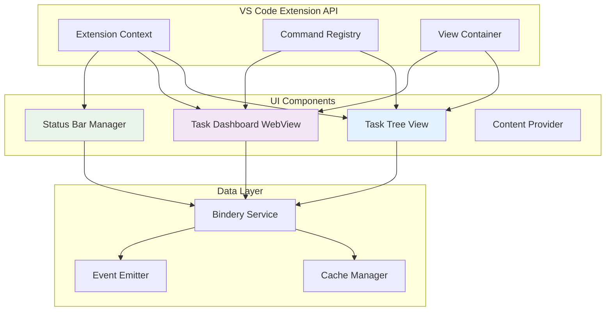

# Native VS Code UI Components Architecture

## Overview

Vespera Forge implements a comprehensive UI layer using native VS Code APIs, providing seamless integration with the editor's design language while delivering sophisticated task orchestration capabilities.

## Component Architecture



## Task Tree View Implementation

### TreeDataProvider Architecture

The Task Tree View uses VS Code's native `TreeDataProvider` interface for optimal performance and user experience:

```typescript
export class TaskTreeDataProvider implements vscode.TreeDataProvider<TaskTreeItem> {
  private _onDidChangeTreeData = new vscode.EventEmitter<TaskTreeItem | undefined | null | void>();
  readonly onDidChangeTreeData = this._onDidChangeTreeData.event;

  private taskCache = new Map<CodexId, TaskSummary>();
  private rootTasks: TaskSummary[] = [];
  
  async getChildren(element?: TaskTreeItem): Promise<TaskTreeItem[]> {
    if (!element) {
      // Load root tasks (no parent)
      return this.loadRootTasks();
    } else {
      // Load subtasks for given parent
      return this.loadSubtasks(element.task.id);
    }
  }
}
```

### Lazy Loading Strategy

**Root Level Loading**:
```typescript
private async loadRootTasks(): Promise<TaskTreeItem[]> {
  const binderyService = getBinderyService();
  const result = await binderyService.listTasks({
    parent_id: undefined,        // Only root tasks
    project_id: this.currentProjectId,
    limit: 100                   // Reasonable page size
  });

  if (result.success) {
    this.rootTasks = result.data;
    this.updateCache(result.data);
    return result.data.map(task => this.createTaskTreeItem(task));
  }
  
  return [];
}
```

**Child Level Loading**:
```typescript
private async loadSubtasks(parentId: CodexId): Promise<TaskTreeItem[]> {
  // Try hierarchical tree API first (more efficient)
  const treeResult = await binderyService.getTaskTree(parentId, 2);
  if (treeResult.success && treeResult.data.children.length > 0) {
    const childTasks = treeResult.data.children.map(child => child.task);
    this.updateCache(childTasks);
    return childTasks.map(task => this.createTaskTreeItem(task));
  }
  
  // Fallback to filtered list
  const listResult = await binderyService.listTasks({
    parent_id: parentId,
    limit: 100
  });
  
  return listResult.success ? 
    listResult.data.map(task => this.createTaskTreeItem(task)) : [];
}
```

### Visual Design System

**Status Icons & Colors**:
```typescript
private getTaskIcon(status: TaskStatus, priority: TaskPriority): vscode.ThemeIcon {
  const iconMap: Record<TaskStatus, string> = {
    [TaskStatus.Todo]: 'circle-outline',
    [TaskStatus.Doing]: 'sync~spin',      // Animated spinner
    [TaskStatus.Review]: 'eye',
    [TaskStatus.Done]: 'check',
    [TaskStatus.Blocked]: 'error',
    [TaskStatus.Cancelled]: 'x',
    [TaskStatus.Archived]: 'archive'
  };

  const colorMap: Record<TaskPriority, vscode.ThemeColor> = {
    [TaskPriority.Critical]: new vscode.ThemeColor('errorForeground'),
    [TaskPriority.High]: new vscode.ThemeColor('notificationsWarningIcon.foreground'),
    [TaskPriority.Normal]: new vscode.ThemeColor('foreground'),
    [TaskPriority.Low]: new vscode.ThemeColor('descriptionForeground'),
    [TaskPriority.Someday]: new vscode.ThemeColor('disabledForeground')
  };

  return new vscode.ThemeIcon(iconMap[status], colorMap[priority]);
}
```

**Rich Tooltips**:
```typescript
private getTaskTooltip(task: TaskSummary): vscode.MarkdownString {
  const tooltip = new vscode.MarkdownString();
  tooltip.appendMarkdown(`**${task.title}**\n\n`);
  tooltip.appendMarkdown(`**Status:** ${task.status}\n`);
  tooltip.appendMarkdown(`**Priority:** ${task.priority}\n`);
  
  if (task.assignee) {
    tooltip.appendMarkdown(`**Assignee:** ${task.assignee}\n`);
  }
  
  if (task.due_date) {
    const dueDate = new Date(task.due_date);
    const isOverdue = dueDate < new Date();
    tooltip.appendMarkdown(`**Due:** ${dueDate.toLocaleDateString()}${isOverdue ? ' ⚠️' : ''}\n`);
  }
  
  if (task.tags.length > 0) {
    tooltip.appendMarkdown(`**Tags:** ${task.tags.map(tag => `\`${tag}\``).join(', ')}\n`);
  }
  
  tooltip.appendMarkdown(`\n---\n`);
  tooltip.appendMarkdown(`Created: ${new Date(task.created_at).toLocaleString()}\n`);
  tooltip.appendMarkdown(`Updated: ${new Date(task.updated_at).toLocaleString()}`);
  
  return tooltip;
}
```

### Context Menu Integration

**Context Value System**:
```typescript
private getContextValue(task: TaskSummary): string {
  const parts = ['task'];
  
  // Status-specific actions
  parts.push(`status-${task.status}`);
  parts.push(`priority-${task.priority}`);
  
  // Capability flags
  if (task.child_count > 0) {
    parts.push('has-children');
  }
  
  if (task.status === TaskStatus.Todo || task.status === TaskStatus.Doing) {
    parts.push('can-complete');
  }
  
  return parts.join('-');
}
```

**Context Menu Commands**:
```typescript
export function registerTaskTreeCommands(context: vscode.ExtensionContext): void {
  // Create subtask
  context.subscriptions.push(
    vscode.commands.registerCommand('vespera-forge.createSubtask', async (taskItem: TaskTreeItem) => {
      const title = await vscode.window.showInputBox({
        prompt: 'Enter subtask title',
        placeHolder: 'New subtask...',
        validateInput: (value) => {
          if (!value.trim()) return 'Title cannot be empty';
          if (value.length > 100) return 'Title too long (max 100 chars)';
          return undefined;
        }
      });

      if (!title) return;

      const result = await binderyService.createTask({
        title: title.trim(),
        description: '',
        parent_id: taskItem.task.id,
        tags: [],
        labels: {},
        subtasks: []
      });

      if (result.success) {
        vscode.commands.executeCommand('vespera-forge.refreshTaskTree');
        vscode.window.showInformationMessage(`Subtask "${title}" created.`);
      } else {
        vscode.window.showErrorMessage(`Failed to create subtask: ${result.error.message}`);
      }
    })
  );
}
```

## Task Dashboard WebView

### WebView Architecture

The Task Dashboard uses VS Code's WebView API to provide rich, interactive task management:

```typescript
export class TaskDashboardProvider implements vscode.WebviewViewProvider {
  private _view?: vscode.WebviewView;
  private _extensionUri: vscode.Uri;
  
  constructor(extensionUri: vscode.Uri) {
    this._extensionUri = extensionUri;
  }

  resolveWebviewView(
    webviewView: vscode.WebviewView,
    context: vscode.WebviewViewResolveContext,
    _token: vscode.CancellationToken
  ): void {
    this._view = webviewView;
    
    webviewView.webview.options = {
      enableScripts: true,
      localResourceRoots: [this._extensionUri]
    };

    webviewView.webview.html = this.getHtmlForWebview(webviewView.webview);
    this.setupMessageHandling(webviewView.webview);
  }
}
```

### HTML Generation with Security

```typescript
private getHtmlForWebview(webview: vscode.Webview): string {
  // Get resource URIs with proper security
  const styleResetUri = webview.asWebviewUri(
    vscode.Uri.joinPath(this._extensionUri, 'media', 'reset.css')
  );
  const styleVSCodeUri = webview.asWebviewUri(
    vscode.Uri.joinPath(this._extensionUri, 'media', 'vscode.css')
  );
  const styleDashboardUri = webview.asWebviewUri(
    vscode.Uri.joinPath(this._extensionUri, 'media', 'dashboard.css')
  );
  const scriptUri = webview.asWebviewUri(
    vscode.Uri.joinPath(this._extensionUri, 'media', 'dashboard.js')
  );

  // Use nonce for security
  const nonce = this.getNonce();

  return `<!DOCTYPE html>
<html lang="en">
<head>
    <meta charset="UTF-8">
    <meta name="viewport" content="width=device-width, initial-scale=1.0">
    <meta http-equiv="Content-Security-Policy" content="default-src 'none'; style-src ${webview.cspSource} 'unsafe-inline'; script-src 'nonce-${nonce}';">
    
    <link href="${styleResetUri}" rel="stylesheet">
    <link href="${styleVSCodeUri}" rel="stylesheet">
    <link href="${styleDashboardUri}" rel="stylesheet">
    
    <title>Task Dashboard</title>
</head>
<body>
    <div id="dashboard-container">
        <div id="loading-indicator" class="loading">Loading tasks...</div>
        <div id="dashboard-content" style="display: none;">
            <!-- Dashboard content loaded dynamically -->
        </div>
    </div>
    
    <script nonce="${nonce}" src="${scriptUri}"></script>
</body>
</html>`;
}
```

### Message Passing System

**Extension → WebView Communication**:
```typescript
private async updateDashboardData(): Promise<void> {
  if (!this._view) return;

  try {
    const binderyService = getBinderyService();
    const dashboardResult = await binderyService.getTaskDashboard();
    
    if (dashboardResult.success) {
      this._view.webview.postMessage({
        type: 'dashboardData',
        data: dashboardResult.data
      });
    } else {
      this._view.webview.postMessage({
        type: 'error', 
        message: dashboardResult.error.message
      });
    }
  } catch (error) {
    this._view.webview.postMessage({
      type: 'error',
      message: 'Failed to load dashboard data'
    });
  }
}
```

**WebView → Extension Communication**:
```typescript
private setupMessageHandling(webview: vscode.Webview): void {
  webview.onDidReceiveMessage(async (message) => {
    switch (message.type) {
      case 'createTask':
        await this.handleCreateTask(message.data);
        break;
        
      case 'updateTaskStatus':
        await this.handleUpdateTaskStatus(message.taskId, message.status);
        break;
        
      case 'refreshData':
        await this.updateDashboardData();
        break;
        
      case 'openTask':
        await vscode.commands.executeCommand('vespera-forge.openTaskDetails', message.taskId);
        break;
    }
  });
}
```

### Interactive Dashboard Components

**Task Creation Form**:
```javascript
// dashboard.js - Client-side code
class TaskCreationForm {
  constructor(vscode) {
    this.vscode = vscode;
    this.setupForm();
  }
  
  setupForm() {
    const form = document.getElementById('new-task-form');
    form.addEventListener('submit', (e) => {
      e.preventDefault();
      this.handleSubmit(new FormData(form));
    });
  }
  
  handleSubmit(formData) {
    const taskData = {
      title: formData.get('title'),
      description: formData.get('description'),
      priority: formData.get('priority'),
      tags: formData.get('tags').split(',').map(t => t.trim()).filter(Boolean)
    };
    
    this.vscode.postMessage({
      type: 'createTask',
      data: taskData
    });
  }
}
```

**Real-time Metrics Display**:
```javascript
class DashboardMetrics {
  updateMetrics(dashboardData) {
    // Update task counts
    document.getElementById('total-tasks').textContent = dashboardData.total_tasks;
    document.getElementById('completed-tasks').textContent = 
      dashboardData.status_breakdown.Done || 0;
    
    // Update progress bar
    const completionRate = dashboardData.completion_rate || 0;
    document.getElementById('progress-bar').style.width = `${completionRate}%`;
    document.getElementById('progress-text').textContent = `${Math.round(completionRate)}%`;
    
    // Update status breakdown chart
    this.updateStatusChart(dashboardData.status_breakdown);
    
    // Update recent tasks list
    this.updateRecentTasks(dashboardData.recent_tasks);
  }
}
```

## Status Bar Integration

### Status Bar Manager

```typescript
export class StatusBarManager {
  private connectionStatusItem: vscode.StatusBarItem;
  private taskCountItem: vscode.StatusBarItem;
  private quickActionItem: vscode.StatusBarItem;
  
  constructor(context: vscode.ExtensionContext) {
    // Connection status (left side)
    this.connectionStatusItem = vscode.window.createStatusBarItem(
      vscode.StatusBarAlignment.Left, 
      100
    );
    this.connectionStatusItem.command = 'vespera-forge.openTaskDashboard';
    
    // Task count (left side)
    this.taskCountItem = vscode.window.createStatusBarItem(
      vscode.StatusBarAlignment.Left, 
      99
    );
    this.taskCountItem.command = 'vespera-forge.openTaskTree';
    
    // Quick actions (right side)
    this.quickActionItem = vscode.window.createStatusBarItem(
      vscode.StatusBarAlignment.Right, 
      100
    );
    this.quickActionItem.command = 'vespera-forge.createTask';
    this.quickActionItem.text = '$(add) New Task';
    this.quickActionItem.tooltip = 'Create new task';
    
    context.subscriptions.push(
      this.connectionStatusItem,
      this.taskCountItem,
      this.quickActionItem
    );
  }
}
```

### Dynamic Status Updates

```typescript
export class StatusBarManager {
  updateConnectionStatus(connectionInfo: BinderyConnectionInfo): void {
    switch (connectionInfo.status) {
      case BinderyConnectionStatus.Connected:
        this.connectionStatusItem.text = '$(check) Bindery Connected';
        this.connectionStatusItem.backgroundColor = undefined;
        this.connectionStatusItem.tooltip = 
          `Connected to Bindery ${connectionInfo.version?.version || 'unknown'}`;
        break;
        
      case BinderyConnectionStatus.Connecting:
        this.connectionStatusItem.text = '$(sync~spin) Connecting...';
        this.connectionStatusItem.backgroundColor = 
          new vscode.ThemeColor('statusBarItem.warningBackground');
        this.connectionStatusItem.tooltip = 'Connecting to Bindery backend';
        break;
        
      case BinderyConnectionStatus.Disconnected:
        this.connectionStatusItem.text = '$(debug-disconnect) Bindery Offline';
        this.connectionStatusItem.backgroundColor = 
          new vscode.ThemeColor('statusBarItem.errorBackground');
        this.connectionStatusItem.tooltip = 'Bindery backend not connected (using mock mode)';
        break;
        
      case BinderyConnectionStatus.Error:
        this.connectionStatusItem.text = '$(error) Bindery Error';
        this.connectionStatusItem.backgroundColor = 
          new vscode.ThemeColor('statusBarItem.errorBackground');
        this.connectionStatusItem.tooltip = 
          `Connection error: ${connectionInfo.last_error || 'Unknown error'}`;
        break;
    }
    
    this.connectionStatusItem.show();
  }
  
  async updateTaskCounts(): Promise<void> {
    try {
      const binderyService = getBinderyService();
      const dashboardResult = await binderyService.getTaskDashboard();
      
      if (dashboardResult.success) {
        const data = dashboardResult.data;
        const activeTasks = data.total_tasks - (data.status_breakdown.Done || 0);
        
        this.taskCountItem.text = `$(checklist) ${activeTasks} tasks`;
        this.taskCountItem.tooltip = 
          `${activeTasks} active tasks\n${data.status_breakdown.Done || 0} completed`;
        this.taskCountItem.show();
      } else {
        this.taskCountItem.hide();
      }
    } catch (error) {
      this.taskCountItem.hide();
    }
  }
}
```

## Component Integration & Coordination

### Event-Driven Updates

```typescript
class UICoordinator {
  private treeProvider: TaskTreeDataProvider;
  private dashboardProvider: TaskDashboardProvider;
  private statusBarManager: StatusBarManager;
  
  constructor(
    treeProvider: TaskTreeDataProvider,
    dashboardProvider: TaskDashboardProvider,
    statusBarManager: StatusBarManager
  ) {
    this.setupEventListeners();
  }
  
  private setupEventListeners(): void {
    const binderyService = getBinderyService();
    
    // Connection status changes
    binderyService.on('statusChanged', (info) => {
      this.statusBarManager.updateConnectionStatus(info);
      
      if (info.status === BinderyConnectionStatus.Connected) {
        this.refreshAllComponents();
      }
    });
    
    // Task data changes
    binderyService.on('taskUpdated', (taskId: CodexId) => {
      this.treeProvider.refreshTask(taskId);
      this.dashboardProvider.refreshTask(taskId);
      this.statusBarManager.updateTaskCounts();
    });
    
    // Periodic refresh
    setInterval(() => {
      if (binderyService.isConnected()) {
        this.refreshAllComponents();
      }
    }, 30000); // 30 seconds
  }
  
  private refreshAllComponents(): void {
    this.treeProvider.refresh();
    this.dashboardProvider.refresh();
    this.statusBarManager.updateTaskCounts();
  }
}
```

### Memory Management

```typescript
class ComponentManager {
  private disposables: vscode.Disposable[] = [];
  
  dispose(): void {
    this.disposables.forEach(disposable => disposable.dispose());
    this.disposables = [];
  }
  
  register(disposable: vscode.Disposable): void {
    this.disposables.push(disposable);
  }
  
  // Automatic cleanup on extension deactivation
  setupAutoCleanup(context: vscode.ExtensionContext): void {
    context.subscriptions.push({
      dispose: () => this.dispose()
    });
  }
}
```

## Accessibility & Theme Support

### Theme Integration

```css
/* dashboard.css - VS Code theme variables */
:root {
  --vscode-foreground: var(--vscode-foreground);
  --vscode-background: var(--vscode-editor-background);
  --vscode-accent: var(--vscode-textLink-foreground);
  --vscode-error: var(--vscode-errorForeground);
  --vscode-warning: var(--vscode-notificationsWarningIcon-foreground);
}

.task-item {
  background: var(--vscode-background);
  color: var(--vscode-foreground);
  border: 1px solid var(--vscode-panel-border);
}

.task-item:hover {
  background: var(--vscode-list-hoverBackground);
}
```

### Keyboard Navigation

```typescript
class AccessibilityManager {
  setupKeyboardNavigation(webview: vscode.Webview): void {
    webview.onDidReceiveMessage((message) => {
      if (message.type === 'keydown') {
        switch (message.key) {
          case 'Enter':
            // Activate selected item
            break;
          case 'ArrowUp':
          case 'ArrowDown':
            // Navigate through items
            break;
          case 'Escape':
            // Close dialogs/panels
            break;
        }
      }
    });
  }
}
```

### Screen Reader Support

```html
<!-- Semantic HTML with ARIA attributes -->
<div role="tree" aria-label="Task Tree">
  <div role="treeitem" 
       aria-expanded="true" 
       aria-label="Project Task: 3 subtasks">
    <span class="task-title">Implement new feature</span>
    <span class="task-status" aria-label="Status: In Progress">🔄</span>
  </div>
</div>
```

## Performance Optimization

### Virtual Scrolling (Future Enhancement)

```typescript
class VirtualizedTreeView {
  private visibleItems: TaskTreeItem[] = [];
  private scrollPosition = 0;
  private itemHeight = 24;
  private containerHeight = 600;
  
  private calculateVisibleRange(): [number, number] {
    const start = Math.floor(this.scrollPosition / this.itemHeight);
    const count = Math.ceil(this.containerHeight / this.itemHeight);
    return [start, start + count];
  }
}
```

### Image and Asset Optimization

```typescript
class AssetManager {
  private iconCache = new Map<string, vscode.Uri>();
  
  getTaskIcon(status: TaskStatus): vscode.Uri {
    const cacheKey = `task-${status}`;
    
    if (!this.iconCache.has(cacheKey)) {
      const iconUri = vscode.Uri.joinPath(
        this.extensionUri, 
        'media', 
        'icons', 
        `${status}.svg`
      );
      this.iconCache.set(cacheKey, iconUri);
    }
    
    return this.iconCache.get(cacheKey)!;
  }
}
```

---

The native VS Code UI components provide a seamless, performant, and accessible interface that integrates naturally with the VS Code ecosystem while delivering sophisticated task orchestration capabilities through the Bindery backend integration.