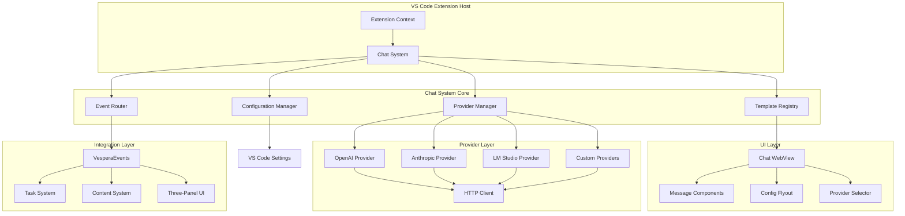

# Vespera Forge Chat System Architecture

## Executive Summary

This document defines the comprehensive architecture for implementing a modular, provider-agnostic chat system in the Vespera Forge VS Code extension. The architecture follows Vespera Atelier's template-driven, event-driven principles while integrating seamlessly with VS Code extension patterns and the existing task management system.

## System Overview

### High-Level Architecture

The Vespera Forge Chat System is built on four foundational pillars:



### Core Components

1. **Template-Driven Configuration**: All provider definitions, UI schemas, and behaviors defined through JSON5 templates
2. **Provider Abstraction Layer**: Unified interface supporting any LLM provider through template configuration
3. **Event-Driven Communication**: Integration with existing VesperaEvents system for cross-component coordination
4. **Atomic Component Design**: Modular UI components following atomic design principles
5. **Three-Panel Integration**: Seamless integration with Vespera's three-panel UI architecture

## Core Components

### 1. Template Registry

The template registry manages provider definitions, UI schemas, and configuration templates following Vespera's template-driven architecture.

#### Template Structure

```typescript
// /src/chat/templates/types.ts
export interface ProviderTemplate {
  template_id: string;
  name: string;
  description: string;
  version: string;
  category: 'llm_provider' | 'chat_ui' | 'chat_config';
  
  provider_config: {
    provider_type: string;
    model: string;
    api_endpoint: string;
    supports_streaming: boolean;
    supports_functions: boolean;
    max_tokens: number;
    context_window: number;
  };
  
  authentication: {
    type: 'api_key' | 'oauth' | 'bearer' | 'custom';
    key_name: string;
    header: string;
    format: string;
  };
  
  ui_schema: {
    config_fields: ConfigField[];
  };
  
  capabilities: {
    streaming: boolean;
    function_calling: boolean;
    image_analysis: boolean;
    code_execution: boolean;
    web_search: boolean;
  };
  
  // Template inheritance
  extends?: string;
  overrides?: Partial<ProviderTemplate>;
}

export interface ConfigField {
  name: string;
  type: 'text' | 'password' | 'number' | 'textarea' | 'select' | 'checkbox';
  required: boolean;
  label: string;
  placeholder?: string;
  description?: string;
  validation?: {
    min?: number;
    max?: number;
    pattern?: string;
    options?: string[];
  };
  default?: any;
}
```

#### Template Registry Implementation

```typescript
// /src/chat/core/template-registry.ts
export class ChatTemplateRegistry {
  private templates = new Map<string, ProviderTemplate>();
  private templateWatcher?: vscode.FileSystemWatcher;
  
  constructor(
    private readonly extensionUri: vscode.Uri,
    private readonly eventRouter: ChatEventRouter
  ) {}
  
  async initialize(): Promise<void> {
    await this.loadBuiltinTemplates();
    await this.loadUserTemplates();
    this.setupTemplateWatcher();
  }
  
  async loadBuiltinTemplates(): Promise<void> {
    const templatesPath = vscode.Uri.joinPath(this.extensionUri, 'templates', 'providers');
    const templateFiles = await vscode.workspace.fs.readDirectory(templatesPath);
    
    for (const [filename] of templateFiles) {
      if (filename.endsWith('.json5')) {
        await this.loadTemplate(vscode.Uri.joinPath(templatesPath, filename));
      }
    }
  }
  
  async loadTemplate(templateUri: vscode.Uri): Promise<void> {
    try {
      const content = await vscode.workspace.fs.readFile(templateUri);
      const templateData = JSON5.parse(Buffer.from(content).toString());
      
      // Validate template schema
      const validationResult = this.validateTemplate(templateData);
      if (!validationResult.valid) {
        throw new Error(`Invalid template: ${validationResult.errors.join(', ')}`);
      }
      
      // Process template inheritance
      const processedTemplate = await this.processTemplateInheritance(templateData);
      
      this.templates.set(processedTemplate.template_id, processedTemplate);
      
      // Emit template loaded event
      this.eventRouter.emit(new TemplateLoadedEvent({
        templateId: processedTemplate.template_id,
        templateName: processedTemplate.name
      }));
      
    } catch (error) {
      console.error(`Failed to load template from ${templateUri.fsPath}:`, error);
    }
  }
  
  getTemplate(templateId: string): ProviderTemplate | undefined {
    return this.templates.get(templateId);
  }
  
  getTemplatesByCategory(category: string): ProviderTemplate[] {
    return Array.from(this.templates.values())
      .filter(template => template.category === category);
  }
  
  private async processTemplateInheritance(template: any): Promise<ProviderTemplate> {
    if (template.extends) {
      const parentTemplate = this.templates.get(template.extends);
      if (parentTemplate) {
        return this.mergeTemplates(parentTemplate, template);
      }
    }
    return template;
  }
  
  private mergeTemplates(parent: ProviderTemplate, child: any): ProviderTemplate {
    return {
      ...parent,
      ...child,
      provider_config: { ...parent.provider_config, ...child.provider_config },
      authentication: { ...parent.authentication, ...child.authentication },
      ui_schema: {
        config_fields: [
          ...parent.ui_schema.config_fields,
          ...(child.ui_schema?.config_fields || [])
        ]
      },
      capabilities: { ...parent.capabilities, ...child.capabilities }
    };
  }
}
```

### 2. Provider System

The provider system implements a template-driven abstraction layer supporting any LLM provider through configuration rather than code changes.

#### Provider Interface

```typescript
// /src/chat/providers/base-provider.ts
export abstract class ChatProvider {
  protected readonly template: ProviderTemplate;
  protected config: ProviderConfig;
  protected status: ProviderStatus = ProviderStatus.Disconnected;
  protected eventEmitter = new EventEmitter();
  
  constructor(template: ProviderTemplate, config: ProviderConfig) {
    this.template = template;
    this.config = config;
  }
  
  abstract async connect(): Promise<void>;
  abstract async disconnect(): Promise<void>;
  abstract async sendMessage(message: ChatMessage): Promise<ChatResponse>;
  abstract async streamMessage(message: ChatMessage): AsyncIterable<ChatChunk>;
  
  // Configuration management
  async configure(newConfig: Partial<ProviderConfig>): Promise<void> {
    const validation = this.validateConfig({ ...this.config, ...newConfig });
    if (!validation.valid) {
      throw new Error(`Invalid configuration: ${validation.errors.join(', ')}`);
    }
    
    this.config = { ...this.config, ...newConfig };
    this.eventEmitter.emit('configUpdated', this.config);
  }
  
  validateConfig(config: ProviderConfig): ValidationResult {
    const errors: string[] = [];
    
    for (const field of this.template.ui_schema.config_fields) {
      if (field.required && !config[field.name]) {
        errors.push(`${field.label} is required`);
      }
      
      if (field.validation && config[field.name]) {
        const value = config[field.name];
        
        if (field.validation.pattern) {
          const regex = new RegExp(field.validation.pattern);
          if (!regex.test(value)) {
            errors.push(`${field.label} format is invalid`);
          }
        }
        
        if (field.type === 'number') {
          const num = Number(value);
          if (field.validation.min !== undefined && num < field.validation.min) {
            errors.push(`${field.label} must be at least ${field.validation.min}`);
          }
          if (field.validation.max !== undefined && num > field.validation.max) {
            errors.push(`${field.label} must be at most ${field.validation.max}`);
          }
        }
      }
    }
    
    return {
      valid: errors.length === 0,
      errors
    };
  }
  
  // Status and capabilities
  getStatus(): ProviderStatus { return this.status; }
  getCapabilities(): ProviderCapabilities { return this.template.capabilities; }
  getTemplate(): ProviderTemplate { return this.template; }
  getConfig(): ProviderConfig { return { ...this.config }; }
  
  // Event handling
  on(event: ProviderEventType, handler: EventHandler): void {
    this.eventEmitter.on(event, handler);
  }
  
  off(event: ProviderEventType, handler: EventHandler): void {
    this.eventEmitter.off(event, handler);
  }
  
  protected emitStatusChange(status: ProviderStatus, error?: string): void {
    this.status = status;
    this.eventEmitter.emit('statusChanged', { status, error });
  }
}
```

#### OpenAI Provider Implementation

```typescript
// /src/chat/providers/openai-provider.ts
export class OpenAIProvider extends ChatProvider {
  private httpClient?: HttpClient;
  
  async connect(): Promise<void> {
    try {
      this.emitStatusChange(ProviderStatus.Connecting);
      
      // Initialize HTTP client with template configuration
      this.httpClient = new HttpClient({
        baseURL: this.template.provider_config.api_endpoint,
        headers: {
          [this.template.authentication.header]: 
            this.template.authentication.format.replace('{key}', this.config.apiKey),
          'Content-Type': 'application/json'
        },
        timeout: 30000
      });
      
      // Test connection with a minimal request
      await this.testConnection();
      
      this.emitStatusChange(ProviderStatus.Connected);
    } catch (error) {
      this.emitStatusChange(ProviderStatus.Error, error.message);
      throw error;
    }
  }
  
  async sendMessage(message: ChatMessage): Promise<ChatResponse> {
    if (!this.httpClient) {
      throw new Error('Provider not connected');
    }
    
    const requestBody = this.buildRequestBody(message, false);
    
    try {
      const response = await this.httpClient.post('/chat/completions', requestBody);
      return this.parseResponse(response.data);
    } catch (error) {
      this.emitStatusChange(ProviderStatus.Error, error.message);
      throw error;
    }
  }
  
  async* streamMessage(message: ChatMessage): AsyncIterable<ChatChunk> {
    if (!this.httpClient) {
      throw new Error('Provider not connected');
    }
    
    const requestBody = this.buildRequestBody(message, true);
    
    try {
      const stream = await this.httpClient.postStream('/chat/completions', requestBody);
      
      for await (const chunk of stream) {
        const lines = chunk.toString().split('\n');
        
        for (const line of lines) {
          if (line.startsWith('data: ')) {
            const data = line.slice(6).trim();
            if (data === '[DONE]') return;
            
            try {
              const parsed = JSON.parse(data);
              const delta = parsed.choices?.[0]?.delta?.content;
              if (delta) {
                yield { content: delta, done: false };
              }
            } catch (e) {
              // Skip invalid JSON
            }
          }
        }
      }
    } catch (error) {
      this.emitStatusChange(ProviderStatus.Error, error.message);
      throw error;
    }
  }
  
  private buildRequestBody(message: ChatMessage, stream: boolean): any {
    return {
      model: this.template.provider_config.model,
      messages: this.formatMessages(message.thread),
      temperature: this.config.temperature || 0.7,
      max_tokens: this.config.maxTokens || this.template.provider_config.max_tokens,
      stream,
      ...(this.config.systemPrompt && {
        messages: [
          { role: 'system', content: this.config.systemPrompt },
          ...this.formatMessages(message.thread)
        ]
      })
    };
  }
  
  private formatMessages(thread: ChatMessage[]): any[] {
    return thread.map(msg => ({
      role: msg.role,
      content: msg.content
    }));
  }
  
  private parseResponse(data: any): ChatResponse {
    return {
      id: data.id,
      content: data.choices[0].message.content,
      role: 'assistant',
      timestamp: new Date(),
      metadata: {
        model: data.model,
        usage: data.usage,
        finish_reason: data.choices[0].finish_reason
      }
    };
  }
  
  private async testConnection(): Promise<void> {
    // Send a minimal test request to verify connection
    const testBody = {
      model: this.template.provider_config.model,
      messages: [{ role: 'user', content: 'test' }],
      max_tokens: 1
    };
    
    await this.httpClient!.post('/chat/completions', testBody);
  }
  
  async disconnect(): Promise<void> {
    this.httpClient = undefined;
    this.emitStatusChange(ProviderStatus.Disconnected);
  }
}
```

### 3. Event System Integration

The chat system integrates with the existing VesperaEvents system for cross-component communication and state synchronization.

#### Chat Event Types

```typescript
// /src/chat/events/types.ts
export interface ChatEventData extends VesperaEventData {
  // Chat-specific events
  chatMessageSent: { messageId: string; content: string; provider: string };
  chatMessageReceived: { messageId: string; content: string; provider: string };
  chatProviderChanged: { from?: string; to: string };
  chatProviderConnected: { providerId: string; providerName: string };
  chatProviderDisconnected: { providerId: string; error?: string };
  chatConfigUpdated: { providerId: string; changes: any };
  chatThreadCreated: { threadId: string; title?: string };
  chatThreadDeleted: { threadId: string };
  chatUILayoutChanged: { mode: ChatLayoutMode; position: ChatPosition };
}

export type ChatEventType = keyof ChatEventData;
```

#### Chat Event Router

```typescript
// /src/chat/events/chat-event-router.ts
export class ChatEventRouter {
  private eventBus = VesperaEventBus.getInstance();
  
  // Emit chat events
  async emit<T extends ChatEventType>(event: ChatEvent<T>): Promise<void> {
    console.log(`[ChatEventRouter] Emitting event: ${event.type}`, event.data);
    this.eventBus.emitEvent(event.type, event.data);
    
    // Cross-system integration events
    await this.handleCrossSystemEvents(event);
  }
  
  // Listen for chat events
  on<T extends ChatEventType>(
    eventType: T, 
    handler: (data: ChatEventData[T]) => void | Promise<void>,
    listenerName?: string
  ): void {
    this.eventBus.onEvent(eventType, handler, listenerName);
  }
  
  // Handle events that affect other systems
  private async handleCrossSystemEvents<T extends ChatEventType>(
    event: ChatEvent<T>
  ): Promise<void> {
    switch (event.type) {
      case 'chatMessageSent':
        // Could trigger task creation or updates
        await this.handlePotentialTaskIntegration(event.data as ChatEventData['chatMessageSent']);
        break;
        
      case 'chatProviderChanged':
        // Update UI components and configurations
        await this.handleProviderChange(event.data as ChatEventData['chatProviderChanged']);
        break;
        
      case 'chatConfigUpdated':
        // Sync configuration changes across components
        await this.handleConfigSync(event.data as ChatEventData['chatConfigUpdated']);
        break;
    }
  }
  
  private async handlePotentialTaskIntegration(data: ChatEventData['chatMessageSent']): Promise<void> {
    // Analyze message content for task-related keywords
    const taskKeywords = ['create task', 'todo', 'remind me', 'schedule'];
    const containsTaskKeyword = taskKeywords.some(keyword => 
      data.content.toLowerCase().includes(keyword)
    );
    
    if (containsTaskKeyword) {
      // Emit suggestion for task creation
      VesperaEvents.taskFocused('suggested', `Potential task from chat: ${data.content.slice(0, 50)}...`);
    }
  }
}
```

### 4. Configuration Management

Hierarchical configuration management supporting VS Code settings, workspace configuration, and user preferences.

#### Configuration Schema

```typescript
// /src/chat/config/types.ts
export interface ChatConfiguration {
  // Provider settings
  providers: {
    [providerId: string]: {
      enabled: boolean;
      config: ProviderConfig;
      isDefault?: boolean;
    };
  };
  
  // UI settings
  ui: {
    theme: 'auto' | 'light' | 'dark';
    layout: ChatLayoutMode;
    position: ChatPosition;
    showTimestamps: boolean;
    compactMode: boolean;
    animationsEnabled: boolean;
  };
  
  // Interaction settings
  interaction: {
    hotkeys: {
      send: 'enter' | 'shift_enter' | 'ctrl_enter';
      newLine: 'shift_enter' | 'ctrl_enter' | 'alt_enter';
      clearChat: string;
      switchProvider: string;
    };
    autoSave: boolean;
    showSendButton: boolean;
    streaming: boolean;
  };
  
  // Integration settings
  integration: {
    taskIntegration: boolean;
    taskKeywords: string[];
    autoSuggestTasks: boolean;
    linkToWorkspace: boolean;
  };
  
  // Advanced settings
  advanced: {
    maxHistorySize: number;
    requestTimeout: number;
    retryAttempts: number;
    debugMode: boolean;
  };
}

export type ConfigScope = 'global' | 'workspace' | 'user';
```

#### Configuration Manager

```typescript
// /src/chat/config/configuration-manager.ts
export class ChatConfigurationManager {
  private config: ChatConfiguration;
  private watchers = new Map<string, ConfigurationWatcher[]>();
  private disposables: vscode.Disposable[] = [];
  
  constructor(
    private readonly context: vscode.ExtensionContext,
    private readonly templateRegistry: ChatTemplateRegistry,
    private readonly eventRouter: ChatEventRouter
  ) {
    this.loadConfiguration();
    this.setupConfigurationWatchers();
  }
  
  private loadConfiguration(): void {
    const defaults = this.getDefaultConfiguration();
    const globalConfig = this.getVSCodeConfiguration();
    const workspaceConfig = this.getWorkspaceConfiguration();
    const userConfig = this.getUserConfiguration();
    
    this.config = this.mergeConfigurations([
      defaults,
      globalConfig,
      workspaceConfig,
      userConfig
    ]);
  }
  
  private getDefaultConfiguration(): ChatConfiguration {
    return {
      providers: {},
      ui: {
        theme: 'auto',
        layout: 'embedded',
        position: 'right',
        showTimestamps: true,
        compactMode: false,
        animationsEnabled: true
      },
      interaction: {
        hotkeys: {
          send: 'enter',
          newLine: 'shift_enter',
          clearChat: 'ctrl+l',
          switchProvider: 'ctrl+shift+p'
        },
        autoSave: true,
        showSendButton: true,
        streaming: true
      },
      integration: {
        taskIntegration: true,
        taskKeywords: ['task', 'todo', 'reminder', 'schedule'],
        autoSuggestTasks: true,
        linkToWorkspace: true
      },
      advanced: {
        maxHistorySize: 1000,
        requestTimeout: 30000,
        retryAttempts: 3,
        debugMode: false
      }
    };
  }
  
  private getVSCodeConfiguration(): Partial<ChatConfiguration> {
    const config = vscode.workspace.getConfiguration('vesperaForge.chat');
    
    return {
      providers: config.get('providers', {}),
      ui: {
        layout: config.get('ui.layout', 'embedded'),
        position: config.get('ui.position', 'right'),
        theme: config.get('ui.theme', 'auto'),
        showTimestamps: config.get('ui.showTimestamps', true),
        compactMode: config.get('ui.compactMode', false),
        animationsEnabled: config.get('ui.animationsEnabled', true)
      },
      interaction: {
        hotkeys: {
          send: config.get('hotkeys.send', 'enter'),
          newLine: config.get('hotkeys.newLine', 'shift_enter'),
          clearChat: config.get('hotkeys.clearChat', 'ctrl+l'),
          switchProvider: config.get('hotkeys.switchProvider', 'ctrl+shift+p')
        },
        autoSave: config.get('interaction.autoSave', true),
        showSendButton: config.get('interaction.showSendButton', true),
        streaming: config.get('interaction.streaming', true)
      },
      integration: {
        taskIntegration: config.get('integration.taskIntegration', true),
        taskKeywords: config.get('integration.taskKeywords', []),
        autoSuggestTasks: config.get('integration.autoSuggestTasks', true),
        linkToWorkspace: config.get('integration.linkToWorkspace', true)
      },
      advanced: {
        maxHistorySize: config.get('advanced.maxHistorySize', 1000),
        requestTimeout: config.get('advanced.requestTimeout', 30000),
        retryAttempts: config.get('advanced.retryAttempts', 3),
        debugMode: config.get('advanced.debugMode', false)
      }
    };
  }
  
  private setupConfigurationWatchers(): void {
    // Watch VS Code settings changes
    const settingsWatcher = vscode.workspace.onDidChangeConfiguration((e) => {
      if (e.affectsConfiguration('vesperaForge.chat')) {
        this.loadConfiguration();
        this.notifyWatchers('settings', this.config);
      }
    });
    this.disposables.push(settingsWatcher);
    
    // Watch template changes
    const templateWatcher = vscode.workspace.createFileSystemWatcher(
      '**/templates/**/*.json5'
    );
    
    templateWatcher.onDidChange(() => {
      this.loadConfiguration();
      this.notifyWatchers('templates', this.config);
    });
    
    this.disposables.push(templateWatcher);
  }
  
  // Configuration access methods
  getConfiguration(): ChatConfiguration {
    return { ...this.config };
  }
  
  getProviderConfig(providerId: string): ProviderConfig | undefined {
    return this.config.providers[providerId]?.config;
  }
  
  async updateConfiguration(
    scope: ConfigScope,
    updates: Partial<ChatConfiguration>
  ): Promise<void> {
    switch (scope) {
      case 'global':
        await this.updateVSCodeConfiguration(updates);
        break;
      case 'workspace':
        await this.updateWorkspaceConfiguration(updates);
        break;
      case 'user':
        await this.updateUserConfiguration(updates);
        break;
    }
    
    this.loadConfiguration();
    this.notifyWatchers(scope, this.config);
    
    // Emit configuration change event
    this.eventRouter.emit(new ConfigurationChangedEvent({
      scope,
      changes: updates
    }));
  }
  
  private async updateVSCodeConfiguration(updates: Partial<ChatConfiguration>): Promise<void> {
    const config = vscode.workspace.getConfiguration('vesperaForge.chat');
    
    if (updates.ui) {
      for (const [key, value] of Object.entries(updates.ui)) {
        await config.update(`ui.${key}`, value, vscode.ConfigurationTarget.Global);
      }
    }
    
    if (updates.interaction?.hotkeys) {
      for (const [key, value] of Object.entries(updates.interaction.hotkeys)) {
        await config.update(`hotkeys.${key}`, value, vscode.ConfigurationTarget.Global);
      }
    }
    
    // Handle other configuration sections...
  }
  
  watchConfiguration(
    key: string, 
    callback: ConfigurationWatcher,
    immediate: boolean = false
  ): void {
    const watchers = this.watchers.get(key) || [];
    watchers.push(callback);
    this.watchers.set(key, watchers);
    
    if (immediate) {
      callback(this.config, 'immediate');
    }
  }
  
  private notifyWatchers(changeType: string, config: ChatConfiguration): void {
    this.watchers.forEach((watchers) => {
      watchers.forEach(watcher => watcher(config, changeType));
    });
  }
  
  dispose(): void {
    this.disposables.forEach(d => d.dispose());
    this.disposables.length = 0;
    this.watchers.clear();
  }
}
```

## File Structure

The chat system follows a modular directory structure aligned with atomic design principles:

```
src/chat/
├── core/                           # Core system components
│   ├── chat-manager.ts            # Main chat system coordinator
│   ├── template-registry.ts       # Template management and loading
│   ├── provider-factory.ts        # Provider instantiation
│   └── http-client.ts             # Shared HTTP utilities
├── providers/                      # Provider implementations
│   ├── base-provider.ts          # Abstract base provider
│   ├── openai-provider.ts        # OpenAI implementation
│   ├── anthropic-provider.ts     # Anthropic implementation
│   ├── lmstudio-provider.ts      # LM Studio implementation
│   └── index.ts                   # Provider registry
├── config/                        # Configuration management
│   ├── configuration-manager.ts  # Hierarchical config management
│   ├── types.ts                  # Configuration interfaces
│   └── defaults.ts               # Default configurations
├── events/                        # Event system integration
│   ├── chat-event-router.ts     # Chat event routing
│   ├── types.ts                  # Event type definitions
│   └── handlers/                 # Specific event handlers
├── ui/                           # UI component system
│   ├── components/               # Atomic UI components
│   │   ├── atoms/               # Basic building blocks
│   │   │   ├── message.tsx      # Individual message display
│   │   │   ├── send-button.tsx  # Send action button
│   │   │   ├── provider-icon.tsx # Provider indicator
│   │   │   └── status-indicator.tsx # Connection status
│   │   ├── molecules/           # Composed components
│   │   │   ├── message-input.tsx # Input + send functionality
│   │   │   ├── message-thread.tsx # Message + metadata
│   │   │   ├── provider-selector.tsx # Provider dropdown
│   │   │   └── config-panel.tsx # Settings group
│   │   ├── organisms/           # Complex components
│   │   │   ├── chat-window.tsx  # Complete chat interface
│   │   │   ├── config-flyout.tsx # Configuration overlay
│   │   │   └── chat-history.tsx # Message list management
│   │   └── templates/           # Layout components
│   │       ├── chat-layout.tsx  # Main layout structure
│   │       └── config-layout.tsx # Settings layout
│   ├── webview/                 # WebView implementation
│   │   ├── chat-webview-provider.ts # Main WebView provider
│   │   ├── html-generator.ts    # Dynamic HTML generation
│   │   └── message-handler.ts   # WebView message routing
│   └── styles/                  # CSS and styling
│       ├── chat.css            # Main chat styles
│       ├── config.css          # Configuration styles
│       └── themes/             # Theme definitions
├── types/                       # TypeScript type definitions
│   ├── chat.ts                 # Core chat types
│   ├── provider.ts             # Provider interfaces
│   ├── config.ts               # Configuration types
│   └── events.ts               # Event type definitions
├── utils/                       # Shared utilities
│   ├── validation.ts           # Input validation
│   ├── encryption.ts           # Credential encryption
│   ├── markdown.ts             # Markdown processing
│   └── theme-helpers.ts        # Theme utilities
└── index.ts                     # Main chat system exports

templates/                       # Provider and UI templates
├── providers/                   # Provider definitions
│   ├── openai-gpt4.json5      # OpenAI GPT-4 template
│   ├── anthropic-claude.json5  # Anthropic Claude template
│   ├── lmstudio-local.json5    # Local LM Studio template
│   └── custom-provider.json5   # Template for custom providers
├── ui/                         # UI configuration templates
│   ├── chat-layouts.json5      # Layout definitions
│   └── themes.json5            # Theme configurations
└── examples/                   # Example templates
    ├── advanced-openai.json5   # Advanced OpenAI configuration
    └── multi-model-setup.json5 # Multi-provider setup

media/                          # Static assets
├── chat/                       # Chat-specific assets
│   ├── chat.css               # Main chat stylesheet
│   ├── chat.js                # Chat JavaScript
│   └── icons/                 # Provider icons
└── config/                     # Configuration assets
    ├── config.css             # Configuration stylesheet
    └── config.js              # Configuration JavaScript
```

## Interface Contracts

### Core Interface Definitions

```typescript
// /src/chat/types/chat.ts
export interface ChatMessage {
  id: string;
  role: 'user' | 'assistant' | 'system';
  content: string;
  timestamp: Date;
  threadId: string;
  metadata?: {
    provider?: string;
    model?: string;
    tokens?: number;
    duration?: number;
    error?: string;
  };
}

export interface ChatThread {
  id: string;
  title?: string;
  messages: ChatMessage[];
  createdAt: Date;
  updatedAt: Date;
  providerId: string;
  metadata: Record<string, any>;
}

export interface ChatResponse {
  id: string;
  content: string;
  role: 'assistant';
  timestamp: Date;
  metadata?: {
    model: string;
    usage?: {
      prompt_tokens: number;
      completion_tokens: number;
      total_tokens: number;
    };
    finish_reason: string;
  };
}

export interface ChatChunk {
  content: string;
  done: boolean;
  metadata?: any;
}

// /src/chat/types/provider.ts
export interface ProviderConfig {
  [key: string]: any;
  apiKey?: string;
  baseUrl?: string;
  model?: string;
  temperature?: number;
  maxTokens?: number;
  systemPrompt?: string;
}

export enum ProviderStatus {
  Disconnected = 'disconnected',
  Connecting = 'connecting',
  Connected = 'connected',
  Error = 'error'
}

export interface ProviderCapabilities {
  streaming: boolean;
  function_calling: boolean;
  image_analysis: boolean;
  code_execution: boolean;
  web_search: boolean;
}

export interface ValidationResult {
  valid: boolean;
  errors: string[];
}

// /src/chat/types/config.ts
export type ChatLayoutMode = 'embedded' | 'floating' | 'sidebar' | 'panel';
export type ChatPosition = 'left' | 'right' | 'bottom' | 'top';

export interface HotkeyConfig {
  send: 'enter' | 'shift_enter' | 'ctrl_enter';
  newLine: 'shift_enter' | 'ctrl_enter' | 'alt_enter';
  clearChat: string;
  switchProvider: string;
}

export interface ConfigurationWatcher {
  (config: ChatConfiguration, changeType: string): void;
}
```

### WebView Communication Contract

```typescript
// /src/chat/webview/types.ts
export type WebViewMessageType = 
  | 'sendMessage'
  | 'switchProvider' 
  | 'configureProvider'
  | 'clearHistory'
  | 'exportHistory'
  | 'updateSettings'
  | 'requestProviders'
  | 'requestHistory';

export interface WebViewMessage {
  type: WebViewMessageType;
  data?: any;
  requestId?: string;
}

export interface WebViewResponse {
  success: boolean;
  data?: any;
  error?: string;
  requestId?: string;
}

// Message-specific interfaces
export interface SendMessageRequest {
  content: string;
  threadId?: string;
  providerId?: string;
}

export interface ConfigureProviderRequest {
  providerId: string;
  config: Partial<ProviderConfig>;
}

export interface UpdateSettingsRequest {
  ui?: Partial<ChatConfiguration['ui']>;
  interaction?: Partial<ChatConfiguration['interaction']>;
}
```

## Implementation Phases

### Phase 1: Core Infrastructure (Weeks 1-2)

**Priority**: Critical foundation components

**Deliverables**:
- [ ] Template Registry with JSON5 parsing and validation
- [ ] Base Provider abstraction and interface
- [ ] Configuration Manager with VS Code settings integration
- [ ] Event Router with VesperaEvents integration
- [ ] Basic WebView Provider setup

**Technical Tasks**:
1. Implement `ChatTemplateRegistry` with template loading and validation
2. Create `ChatProvider` abstract base class with lifecycle management
3. Build `ChatConfigurationManager` with hierarchical configuration
4. Integrate `ChatEventRouter` with existing VesperaEvents system
5. Set up basic WebView infrastructure and message handling

**Acceptance Criteria**:
- Templates can be loaded from JSON5 files with validation
- Provider lifecycle (connect/disconnect/configure) works
- Configuration changes trigger appropriate events
- WebView can render and communicate with extension

### Phase 2: Provider Implementation (Weeks 3-4)

**Priority**: Core LLM provider support

**Deliverables**:
- [ ] OpenAI Provider with streaming support
- [ ] Anthropic Provider with Claude integration
- [ ] LM Studio Provider for local models
- [ ] Provider Factory and Registry
- [ ] Configuration UI for providers

**Technical Tasks**:
1. Implement `OpenAIProvider` with chat completions API
2. Implement `AnthropicProvider` with Messages API
3. Implement `LMStudioProvider` for local model support
4. Create `ProviderFactory` for dynamic provider creation
5. Build configuration flyout UI for provider setup

**Acceptance Criteria**:
- All providers can connect and send/receive messages
- Streaming responses work correctly
- Provider configuration is persistent and validated
- Users can switch between providers seamlessly

### Phase 3: UI Components (Weeks 5-6)

**Priority**: User interface and interaction

**Deliverables**:
- [ ] Atomic UI components (atoms, molecules, organisms)
- [ ] Chat Window with message display and input
- [ ] Configuration Flyout with provider settings
- [ ] Theme integration and responsive design
- [ ] Keyboard shortcuts and hotkeys

**Technical Tasks**:
1. Build atomic components following design system
2. Implement chat window with virtual scrolling
3. Create configuration flyout with template-driven forms
4. Add theme support with VS Code integration
5. Implement keyboard shortcuts and accessibility

**Acceptance Criteria**:
- Chat interface is responsive and accessible
- Configuration flyout works without modal blocking
- Themes adapt to VS Code color scheme
- Keyboard navigation works throughout interface

### Phase 4: Advanced Features (Weeks 7-8)

**Priority**: Enhanced functionality and polish

**Deliverables**:
- [ ] Message history persistence and search
- [ ] Export/import conversation functionality
- [ ] Task integration with automatic suggestions
- [ ] Multi-thread conversation support
- [ ] Error handling and retry logic

**Technical Tasks**:
1. Implement conversation persistence with SQLite
2. Add search and filtering for chat history
3. Build export functionality (JSON, Markdown, PDF)
4. Integrate with task system for automatic task suggestions
5. Add comprehensive error handling and user feedback

**Acceptance Criteria**:
- Chat history persists across VS Code sessions
- Users can search and filter previous conversations
- Task integration provides helpful suggestions
- Error states are handled gracefully with recovery options

### Phase 5: Extension and Testing (Weeks 9-10)

**Priority**: Ecosystem integration and quality assurance

**Deliverables**:
- [ ] Comprehensive unit and integration tests
- [ ] Custom provider template examples
- [ ] Documentation and user guides
- [ ] Performance optimization
- [ ] Extension marketplace preparation

**Technical Tasks**:
1. Write unit tests for all core components
2. Create integration tests for provider interactions
3. Build example custom provider templates
4. Optimize performance for large chat histories
5. Prepare extension for marketplace publication

**Acceptance Criteria**:
- Test coverage exceeds 80% for core functionality
- Performance remains smooth with long conversations
- Documentation is comprehensive and user-friendly
- Extension meets VS Code marketplace requirements

## Security and Privacy Considerations

### API Key Management

```typescript
// /src/chat/utils/encryption.ts
export class CredentialManager {
  private static readonly ENCRYPTION_KEY = 'vespera-chat-credentials';
  
  static async storeCredential(providerId: string, credential: string): Promise<void> {
    const encrypted = await this.encrypt(credential);
    await vscode.window.showInputBox({
      prompt: `Store credential for ${providerId}`,
      password: true,
      value: encrypted
    });
  }
  
  static async retrieveCredential(providerId: string): Promise<string | undefined> {
    const encrypted = vscode.workspace.getConfiguration('vesperaForge.chat')
      .get(`providers.${providerId}.apiKey`);
    
    if (!encrypted) return undefined;
    
    return await this.decrypt(encrypted as string);
  }
  
  private static async encrypt(value: string): Promise<string> {
    // Use VS Code's SecretStorage API when available
    return Buffer.from(value).toString('base64');
  }
  
  private static async decrypt(encrypted: string): Promise<string> {
    return Buffer.from(encrypted, 'base64').toString();
  }
}
```

### Content Security Policy

```typescript
// /src/chat/webview/security.ts
export function getChatWebViewCSP(webview: vscode.Webview): string {
  const cspSource = webview.cspSource;
  
  return `
    default-src 'none';
    style-src ${cspSource} 'unsafe-inline';
    script-src ${cspSource} 'unsafe-eval';
    img-src ${cspSource} https: data:;
    connect-src https: wss:;
    font-src ${cspSource};
  `;
}
```

### Data Privacy

- **Local Storage**: All conversation data stored locally in VS Code workspace
- **No Telemetry**: Chat content never transmitted to Vespera servers
- **Provider Isolation**: Each provider handles its own data transmission
- **User Control**: Users can export, delete, or modify all stored data

## Performance Considerations

### Virtual Scrolling for Large Conversations

```typescript
// /src/chat/ui/components/organisms/chat-history.tsx
export class ChatHistory {
  private virtualScroller: VirtualScroller;
  private messageCache = new Map<string, ChatMessage>();
  
  constructor(private container: HTMLElement) {
    this.virtualScroller = new VirtualScroller({
      container: this.container,
      itemHeight: this.calculateMessageHeight,
      renderItem: this.renderMessage,
      bufferSize: 10
    });
  }
  
  private calculateMessageHeight = (message: ChatMessage): number => {
    // Dynamic height calculation based on content
    const baseHeight = 60;
    const contentHeight = Math.ceil(message.content.length / 80) * 20;
    return baseHeight + contentHeight;
  };
  
  private renderMessage = (message: ChatMessage): HTMLElement => {
    // Efficient message rendering with caching
    const cached = this.messageCache.get(message.id);
    if (cached) return this.createMessageElement(cached);
    
    const element = this.createMessageElement(message);
    this.messageCache.set(message.id, message);
    return element;
  };
}
```

### Streaming Response Optimization

```typescript
// /src/chat/providers/streaming-optimizer.ts
export class StreamingOptimizer {
  private buffer: string = '';
  private flushTimer?: NodeJS.Timeout;
  private readonly FLUSH_INTERVAL = 100; // ms
  private readonly MIN_CHUNK_SIZE = 50;
  
  processChunk(chunk: string, onFlush: (content: string) => void): void {
    this.buffer += chunk;
    
    // Clear existing timer
    if (this.flushTimer) {
      clearTimeout(this.flushTimer);
    }
    
    // Immediate flush for large buffers
    if (this.buffer.length >= this.MIN_CHUNK_SIZE) {
      this.flush(onFlush);
      return;
    }
    
    // Debounced flush for small chunks
    this.flushTimer = setTimeout(() => {
      this.flush(onFlush);
    }, this.FLUSH_INTERVAL);
  }
  
  private flush(onFlush: (content: string) => void): void {
    if (this.buffer.length > 0) {
      onFlush(this.buffer);
      this.buffer = '';
    }
    
    if (this.flushTimer) {
      clearTimeout(this.flushTimer);
      this.flushTimer = undefined;
    }
  }
}
```

## Integration Points

### Task System Integration

```typescript
// /src/chat/integrations/task-integration.ts
export class TaskIntegration {
  constructor(
    private configManager: ChatConfigurationManager,
    private eventRouter: ChatEventRouter
  ) {
    this.setupEventListeners();
  }
  
  private setupEventListeners(): void {
    // Listen for chat messages that might contain tasks
    this.eventRouter.on('chatMessageSent', this.analyzeMessageForTasks.bind(this));
    this.eventRouter.on('chatMessageReceived', this.analyzeResponseForTasks.bind(this));
  }
  
  private async analyzeMessageForTasks(data: ChatEventData['chatMessageSent']): Promise<void> {
    const config = this.configManager.getConfiguration();
    
    if (!config.integration.taskIntegration) return;
    
    const taskKeywords = config.integration.taskKeywords;
    const containsTaskKeyword = taskKeywords.some(keyword =>
      data.content.toLowerCase().includes(keyword.toLowerCase())
    );
    
    if (containsTaskKeyword && config.integration.autoSuggestTasks) {
      // Extract potential task information
      const taskSuggestion = this.extractTaskFromMessage(data.content);
      
      if (taskSuggestion) {
        // Emit task suggestion event
        VesperaEvents.taskFocused('suggestion', `AI suggested: ${taskSuggestion.title}`);
        
        // Show notification to user
        const action = await vscode.window.showInformationMessage(
          `Create task: "${taskSuggestion.title}"?`,
          'Create Task',
          'Dismiss'
        );
        
        if (action === 'Create Task') {
          VesperaEvents.taskCreated(taskSuggestion.id, taskSuggestion.title);
        }
      }
    }
  }
  
  private extractTaskFromMessage(content: string): TaskSuggestion | null {
    // Simple task extraction logic
    // Could be enhanced with NLP or pattern matching
    const taskPatterns = [
      /(?:create|add|make)\s+(?:a\s+)?task:?\s*(.+)/i,
      /(?:todo|to-do):?\s*(.+)/i,
      /remind me to\s+(.+)/i,
      /i need to\s+(.+)/i
    ];
    
    for (const pattern of taskPatterns) {
      const match = content.match(pattern);
      if (match) {
        return {
          id: `task-${Date.now()}`,
          title: match[1].trim(),
          source: 'chat-ai'
        };
      }
    }
    
    return null;
  }
}

interface TaskSuggestion {
  id: string;
  title: string;
  source: string;
}
```

### Three-Panel UI Integration

```typescript
// /src/chat/ui/layout/three-panel-integration.ts
export class ThreePanelIntegration {
  private currentLayout: ChatLayoutMode = 'embedded';
  private currentPosition: ChatPosition = 'right';
  
  constructor(
    private configManager: ChatConfigurationManager,
    private eventRouter: ChatEventRouter
  ) {
    this.setupLayoutListeners();
  }
  
  private setupLayoutListeners(): void {
    // Listen for layout changes from configuration
    this.configManager.watchConfiguration('ui', (config) => {
      if (config.ui.layout !== this.currentLayout || 
          config.ui.position !== this.currentPosition) {
        this.updateLayout(config.ui.layout, config.ui.position);
      }
    });
    
    // Listen for workspace layout changes
    vscode.window.onDidChangeActiveTextEditor(() => {
      this.adaptToWorkspaceLayout();
    });
  }
  
  private async updateLayout(layout: ChatLayoutMode, position: ChatPosition): Promise<void> {
    this.currentLayout = layout;
    this.currentPosition = position;
    
    // Emit layout change event
    this.eventRouter.emit(new LayoutChangedEvent({
      layout,
      position,
      timestamp: new Date()
    }));
    
    // Update CSS classes for responsive design
    this.updateLayoutClasses();
    
    // Adjust WebView positioning
    await this.adjustWebViewPosition();
  }
  
  private updateLayoutClasses(): void {
    const chatContainer = document.querySelector('.chat-container');
    if (chatContainer) {
      chatContainer.className = `chat-container layout-${this.currentLayout} position-${this.currentPosition}`;
    }
  }
  
  private async adjustWebViewPosition(): Promise<void> {
    switch (this.currentLayout) {
      case 'embedded':
        // Chat embedded in main editor area
        await this.setWebViewLocation('editor');
        break;
      case 'sidebar':
        // Chat in dedicated sidebar
        await this.setWebViewLocation('sidebar');
        break;
      case 'floating':
        // Chat as floating panel
        await this.setWebViewLocation('floating');
        break;
      case 'panel':
        // Chat in bottom panel
        await this.setWebViewLocation('panel');
        break;
    }
  }
  
  private async setWebViewLocation(location: string): Promise<void> {
    // Implementation would depend on VS Code WebView API capabilities
    // This is a placeholder for the actual positioning logic
    console.log(`Setting chat WebView location to: ${location}`);
  }
  
  private adaptToWorkspaceLayout(): void {
    // Adapt chat interface based on current workspace layout
    const activeEditor = vscode.window.activeTextEditor;
    
    if (activeEditor) {
      // Adjust chat positioning based on editor state
      const isFullWidth = vscode.window.visibleTextEditors.length === 1;
      const hasMultiplePanels = vscode.window.visibleTextEditors.length > 1;
      
      if (isFullWidth && this.currentLayout === 'embedded') {
        // Optimize for single editor view
        this.updateChatWidth('wide');
      } else if (hasMultiplePanels) {
        // Optimize for split editor view
        this.updateChatWidth('narrow');
      }
    }
  }
  
  private updateChatWidth(width: 'narrow' | 'wide'): void {
    const chatContainer = document.querySelector('.chat-container');
    if (chatContainer) {
      chatContainer.classList.toggle('width-narrow', width === 'narrow');
      chatContainer.classList.toggle('width-wide', width === 'wide');
    }
  }
}
```

## Conclusion

This comprehensive architecture specification provides a robust foundation for implementing the Vespera Forge chat system. The design emphasizes:

1. **Template-Driven Flexibility**: All configurations, providers, and UI layouts are defined through extensible JSON5 templates
2. **Provider Agnostic Design**: Unified interface supporting any LLM provider through configuration
3. **Event-Driven Integration**: Seamless integration with existing Vespera systems through the established event architecture
4. **Atomic Component Design**: Modular, testable, and reusable UI components
5. **Three-Panel UI Alignment**: Native integration with Vespera's three-panel design philosophy

The phased implementation approach ensures steady progress while maintaining system stability and user experience. The architecture supports future extensibility through custom provider templates and user-defined configurations, staying true to Vespera Atelier's vision of user-extensible, template-driven systems.

Key benefits of this architecture:

- **Maintainability**: Clear separation of concerns and modular design
- **Extensibility**: New providers can be added through templates without code changes
- **Performance**: Optimized for large conversations with virtual scrolling and streaming
- **Security**: Comprehensive credential management and content security policies
- **Integration**: Native integration with existing Vespera systems and VS Code APIs

This architecture positions the chat system as a core component of the Vespera Forge ecosystem while maintaining the flexibility and extensibility that defines the Vespera Atelier platform.