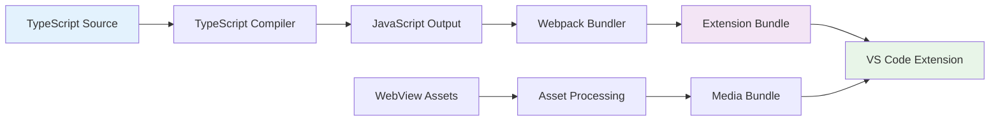

# Building & Testing Guide

## Build System Architecture

Vespera Forge uses a modern TypeScript + Webpack build system optimized for VS Code extension development.



## Build Configurations

### Development Build

**Purpose**: Fast compilation with debugging support

```bash
# Development compilation (preserves source maps, faster)
npm run compile

# Watch mode for continuous development  
npm run watch

# Combined clean + watch
npm run dev
```

**TypeScript Configuration** (`tsconfig.json`):
```json
{
  "compilerOptions": {
    "module": "commonjs",
    "target": "ES2020",
    "lib": ["ES2020"],
    "outDir": "out",
    "rootDir": "src",
    "strict": true,
    "esModuleInterop": true,
    "skipLibCheck": true,
    "forceConsistentCasingInFileNames": true,
    "declaration": true,
    "declarationMap": true,
    "sourceMap": true
  },
  "exclude": ["node_modules", ".vscode-test"]
}
```

### Production Build

**Purpose**: Optimized, minified bundle for distribution

```bash
# Production webpack build
npm run package

# Pre-publish optimization
npm run vscode:prepublish
```

**Webpack Configuration** (`webpack.config.js`):
```javascript
const path = require('path');

module.exports = (env, argv) => {
  const isProduction = argv.mode === 'production';
  
  return {
    target: 'node',
    mode: isProduction ? 'production' : 'development',
    entry: './src/extension.ts',
    output: {
      path: path.resolve(__dirname, 'dist'),
      filename: 'extension.js',
      libraryTarget: 'commonjs2'
    },
    externals: {
      vscode: 'commonjs vscode' // VS Code API excluded from bundle
    },
    resolve: {
      extensions: ['.ts', '.js'],
      alias: {
        '@': path.resolve(__dirname, 'src')
      }
    },
    module: {
      rules: [
        {
          test: /\.ts$/,
          exclude: /node_modules/,
          use: [
            {
              loader: 'ts-loader',
              options: {
                compilerOptions: {
                  sourceMap: !isProduction,
                  declaration: false
                }
              }
            }
          ]
        }
      ]
    },
    devtool: isProduction ? 'hidden-source-map' : 'nosources-source-map',
    optimization: {
      minimize: isProduction
    }
  };
};
```

## Build Performance Optimization

### TypeScript Compilation

**Incremental Compilation**:
```json
// tsconfig.json
{
  "compilerOptions": {
    "incremental": true,
    "tsBuildInfoFile": ".tsbuildinfo"
  }
}
```

**Path Mapping** for cleaner imports:
```json
{
  "compilerOptions": {
    "baseUrl": ".",
    "paths": {
      "@/*": ["src/*"],
      "@/types/*": ["src/types/*"],
      "@/services/*": ["src/services/*"]
    }
  }
}
```

### Webpack Optimizations

**Code Splitting** (if needed for large extensions):
```javascript
module.exports = {
  optimization: {
    splitChunks: {
      chunks: 'all',
      cacheGroups: {
        vendor: {
          test: /[\\/]node_modules[\\/]/,
          name: 'vendors',
          chunks: 'all'
        }
      }
    }
  }
};
```

**Bundle Analysis**:
```bash
# Analyze bundle size
npm install -g webpack-bundle-analyzer
npx webpack-bundle-analyzer dist/extension.js
```

## Testing Strategy

### Test Architecture

```
src/test/
├── extension.test.ts           # Main extension tests
├── bindery-integration.test.ts # Service layer tests
├── ui-components.test.ts       # UI component tests
├── mock-data/                  # Test fixtures
│   ├── tasks.json             # Sample task data
│   └── dashboard.json         # Sample dashboard data
└── helpers/                    # Test utilities
    ├── mock-bindery.ts        # Mock service implementation
    └── vscode-mock.ts         # VS Code API mocking
```

### Unit Testing

**Test Runner Configuration** (`.vscode/tasks.json`):
```json
{
  "version": "2.0.0",
  "tasks": [
    {
      "type": "npm",
      "script": "test",
      "group": "test",
      "presentation": {
        "echo": true,
        "reveal": "always",
        "panel": "new"
      },
      "problemMatcher": "$tsc"
    }
  ]
}
```

**Extension Core Tests**:
```typescript
// src/test/extension.test.ts
import * as assert from 'assert';
import * as vscode from 'vscode';
import { getBinderyService } from '../services/bindery';

suite('Extension Test Suite', () => {
  vscode.window.showInformationMessage('Start all tests.');

  test('Extension activation', async () => {
    // Test that extension activates without errors
    const extension = vscode.extensions.getExtension('vespera-atelier.vespera-forge');
    assert.ok(extension);
    
    await extension!.activate();
    assert.ok(extension!.isActive);
  });

  test('Bindery service initialization', () => {
    const service = getBinderyService();
    assert.ok(service);
    assert.ok(typeof service.initialize === 'function');
  });

  test('Mock mode functionality', async () => {
    const service = getBinderyService();
    
    // Test version info (should work in mock mode)
    const versionResult = await service.getVersionInfo();
    assert.ok(versionResult.success);
    assert.ok(versionResult.data?.version);
  });
});
```

**Service Layer Tests**:
```typescript
// src/test/bindery-integration.test.ts
import * as assert from 'assert';
import { BinderyService } from '../services/bindery';
import { TaskStatus, TaskPriority } from '../types/bindery';

suite('Bindery Integration Tests', () => {
  let service: BinderyService;

  setup(() => {
    service = new BinderyService({ enableLogging: false });
  });

  teardown(async () => {
    await service.disconnect();
  });

  test('Task CRUD operations in mock mode', async () => {
    // Initialize service (will use mock mode)
    const initResult = await service.initialize();
    assert.ok(initResult); // May be mock or real depending on backend availability

    // Create task
    const taskInput = {
      title: 'Test Task',
      description: 'Test description',
      priority: TaskPriority.Normal,
      tags: ['test'],
      labels: {},
      subtasks: []
    };

    const createResult = await service.createTask(taskInput);
    assert.ok(createResult.success);
    
    if (createResult.success) {
      const taskId = createResult.data;
      assert.ok(taskId);

      // Get task
      const getResult = await service.getTask(taskId);
      assert.ok(getResult.success);
      
      if (getResult.success) {
        assert.strictEqual(getResult.data.title, 'Test Task');
      }
    }
  });

  test('Dashboard data retrieval', async () => {
    await service.initialize();
    
    const dashboardResult = await service.getTaskDashboard();
    assert.ok(dashboardResult.success);
    
    if (dashboardResult.success) {
      const dashboard = dashboardResult.data;
      assert.ok(typeof dashboard.total_tasks === 'number');
      assert.ok(typeof dashboard.status_breakdown === 'object');
    }
  });
});
```

### Integration Testing

**UI Component Tests**:
```typescript
// src/test/ui-components.test.ts
import * as assert from 'assert';
import * as vscode from 'vscode';
import { TaskTreeDataProvider } from '../views/task-tree-view';
import { mockTaskData } from './mock-data/tasks';

suite('UI Components Tests', () => {
  test('Task tree data provider', () => {
    const provider = new TaskTreeDataProvider();
    assert.ok(provider);
    
    // Test tree item creation
    const mockTask = mockTaskData[0];
    const children = provider.getChildren();
    assert.ok(children instanceof Promise);
  });

  test('Status bar manager updates', async () => {
    // Test status bar integration
    const statusItems = vscode.window.createStatusBarItem();
    assert.ok(statusItems);
    
    // Test status updates
    statusItems.text = '$(check) Connected';
    assert.strictEqual(statusItems.text, '$(check) Connected');
  });
});
```

### Test Data Management

**Mock Task Data** (`src/test/mock-data/tasks.json`):
```json
[
  {
    "id": "task_123",
    "title": "Implement user authentication",
    "description": "Add login/logout functionality with JWT tokens",
    "status": "Doing", 
    "priority": "High",
    "created_at": "2025-01-09T10:00:00Z",
    "updated_at": "2025-01-09T12:00:00Z",
    "tags": ["auth", "backend"],
    "child_count": 3
  },
  {
    "id": "task_456", 
    "title": "Design user interface",
    "description": "Create mockups and prototypes",
    "status": "Todo",
    "priority": "Normal",
    "created_at": "2025-01-09T09:00:00Z",
    "updated_at": "2025-01-09T09:30:00Z", 
    "tags": ["ui", "design"],
    "child_count": 0
  }
]
```

**Mock Service Helper**:
```typescript
// src/test/helpers/mock-bindery.ts
import { BinderyService } from '../../services/bindery';
import { TaskSummary } from '../../types/bindery';
import mockTasks from '../mock-data/tasks.json';

export class MockBinderyService extends BinderyService {
  private mockTasks: TaskSummary[] = mockTasks;
  private nextId = 1000;

  async createTask(input: any): Promise<any> {
    const newTask: TaskSummary = {
      id: `mock_task_${this.nextId++}`,
      title: input.title,
      description: input.description,
      status: 'Todo',
      priority: input.priority || 'Normal',
      created_at: new Date().toISOString(),
      updated_at: new Date().toISOString(),
      tags: input.tags || [],
      child_count: 0
    };
    
    this.mockTasks.push(newTask);
    return { success: true, data: newTask.id };
  }

  async listTasks(): Promise<any> {
    return { success: true, data: this.mockTasks };
  }
}
```

## Test Execution

### Running Tests

**Command Line**:
```bash
# Compile test files
npm run compile-tests

# Run all tests
npm run test

# Run with coverage (if configured)
npm run test:coverage
```

**VS Code Integration**:
1. Open Command Palette (`Ctrl+Shift+P`)
2. Run `Test: Run All Tests`  
3. View results in Test Explorer

**Debug Tests**:
```json
// .vscode/launch.json
{
  "name": "Extension Tests",
  "type": "extensionHost",
  "request": "launch",
  "args": [
    "--extensionDevelopmentPath=${workspaceFolder}",
    "--extensionTestsPath=${workspaceFolder}/out/test"
  ],
  "outFiles": ["${workspaceFolder}/out/test/**/*.js"]
}
```

### Continuous Integration

**GitHub Actions Workflow** (`.github/workflows/test.yml`):
```yaml
name: Test Extension

on:
  push:
    paths: ['plugins/VSCode/vespera-forge/**']
  pull_request:
    paths: ['plugins/VSCode/vespera-forge/**']

jobs:
  test:
    runs-on: ubuntu-latest
    
    steps:
    - uses: actions/checkout@v4
    
    - name: Setup Node.js
      uses: actions/setup-node@v4
      with:
        node-version: '18'
        cache: 'npm'
        cache-dependency-path: plugins/VSCode/vespera-forge/package-lock.json
    
    - name: Install dependencies
      run: npm ci
      working-directory: plugins/VSCode/vespera-forge
    
    - name: Compile TypeScript
      run: npm run compile
      working-directory: plugins/VSCode/vespera-forge
    
    - name: Run tests
      run: |
        Xvfb :99 -screen 0 1024x768x24 > /dev/null 2>&1 &
        export DISPLAY=:99
        npm run test
      working-directory: plugins/VSCode/vespera-forge
    
    - name: Package extension
      run: npm run package
      working-directory: plugins/VSCode/vespera-forge
```

## Code Quality Tools

### ESLint Configuration

**Configuration** (`.eslintrc.json`):
```json
{
  "extends": [
    "@typescript-eslint/recommended"
  ],
  "parser": "@typescript-eslint/parser",
  "plugins": ["@typescript-eslint"],
  "root": true,
  "parserOptions": {
    "ecmaVersion": 6,
    "sourceType": "module"
  },
  "rules": {
    "@typescript-eslint/naming-convention": [
      "warn",
      {
        "selector": "import",
        "format": ["camelCase", "PascalCase"]
      }
    ],
    "@typescript-eslint/semi": "warn",
    "curly": "warn",
    "eqeqeq": "warn",
    "no-throw-literal": "warn",
    "semi": "off"
  }
}
```

**Linting Commands**:
```bash
# Check code style
npm run lint

# Auto-fix issues
npm run lint:fix

# Check specific files
npx eslint src/services/bindery.ts
```

### Prettier Integration

**Configuration** (`.prettierrc`):
```json
{
  "semi": true,
  "trailingComma": "es5",
  "singleQuote": true,
  "printWidth": 100,
  "tabWidth": 2,
  "useTabs": false
}
```

### Type Checking

**Strict TypeScript Configuration**:
```json
{
  "compilerOptions": {
    "strict": true,
    "noImplicitAny": true,
    "noImplicitReturns": true,
    "noFallthroughCasesInSwitch": true,
    "noUncheckedIndexedAccess": true
  }
}
```

**Type Checking Commands**:
```bash
# Type check without emitting
npx tsc --noEmit

# Type check with project references
npx tsc --build --dry --force
```

## Performance Profiling

### Bundle Size Analysis

**Webpack Bundle Analyzer**:
```bash
npm install -g webpack-bundle-analyzer
npm run package
npx webpack-bundle-analyzer dist/extension.js
```

### Extension Performance

**VS Code Performance Monitoring**:
```typescript
// Performance measuring example
export async function activate(context: vscode.ExtensionContext): Promise<void> {
  const startTime = Date.now();
  
  try {
    // Extension initialization
    await initializeExtension(context);
    
    const activationTime = Date.now() - startTime;
    console.log(`Vespera Forge activated in ${activationTime}ms`);
    
  } catch (error) {
    console.error('Activation failed:', error);
  }
}
```

### Memory Usage Monitoring

```typescript
class PerformanceMonitor {
  private memoryCheckInterval?: NodeJS.Timeout;
  
  startMonitoring(): void {
    this.memoryCheckInterval = setInterval(() => {
      const usage = process.memoryUsage();
      console.log('Memory usage:', {
        rss: Math.round(usage.rss / 1024 / 1024) + 'MB',
        heapUsed: Math.round(usage.heapUsed / 1024 / 1024) + 'MB',
        heapTotal: Math.round(usage.heapTotal / 1024 / 1024) + 'MB'
      });
    }, 30000); // Every 30 seconds
  }
  
  dispose(): void {
    if (this.memoryCheckInterval) {
      clearInterval(this.memoryCheckInterval);
    }
  }
}
```

## Distribution & Packaging

### VSIX Package Creation

```bash
# Install vsce (VS Code Extension CLI)
npm install -g vsce

# Create VSIX package
vsce package

# Publish to marketplace (requires publisher account)
vsce publish
```

### Package Optimization

**Pre-publish Checklist**:
- ✅ All tests passing
- ✅ No linting errors  
- ✅ Bundle size reasonable (<5MB)
- ✅ README.md updated
- ✅ CHANGELOG.md updated
- ✅ Version number incremented

**Bundle Size Optimization**:
```javascript
// webpack.config.js optimizations
module.exports = {
  optimization: {
    minimize: true,
    usedExports: true,
    sideEffects: false
  },
  resolve: {
    alias: {
      // Replace heavy dependencies with lighter alternatives if needed
    }
  }
};
```

## Troubleshooting Build Issues

### Common Problems

**TypeScript Compilation Errors**:
```bash
# Clear TypeScript cache
rm -rf node_modules/.cache
rm .tsbuildinfo

# Reinstall type definitions
npm install --save-dev @types/vscode@latest
```

**Webpack Bundle Issues**:
```bash
# Clear webpack cache
rm -rf dist/
rm -rf .webpack-cache/

# Verbose webpack output
npx webpack --mode production --stats verbose
```

**Test Failures**:
```bash
# Run tests with debugging
npm run test -- --timeout 10000 --reporter spec

# Run specific test suite
npx mocha out/test/bindery-integration.test.js
```

**Extension Loading Problems**:
```bash
# Check extension manifest
npx vsce ls

# Validate package.json
npm run vscode:prepublish
```

---

The build and testing system provides a robust foundation for developing, testing, and distributing the Vespera Forge VS Code extension with confidence in quality and performance.