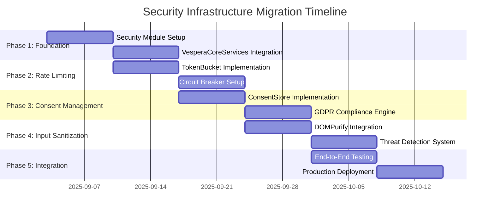

# Migration and Deployment Guide

**Version**: 1.0  
**Date**: September 2025  
**Status**: Production Ready  

## 📋 Overview

This guide provides comprehensive instructions for migrating to the Vespera Forge security infrastructure, including deployment strategies, rollback procedures, and performance optimization guidance.

## 🎯 Migration Strategy

### Phase-Based Approach

The migration follows a carefully planned 5-phase approach designed to minimize risk and ensure smooth transition:



### Migration Prerequisites

#### System Requirements
- **VS Code Version**: ^1.95.0
- **Node.js Version**: ^18.0.0
- **TypeScript Version**: ^5.0.0
- **Available Memory**: 100MB+ additional for development
- **Available Storage**: 50MB+ for audit logs and configuration

#### Development Environment Setup
```bash
# Install required dependencies
npm install --save dompurify joi fast-xml-parser
npm install --save-dev @types/dompurify

# Update VS Code engine requirement
# In package.json:
{
  "engines": {
    "vscode": "^1.95.0"
  }
}
```

#### Feature Flag Configuration
```typescript
// In extension settings or configuration
const migrationConfig = {
  "vesperaForge.migration.enableSecurityInfrastructure": true,
  "vesperaForge.migration.phaseGates": {
    "foundation": true,
    "rateLimiting": false,
    "consentManagement": false,
    "inputSanitization": false,
    "fullIntegration": false
  }
};
```

## 🚀 Phase 1: Foundation Infrastructure

### Objective
Establish the security module structure and integrate with existing VesperaCoreServices.

### Implementation Steps

#### 1.1 Create Security Module Structure
```bash
# Create security module directories
mkdir -p src/core/security/{rate-limiting,consent,sanitization,audit}
mkdir -p src/types/security
mkdir -p src/test/security
```

#### 1.2 Implement Security Manager
```typescript
// src/core/security/VesperaSecurityManager.ts
import { VesperaLogger } from '../logging/VesperaLogger';
import { VesperaErrorHandler } from '../error-handling/VesperaErrorHandler';
import { VesperaContextManager } from '../memory-management/VesperaContextManager';

export class VesperaSecurityManager {
  private static instance: VesperaSecurityManager;
  
  public static async initialize(
    logger: VesperaLogger,
    errorHandler: VesperaErrorHandler,
    contextManager: VesperaContextManager,
    config: SecurityConfiguration
  ): Promise<VesperaSecurityManager> {
    // Implementation as shown in existing code
  }
}
```

#### 1.3 Integrate with VesperaCoreServices
```typescript
// src/core/security/SecurityEnhancedCoreServices.ts
import { VesperaCoreServices } from '../VesperaCoreServices';

export class SecurityEnhancedVesperaCoreServices extends VesperaCoreServices {
  private securityManager?: VesperaSecurityManager;
  
  public async initializeSecurity(config: SecurityConfiguration): Promise<void> {
    this.securityManager = await VesperaSecurityManager.initialize(
      this.logger,
      this.errorHandler,
      this.contextManager,
      config
    );
  }
  
  // Getter methods for security services
  public get rateLimiter(): VesperaRateLimiter | undefined {
    return this.securityManager?.getService('rateLimiter');
  }
}
```

#### 1.4 Feature Flag Implementation
```typescript
// src/core/security/SecurityFeatureFlags.ts
export class SecurityFeatureFlags {
  private static flags: Record<string, boolean> = {};
  
  public static setFlag(name: string, value: boolean): void {
    this.flags[name] = value;
  }
  
  public static isEnabled(name: string): boolean {
    return this.flags[name] ?? false;
  }
}
```

### Phase 1 Validation Checklist
- [ ] Security manager initializes without errors
- [ ] Integration with VesperaCoreServices is seamless
- [ ] Feature flags control security service activation
- [ ] Memory usage remains within acceptable limits
- [ ] Extension startup time increase is < 50ms

### Phase 1 Rollback Procedure
```typescript
// Emergency rollback for Phase 1
const rollbackPhase1 = async () => {
  SecurityFeatureFlags.setFlag('SECURITY_INFRASTRUCTURE_ENABLED', false);
  
  // Dispose security manager if initialized
  if (securityManager) {
    await securityManager.dispose();
  }
  
  // Revert to original VesperaCoreServices
  const originalServices = new VesperaCoreServices();
  await originalServices.initialize(context, originalConfig);
};
```

## 🚦 Phase 2: Rate Limiting Implementation

### Objective
Implement comprehensive rate limiting with token bucket algorithms and circuit breakers.

### Implementation Steps

#### 2.1 Token Bucket Implementation
```typescript
// src/core/security/rate-limiting/TokenBucket.ts
export class TokenBucket {
  private tokens: number;
  private lastRefill: number;
  private refillTimer?: NodeJS.Timeout;

  constructor(private config: TokenBucketConfig) {
    this.tokens = config.initialTokens ?? config.capacity;
    this.lastRefill = Date.now();
    this.startRefillTimer();
  }

  public async consumeTokens(count: number = 1): Promise<boolean> {
    this.refill();
    
    if (this.tokens >= count) {
      this.tokens -= count;
      return true;
    }
    
    return false;
  }

  private refill(): void {
    const now = Date.now();
    const timePassed = now - this.lastRefill;
    const tokensToAdd = Math.floor(timePassed / this.config.refillInterval) * this.config.refillRate;
    
    if (tokensToAdd > 0) {
      this.tokens = Math.min(this.config.capacity, this.tokens + tokensToAdd);
      this.lastRefill = now;
    }
  }
}
```

#### 2.2 Circuit Breaker Implementation
```typescript
// src/core/security/rate-limiting/CircuitBreaker.ts
export class CircuitBreaker {
  private state: CircuitBreakerState = CircuitBreakerState.CLOSED;
  private failureCount = 0;
  private lastFailureTime = 0;
  private halfOpenCalls = 0;

  constructor(private config: CircuitBreakerConfig) {}

  public async execute<T>(operation: () => Promise<T>): Promise<T> {
    if (this.state === CircuitBreakerState.OPEN) {
      if (Date.now() - this.lastFailureTime < this.config.recoveryTimeout) {
        throw new VesperaCircuitBreakerError('Circuit breaker is OPEN');
      } else {
        this.state = CircuitBreakerState.HALF_OPEN;
        this.halfOpenCalls = 0;
      }
    }

    try {
      const result = await operation();
      this.onSuccess();
      return result;
    } catch (error) {
      this.onFailure();
      throw error;
    }
  }
}
```

#### 2.3 Rate Limiter Service
```typescript
// src/core/security/rate-limiting/VesperaRateLimiter.ts
export class VesperaRateLimiter implements VesperaRateLimiterInterface {
  private buckets = new Map<string, TokenBucket>();
  private circuitBreakers = new Map<string, CircuitBreaker>();
  private rules: RateLimitRule[] = [];

  public async checkRateLimit(context: RateLimitContext): Promise<RateLimitResult> {
    const matchingRule = this.findMatchingRule(context.resourceId);
    if (!matchingRule) {
      return { allowed: true, rule: null, tokensRemaining: Infinity };
    }

    const bucketKey = this.getBucketKey(matchingRule, context);
    const bucket = this.getOrCreateBucket(bucketKey, matchingRule.bucket);
    
    const allowed = await bucket.consumeTokens(1);
    
    if (!allowed) {
      await this.executeRateLimitActions(matchingRule, context);
    }

    return {
      allowed,
      rule: matchingRule,
      tokensRemaining: bucket.getTokenCount(),
      retryAfter: allowed ? undefined : this.calculateRetryAfter(bucket)
    };
  }
}
```

### Phase 2 Performance Benchmarks

#### Memory Usage Targets
- Token buckets: < 1KB per bucket
- Circuit breakers: < 512 bytes per breaker
- Total rate limiting overhead: < 10MB

#### Performance Targets
- Rate limit check: < 1ms average
- Token consumption: < 0.5ms average
- Rule evaluation: < 0.1ms average

### Phase 2 Testing Strategy
```typescript
describe('Rate Limiting System', () => {
  describe('Token Bucket', () => {
    it('should allow requests within capacity', async () => {
      const bucket = new TokenBucket({ capacity: 10, refillRate: 1, refillInterval: 1000 });
      const result = await bucket.consumeTokens(5);
      expect(result).toBe(true);
    });

    it('should reject requests exceeding capacity', async () => {
      const bucket = new TokenBucket({ capacity: 10, refillRate: 1, refillInterval: 1000 });
      await bucket.consumeTokens(10);
      const result = await bucket.consumeTokens(1);
      expect(result).toBe(false);
    });

    it('should refill tokens over time', async () => {
      // Implementation with time mocking
    });
  });

  describe('Circuit Breaker', () => {
    it('should open circuit after failure threshold', async () => {
      // Test circuit breaker failure handling
    });

    it('should attempt recovery after timeout', async () => {
      // Test circuit breaker recovery
    });
  });
});
```

### Phase 2 Validation Checklist
- [ ] Token buckets correctly enforce rate limits
- [ ] Circuit breakers open/close based on failure thresholds
- [ ] Rate limiting rules are evaluated efficiently
- [ ] Memory usage is within targets
- [ ] Performance benchmarks are met

## ✅ Phase 3: Consent Management Implementation

### Objective
Implement GDPR-compliant consent management with encrypted storage and audit trails.

### Implementation Steps

#### 3.1 Consent Store Implementation
```typescript
// src/core/security/consent/ConsentStore.ts
export class ConsentStore {
  private storage: vscode.Memento;
  private encryptionKey: string;

  constructor(context: vscode.ExtensionContext) {
    this.storage = context.globalState;
    this.encryptionKey = this.generateEncryptionKey();
  }

  public async storeConsent(record: ConsentRecord): Promise<void> {
    const encryptedRecord = await this.encryptRecord(record);
    const key = this.getConsentKey(record.userId, record.purposeId);
    await this.storage.update(key, encryptedRecord);
    
    // Store in audit trail
    await this.auditLogger.logConsentEvent({
      userId: record.userId,
      purposeId: record.purposeId,
      action: 'granted',
      timestamp: Date.now(),
      evidence: record.evidence
    });
  }

  public async getConsent(userId: string, purposeId: string): Promise<ConsentRecord | null> {
    const key = this.getConsentKey(userId, purposeId);
    const encryptedRecord = this.storage.get(key);
    
    if (!encryptedRecord) {
      return null;
    }

    return await this.decryptRecord(encryptedRecord);
  }
}
```

#### 3.2 Consent Manager Implementation
```typescript
// src/core/security/consent/VesperaConsentManager.ts
export class VesperaConsentManager implements VesperaConsentManagerInterface {
  private consentStore: ConsentStore;
  private consentUI: ConsentUI;

  public async requestConsent(purposes: string[]): Promise<ConsentUIResponse> {
    // Check existing consent
    const existingConsents = await Promise.all(
      purposes.map(p => this.hasConsent('current-user', p))
    );

    const missingConsents = purposes.filter((_, index) => !existingConsents[index]);
    
    if (missingConsents.length === 0) {
      return { granted: true, purposes, timestamp: Date.now() };
    }

    // Show consent UI for missing consents
    const uiResponse = await this.consentUI.showConsentDialog(missingConsents);
    
    if (uiResponse.granted) {
      // Store granted consents
      await Promise.all(
        uiResponse.purposes.map(purposeId => 
          this.grantConsent('current-user', purposeId, uiResponse.evidence)
        )
      );
    }

    return uiResponse;
  }

  public async withdrawConsent(userId: string, purposes?: string[]): Promise<void> {
    if (!purposes) {
      // Withdraw all consents (right to be forgotten)
      const allPurposes = await this.getAllConsentPurposes(userId);
      purposes = allPurposes.map(p => p.id);
    }

    await Promise.all(
      purposes.map(async (purposeId) => {
        await this.consentStore.removeConsent(userId, purposeId);
        
        // Trigger data cleanup
        await this.cleanupUserData(userId, purposeId);
        
        // Log withdrawal
        await this.auditLogger.logConsentEvent({
          userId,
          purposeId,
          action: 'withdrawn',
          timestamp: Date.now()
        });
      })
    );

    // Emit consent changed event
    this.eventBus.emitSecurityEvent(
      VesperaSecurityEvent.CONSENT_WITHDRAWN,
      { userId, metadata: { purposeIds: purposes } }
    );
  }
}
```

#### 3.3 Non-Intrusive UI Implementation
```typescript
// src/core/security/consent/ConsentUI.ts
export class ConsentUI {
  private panel?: vscode.WebviewPanel;

  public async showConsentDialog(purposes: ConsentPurpose[]): Promise<ConsentUIResponse> {
    return new Promise((resolve) => {
      this.createConsentPanel(purposes, resolve);
    });
  }

  private createConsentPanel(
    purposes: ConsentPurpose[], 
    callback: (response: ConsentUIResponse) => void
  ): void {
    this.panel = vscode.window.createWebviewPanel(
      'vesperaConsent',
      'Privacy Consent',
      vscode.ViewColumn.Beside,
      {
        enableScripts: true,
        localResourceRoots: [],
        retainContextWhenHidden: true
      }
    );

    this.panel.webview.html = this.generateConsentHTML(purposes);
    
    this.panel.webview.onDidReceiveMessage((message) => {
      if (message.command === 'consentResponse') {
        callback({
          granted: message.granted,
          purposes: message.purposes,
          timestamp: Date.now(),
          evidence: {
            method: ConsentMethod.UI_DIALOG,
            ipAddress: 'local',
            userAgent: 'VS Code',
            consentString: message.consentString
          }
        });
        this.panel?.dispose();
      }
    });
  }
}
```

### Phase 3 GDPR Compliance Checklist
- [ ] **Article 6**: Lawful basis for processing established
- [ ] **Article 7**: Consent requirements met (specific, informed, unambiguous)
- [ ] **Article 13/14**: Information provided to data subjects
- [ ] **Article 17**: Right to erasure implemented
- [ ] **Article 20**: Data portability support
- [ ] **Article 30**: Records of processing activities maintained

### Phase 3 Testing Strategy
```typescript
describe('Consent Management System', () => {
  describe('GDPR Compliance', () => {
    it('should require explicit consent for non-essential purposes', async () => {
      const manager = new VesperaConsentManager(store, ui, logger);
      const hasConsent = await manager.hasConsent('user1', 'analytics');
      expect(hasConsent).toBe(false);
    });

    it('should honor consent withdrawal immediately', async () => {
      const manager = new VesperaConsentManager(store, ui, logger);
      await manager.grantConsent('user1', 'analytics', evidence);
      await manager.withdrawConsent('user1', ['analytics']);
      const hasConsent = await manager.hasConsent('user1', 'analytics');
      expect(hasConsent).toBe(false);
    });

    it('should cleanup user data on consent withdrawal', async () => {
      // Test data cleanup mechanism
    });
  });
});
```

## 🛡️ Phase 4: Input Sanitization Implementation

### Objective
Implement comprehensive input sanitization with threat detection and CSP management.

### Implementation Steps

#### 4.1 DOMPurify Integration
```typescript
// src/core/security/sanitization/DOMPurifyAdapter.ts
import DOMPurify from 'dompurify';

export class DOMPurifyAdapter {
  private purify: DOMPurify.DOMPurifyI;

  constructor() {
    // Configure DOMPurify for VS Code WebView environment
    this.purify = DOMPurify();
    this.configurePurify();
  }

  public sanitizeHTML(html: string, config?: SanitizationConfig): string {
    const purifyConfig = this.convertConfig(config);
    return this.purify.sanitize(html, purifyConfig);
  }

  private configurePurify(): void {
    // Configure hooks and policies for VS Code environment
    this.purify.addHook('afterSanitizeElements', (node) => {
      // Custom sanitization logic
    });

    this.purify.addHook('uponSanitizeAttribute', (node, data) => {
      // Attribute validation logic
    });
  }
}
```

#### 4.2 Schema Validation System
```typescript
// src/core/security/sanitization/SchemaValidator.ts
import Joi from 'joi';

export class SchemaValidator {
  private schemas = new Map<string, Joi.Schema>();

  public registerSchema(name: string, schema: Joi.Schema): void {
    this.schemas.set(name, schema);
  }

  public async validateData(data: unknown, schemaName: string): Promise<ValidationResult> {
    const schema = this.schemas.get(schemaName);
    if (!schema) {
      throw new VesperaSanitizationError(`Schema not found: ${schemaName}`);
    }

    try {
      const { error, value } = schema.validate(data, {
        abortEarly: false,
        allowUnknown: false,
        stripUnknown: true
      });

      return {
        valid: !error,
        value,
        errors: error?.details.map(d => d.message) ?? []
      };
    } catch (error) {
      throw new VesperaSanitizationError('Schema validation failed', undefined, undefined, {
        originalError: error,
        schemaName,
        data
      });
    }
  }
}
```

#### 4.3 Threat Detection Engine
```typescript
// src/core/security/sanitization/ThreatDetector.ts
export class ThreatDetector {
  private patterns: Map<string, ThreatPattern> = new Map();
  private mlModel?: ThreatMLModel;

  constructor(private config: ThreatDetectionConfig) {
    this.loadThreatPatterns(config.patterns);
  }

  public async detectThreats(input: string): Promise<DetectedThreat[]> {
    const threats: DetectedThreat[] = [];

    // Pattern-based detection
    for (const [id, pattern] of this.patterns) {
      const matches = input.match(pattern.pattern);
      if (matches) {
        threats.push({
          id,
          type: pattern.type,
          severity: pattern.severity,
          pattern: pattern.pattern.toString(),
          matches: matches,
          confidence: 1.0 // Pattern matches are 100% confident
        });
      }
    }

    // ML-based detection (if available)
    if (this.mlModel) {
      const mlThreats = await this.mlModel.detectThreats(input);
      threats.push(...mlThreats);
    }

    return threats.sort((a, b) => this.getSeverityWeight(b.severity) - this.getSeverityWeight(a.severity));
  }

  private getSeverityWeight(severity: ThreatSeverity): number {
    const weights = {
      [ThreatSeverity.CRITICAL]: 4,
      [ThreatSeverity.HIGH]: 3,
      [ThreatSeverity.MEDIUM]: 2,
      [ThreatSeverity.LOW]: 1
    };
    return weights[severity] ?? 0;
  }
}
```

#### 4.4 Input Sanitizer Service
```typescript
// src/core/security/sanitization/VesperaInputSanitizer.ts
export class VesperaInputSanitizer implements VesperaInputSanitizerInterface {
  private domPurifyAdapter: DOMPurifyAdapter;
  private schemaValidator: SchemaValidator;
  private threatDetector: ThreatDetector;

  public async sanitize(input: string, scope: SanitizationScope): Promise<SanitizationResult> {
    // 1. Threat detection
    const threats = await this.threatDetector.detectThreats(input);
    const criticalThreats = threats.filter(t => t.severity === ThreatSeverity.CRITICAL);

    if (criticalThreats.length > 0) {
      // Block input with critical threats
      await this.auditLogger.logThreatDetection(criticalThreats);
      throw new VesperaThreatError('Critical threat detected', criticalThreats);
    }

    // 2. Apply sanitization rules
    const rule = this.findSanitizationRule(scope);
    let sanitizedInput = input;

    for (const processor of rule.processors) {
      sanitizedInput = await this.processInput(sanitizedInput, processor);
    }

    // 3. Final validation
    const finalThreats = await this.threatDetector.detectThreats(sanitizedInput);
    const remainingThreats = finalThreats.filter(t => t.severity >= ThreatSeverity.HIGH);

    return {
      sanitized: sanitizedInput,
      threats: threats,
      processed: threats.length > 0,
      safe: remainingThreats.length === 0,
      processingTime: Date.now() - startTime
    };
  }
}
```

### Phase 4 Security Testing
```typescript
describe('Input Sanitization System', () => {
  describe('XSS Prevention', () => {
    it('should remove script tags', async () => {
      const sanitizer = new VesperaInputSanitizer(config);
      const result = await sanitizer.sanitize(
        '<script>alert("xss")</script>', 
        SanitizationScope.WEBVIEW
      );
      expect(result.sanitized).not.toContain('<script>');
    });

    it('should neutralize javascript: protocol', async () => {
      const result = await sanitizer.sanitize(
        '<a href="javascript:alert(\'xss\')">link</a>', 
        SanitizationScope.WEBVIEW
      );
      expect(result.sanitized).not.toContain('javascript:');
    });
  });

  describe('Injection Prevention', () => {
    it('should block SQL injection patterns', async () => {
      const input = "'; DROP TABLE users; --";
      const result = await sanitizer.sanitize(input, SanitizationScope.USER_INPUT);
      expect(result.threats).toHaveLength(1);
      expect(result.threats[0].type).toBe(ThreatType.SQL_INJECTION);
    });
  });
});
```

## 🔗 Phase 5: Integration and Testing

### Objective
Complete end-to-end integration of all security services with comprehensive testing.

### Implementation Steps

#### 5.1 Security Enhanced Core Services
```typescript
// src/core/security/SecurityEnhancedCoreServices.ts
export class SecurityEnhancedVesperaCoreServices extends VesperaCoreServices 
  implements SecurityEnhancedCoreServicesInterface {

  private securityManager?: VesperaSecurityManager;
  private rateLimiter?: VesperaRateLimiter;
  private consentManager?: VesperaConsentManager;
  private inputSanitizer?: VesperaInputSanitizer;
  private securityAuditLogger?: VesperaSecurityAuditLogger;

  public static async initialize(
    context: vscode.ExtensionContext,
    config: SecurityEnhancedCoreServicesConfig
  ): Promise<SecurityEnhancedVesperaCoreServices> {
    const instance = new SecurityEnhancedVesperaCoreServices();
    await instance.doInitialize(context, config);
    return instance;
  }

  private async doInitialize(
    context: vscode.ExtensionContext,
    config: SecurityEnhancedCoreServicesConfig
  ): Promise<void> {
    // Initialize base services
    await super.initialize(context, config.base);

    // Initialize security services
    if (config.security?.enabled) {
      await this.initializeSecurityServices(context, config.security);
    }
  }

  private async initializeSecurityServices(
    context: vscode.ExtensionContext,
    config: SecurityConfiguration
  ): Promise<void> {
    // Initialize security manager
    this.securityManager = await VesperaSecurityManager.initialize(
      this.logger,
      this.errorHandler,
      this.contextManager,
      config
    );

    // Initialize individual security services
    if (config.rateLimiting?.enabled) {
      this.rateLimiter = new VesperaRateLimiter(
        config.rateLimiting,
        this.logger,
        this.errorHandler
      );
      this.securityManager.registerService('rateLimiter', this.rateLimiter);
    }

    if (config.consent?.enabled) {
      this.consentManager = new VesperaConsentManager(
        context,
        config.consent,
        this.logger
      );
      this.securityManager.registerService('consentManager', this.consentManager);
    }

    if (config.sanitization?.enabled) {
      this.inputSanitizer = new VesperaInputSanitizer(
        config.sanitization,
        this.logger
      );
      this.securityManager.registerService('inputSanitizer', this.inputSanitizer);
    }

    if (config.audit?.enabled) {
      this.securityAuditLogger = new VesperaSecurityAuditLogger(
        context,
        config.audit,
        this.logger
      );
      this.securityManager.registerService('securityAuditLogger', this.securityAuditLogger);
    }
  }

  // Service getter methods
  public get security(): VesperaSecurityManager {
    if (!this.securityManager) {
      throw new VesperaSecurityError('Security manager not initialized');
    }
    return this.securityManager;
  }

  // Implement security service interfaces
  public async checkRateLimit(context: RateLimitContext): Promise<RateLimitResult> {
    if (!this.rateLimiter) {
      return { allowed: true, rule: null, tokensRemaining: Infinity };
    }
    return this.rateLimiter.checkRateLimit(context);
  }

  public async requestConsent(purposes: string[]): Promise<ConsentUIResponse> {
    if (!this.consentManager) {
      throw new VesperaSecurityError('Consent manager not initialized');
    }
    return this.consentManager.requestConsent(purposes);
  }

  public async sanitizeInput(input: string, scope: SanitizationScope): Promise<SanitizationResult> {
    if (!this.inputSanitizer) {
      return { sanitized: input, threats: [], processed: false, safe: true, processingTime: 0 };
    }
    return this.inputSanitizer.sanitize(input, scope);
  }
}
```

#### 5.2 Extension Integration
```typescript
// src/extension.ts
import { SecurityEnhancedVesperaCoreServices, createDevelopmentSecurityConfig } from './core/security';

export async function activate(context: vscode.ExtensionContext) {
  try {
    // Initialize security-enhanced core services
    const coreServices = await SecurityEnhancedVesperaCoreServices.initialize(context, {
      base: getBaseCoreServicesConfig(),
      security: createDevelopmentSecurityConfig()
    });

    // Register commands with security integration
    context.subscriptions.push(
      vscode.commands.registerCommand('vespera.sendMessage', async (message: string) => {
        // Check rate limit
        const rateLimitResult = await coreServices.checkRateLimit({
          resourceId: 'chat.message',
          userId: getUserId()
        });

        if (!rateLimitResult.allowed) {
          vscode.window.showWarningMessage('Rate limit exceeded. Please wait before sending another message.');
          return;
        }

        // Check consent for chat history
        const consentResponse = await coreServices.requestConsent(['chat-history']);
        if (!consentResponse.granted) {
          vscode.window.showInformationMessage('Chat history consent required for this feature.');
          return;
        }

        // Sanitize input
        const sanitizationResult = await coreServices.sanitizeInput(
          message, 
          SanitizationScope.USER_INPUT
        );

        // Process the sanitized message
        await processChatMessage(sanitizationResult.sanitized);
      })
    );

  } catch (error) {
    console.error('Failed to activate Vespera Forge extension:', error);
    
    // Fallback to basic services without security
    const basicServices = await VesperaCoreServices.initialize(
      context, 
      getBaseCoreServicesConfig()
    );
  }
}
```

### Phase 5 Performance Benchmarks

#### Memory Usage Targets
- Total security infrastructure: < 30MB
- Per-user session overhead: < 1MB
- Audit log storage: < 10MB per 1000 events
- Configuration overhead: < 100KB

#### Performance Targets
- Extension startup: < 200ms additional delay
- Security operation latency: < 10ms average
- Rate limit check: < 1ms
- Input sanitization: < 5ms for typical input

### Phase 5 End-to-End Testing
```typescript
describe('Security Infrastructure Integration', () => {
  let coreServices: SecurityEnhancedVesperaCoreServices;

  beforeEach(async () => {
    const context = createMockExtensionContext();
    coreServices = await SecurityEnhancedVesperaCoreServices.initialize(context, {
      base: getTestCoreServicesConfig(),
      security: createTestSecurityConfig()
    });
  });

  describe('Complete Security Workflow', () => {
    it('should handle chat message with full security pipeline', async () => {
      const maliciousMessage = '<script>alert("xss")</script>Hello world';
      
      // 1. Check rate limit
      const rateLimitResult = await coreServices.checkRateLimit({
        resourceId: 'chat.message',
        userId: 'test-user'
      });
      expect(rateLimitResult.allowed).toBe(true);

      // 2. Request consent
      const consentResponse = await coreServices.requestConsent(['chat-history']);
      expect(consentResponse.granted).toBe(true);

      // 3. Sanitize input
      const sanitizationResult = await coreServices.sanitizeInput(
        maliciousMessage,
        SanitizationScope.USER_INPUT
      );
      expect(sanitizationResult.sanitized).not.toContain('<script>');
      expect(sanitizationResult.threats).toHaveLength(1);
      expect(sanitizationResult.safe).toBe(true);

      // 4. Verify audit logging
      const auditLogger = coreServices.security.getService<VesperaSecurityAuditLogger>('securityAuditLogger');
      const metrics = await auditLogger?.getSecurityMetrics();
      expect(metrics?.sanitization.threatsBlocked).toBeGreaterThan(0);
    });
  });

  describe('Error Handling', () => {
    it('should gracefully degrade when security services fail', async () => {
      // Test graceful degradation scenarios
    });

    it('should maintain security even under high load', async () => {
      // Load testing for security services
    });
  });
});
```

## 🔧 Production Deployment

### Pre-Deployment Checklist

#### Code Quality
- [ ] All unit tests passing (>90% coverage)
- [ ] Integration tests passing
- [ ] Security penetration tests completed
- [ ] Performance benchmarks met
- [ ] Code review approved
- [ ] Security review approved

#### Configuration Management
- [ ] Production security configuration validated
- [ ] Feature flags configured for gradual rollout
- [ ] Environment variables configured
- [ ] Monitoring and alerting configured
- [ ] Backup and rollback procedures tested

#### Documentation
- [ ] API documentation updated
- [ ] User documentation updated
- [ ] Operational procedures documented
- [ ] Incident response procedures tested
- [ ] Rollback procedures documented and tested

### Deployment Strategy

#### Blue-Green Deployment
```bash
# Production deployment script
#!/bin/bash

# 1. Deploy to green environment
deploy_to_green() {
  echo "Deploying security-enhanced version to green environment..."
  
  # Build and package extension
  npm run build:production
  vsce package
  
  # Deploy to green environment
  deploy_extension_to_green vespera-forge-security-v1.0.0.vsix
  
  # Run smoke tests
  run_smoke_tests green
}

# 2. Gradual traffic shift
gradual_rollout() {
  echo "Starting gradual rollout..."
  
  # 10% traffic
  shift_traffic_percentage 10
  monitor_for_duration 30m
  
  # 50% traffic
  shift_traffic_percentage 50
  monitor_for_duration 1h
  
  # 100% traffic
  shift_traffic_percentage 100
  
  echo "Rollout completed successfully"
}

# 3. Blue environment cleanup
cleanup_blue() {
  echo "Cleaning up blue environment..."
  cleanup_old_environment blue
}
```

#### Feature Flag Rollout
```typescript
// Gradual feature rollout configuration
const productionRollout = {
  "SECURITY_INFRASTRUCTURE_ENABLED": {
    "enabled": true,
    "rolloutPercentage": 100
  },
  "RATE_LIMITING_ENABLED": {
    "enabled": true,
    "rolloutPercentage": 100
  },
  "CONSENT_MANAGEMENT_ENABLED": {
    "enabled": true,
    "rolloutPercentage": 100
  },
  "INPUT_SANITIZATION_ENABLED": {
    "enabled": true,
    "rolloutPercentage": 100
  },
  "STRICT_MODE_ENABLED": {
    "enabled": true,
    "rolloutPercentage": 50 // Gradual rollout for strict mode
  }
};
```

### Post-Deployment Monitoring

#### Key Metrics to Monitor
```typescript
interface DeploymentMetrics {
  // Performance metrics
  extensionStartupTime: number;
  securityOperationLatency: number;
  memoryUsage: number;
  
  // Security metrics
  rateLimitViolations: number;
  threatDetections: number;
  consentWithdrawals: number;
  
  // Business metrics
  userSatisfaction: number;
  securityIncidents: number;
  complianceScore: number;
}
```

#### Automated Monitoring Setup
```bash
# Monitoring configuration
setup_monitoring() {
  # Application Performance Monitoring
  configure_apm_alerts
  
  # Security monitoring
  configure_security_alerts
  
  # Business metrics monitoring
  configure_business_metrics
  
  # Health checks
  setup_health_check_monitoring
}
```

## 🔄 Rollback Procedures

### Emergency Rollback

#### Automatic Rollback Triggers
- Extension startup time > 500ms
- Memory usage > 100MB overhead
- Error rate > 1%
- Security service failures > 5%

#### Rollback Script
```bash
#!/bin/bash

emergency_rollback() {
  echo "EMERGENCY ROLLBACK INITIATED"
  
  # 1. Disable security features via feature flags
  disable_all_security_features
  
  # 2. Switch traffic back to previous version
  switch_to_previous_version
  
  # 3. Notify operations team
  send_emergency_alert "Security infrastructure rollback completed"
  
  # 4. Preserve data for analysis
  backup_security_data
  
  echo "Rollback completed successfully"
}

disable_all_security_features() {
  kubectl patch configmap security-flags --patch '
  data:
    SECURITY_INFRASTRUCTURE_ENABLED: "false"
    RATE_LIMITING_ENABLED: "false"
    CONSENT_MANAGEMENT_ENABLED: "false"
    INPUT_SANITIZATION_ENABLED: "false"
  '
}
```

### Planned Rollback

#### Data Preservation
```typescript
// Preserve security data during rollback
const preserveSecurityData = async () => {
  // Export consent records
  const consentData = await exportAllConsentData();
  await backupData('consent-records', consentData);
  
  // Export audit logs
  const auditLogs = await exportAuditLogs();
  await backupData('security-audit', auditLogs);
  
  // Export configuration
  const config = await exportSecurityConfiguration();
  await backupData('security-config', config);
};
```

## 🎯 Success Criteria

### Technical Success Metrics
- [ ] Extension startup time increase < 200ms
- [ ] Memory overhead < 30MB
- [ ] Security operation latency < 10ms
- [ ] Zero critical security vulnerabilities
- [ ] 99.9% security service uptime

### Business Success Metrics
- [ ] 100% GDPR compliance score
- [ ] User satisfaction > 4.5/5.0
- [ ] Security incident rate = 0
- [ ] Adoption rate > 90%
- [ ] Support ticket reduction > 20%

### Operational Success Metrics
- [ ] Mean time to detect < 5 minutes
- [ ] Mean time to resolve < 2 hours
- [ ] Automated alert accuracy > 95%
- [ ] Documentation completeness score > 95%
- [ ] Team security training completion = 100%

## 📚 Post-Migration Activities

### Documentation Updates
- [ ] Update API documentation
- [ ] Create user migration guide
- [ ] Update troubleshooting guides
- [ ] Create operational runbooks
- [ ] Update security policies

### Team Training
- [ ] Developer training on security APIs
- [ ] Operations team security training
- [ ] Incident response training
- [ ] Compliance training
- [ ] End-user security awareness

### Continuous Improvement
- [ ] Security metrics monitoring setup
- [ ] Regular security assessments scheduled
- [ ] Threat intelligence integration
- [ ] User feedback collection system
- [ ] Performance optimization roadmap

---

**Next Steps**: After completing the migration, proceed to the [Developer API Reference](./DEVELOPER_API_REFERENCE.md) for detailed integration guidance and the [Operational Procedures](./OPERATIONAL_PROCEDURES.md) for ongoing maintenance.