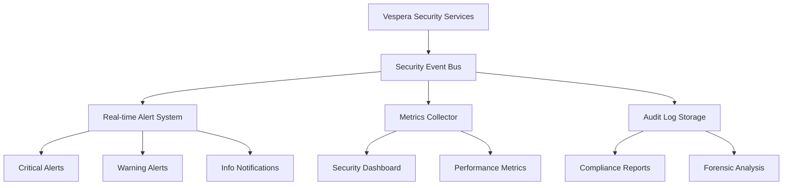

# Operational Procedures

**Version**: 1.0  
**Date**: September 2025  
**Status**: Production Ready  

## 📋 Overview

This document provides comprehensive operational procedures for managing, monitoring, and maintaining the Vespera Forge security infrastructure in production environments.

## 🔍 Security Monitoring and Alerting

### Monitoring Architecture



### Key Monitoring Metrics

#### Security Metrics

| Metric | Threshold | Alert Level | Action Required |
|--------|-----------|-------------|-----------------|
| Rate Limit Violations | > 100/hour | Warning | Review rate limit rules |
| Critical Threats Detected | > 5/hour | Critical | Immediate investigation |
| Consent Withdrawals | > 50/day | Warning | Review user satisfaction |
| Security Service Failures | > 1% | Critical | Service restart/investigation |
| Memory Usage | > 50MB | Warning | Performance optimization |
| Response Time | > 50ms | Warning | Performance tuning |

#### Business Metrics

| Metric | Target | Measurement | Frequency |
|--------|--------|-------------|-----------|
| GDPR Compliance Score | 100% | Automated audit | Daily |
| User Trust Score | > 4.5/5 | User surveys | Weekly |
| Security Incident Count | 0 | Manual tracking | Continuous |
| Feature Adoption Rate | > 90% | Usage analytics | Weekly |

### Alert Configuration

#### Critical Alerts (Immediate Response Required)

```typescript
// Critical alert configuration
const criticalAlerts: AlertRule[] = [
  {
    id: 'multiple-critical-threats',
    name: 'Multiple Critical Threats Detected',
    condition: 'threats.critical.count > 5 IN 1h',
    notification: {
      channels: ['email', 'slack', 'pagerduty'],
      escalation: {
        level1: 'security-team',
        level2: 'security-manager',
        timeout: 300 // 5 minutes
      }
    },
    actions: ['auto-block-source', 'create-incident'],
    runbook: 'SECURITY-001-Multiple-Threats'
  },
  {
    id: 'security-service-down',
    name: 'Core Security Service Unavailable',
    condition: 'service.health.status != "healthy"',
    notification: {
      channels: ['email', 'slack', 'pagerduty'],
      escalation: {
        level1: 'devops-team',
        level2: 'engineering-manager',
        timeout: 180 // 3 minutes
      }
    },
    actions: ['restart-service', 'failover-to-backup'],
    runbook: 'OPS-002-Service-Recovery'
  },
  {
    id: 'memory-leak-detected',
    name: 'Security Service Memory Leak',
    condition: 'memory.usage > 100MB OR memory.growth > 10MB/min',
    notification: {
      channels: ['slack', 'email'],
      escalation: {
        level1: 'performance-team',
        timeout: 600 // 10 minutes
      }
    },
    actions: ['collect-heap-dump', 'schedule-restart'],
    runbook: 'PERF-001-Memory-Investigation'
  }
];
```

#### Warning Alerts (Proactive Monitoring)

```typescript
const warningAlerts: AlertRule[] = [
  {
    id: 'high-rate-limit-violations',
    name: 'Elevated Rate Limit Violations',
    condition: 'rate_limits.violations > 50 IN 1h',
    notification: {
      channels: ['slack'],
      throttle: 3600 // 1 hour
    },
    actions: ['analyze-patterns', 'review-thresholds'],
    runbook: 'SEC-003-Rate-Limit-Analysis'
  },
  {
    id: 'consent-withdrawal-spike',
    name: 'High Consent Withdrawal Rate',
    condition: 'consent.withdrawals > 20 IN 1d',
    notification: {
      channels: ['slack'],
      throttle: 86400 // 24 hours
    },
    actions: ['user-satisfaction-survey', 'privacy-review'],
    runbook: 'PRIVACY-001-Consent-Analysis'
  }
];
```

### Monitoring Setup

#### Automated Health Checks

```typescript
// Health check implementation
class SecurityHealthMonitor {
  private checkInterval = 60000; // 1 minute
  private healthTimer?: NodeJS.Timeout;

  public startMonitoring(): void {
    this.healthTimer = setInterval(async () => {
      await this.performHealthCheck();
    }, this.checkInterval);
  }

  private async performHealthCheck(): Promise<void> {
    try {
      const healthCheck = await this.securityManager.performHealthCheck();
      
      // Check service health
      for (const [serviceName, serviceHealth] of Object.entries(healthCheck.services)) {
        if (!serviceHealth.healthy) {
          await this.alertManager.sendAlert({
            level: 'critical',
            title: `Security Service Unhealthy: ${serviceName}`,
            description: serviceHealth.error || 'Service health check failed',
            metadata: { serviceName, healthCheck }
          });
        }
      }

      // Check metrics thresholds
      const metrics = healthCheck.metrics;
      await this.checkMetricThresholds(metrics);
      
      // Store health status
      await this.metricsCollector.recordHealthStatus(healthCheck);
      
    } catch (error) {
      await this.alertManager.sendAlert({
        level: 'critical',
        title: 'Health Check Failed',
        description: 'Unable to perform security health check',
        metadata: { error: error.message }
      });
    }
  }

  private async checkMetricThresholds(metrics: SecurityMetrics): Promise<void> {
    // Check rate limiting metrics
    if (metrics.rateLimiting.requestsBlocked > 100) {
      await this.alertManager.sendAlert({
        level: 'warning',
        title: 'High Rate Limit Violations',
        description: `${metrics.rateLimiting.requestsBlocked} requests blocked in last period`,
        metadata: { metrics: metrics.rateLimiting }
      });
    }

    // Check threat detection metrics
    if (metrics.sanitization.threatsBlocked > 50) {
      await this.alertManager.sendAlert({
        level: 'warning',
        title: 'High Threat Detection Rate',
        description: `${metrics.sanitization.threatsBlocked} threats detected and blocked`,
        metadata: { metrics: metrics.sanitization }
      });
    }

    // Check consent metrics
    if (metrics.consent.withdrawalEvents > 20) {
      await this.alertManager.sendAlert({
        level: 'warning',
        title: 'High Consent Withdrawal Rate',
        description: `${metrics.consent.withdrawalEvents} consent withdrawals in last period`,
        metadata: { metrics: metrics.consent }
      });
    }
  }
}
```

#### Dashboard Implementation

```typescript
// Security dashboard data provider
class SecurityDashboard {
  public async getDashboardData(): Promise<DashboardData> {
    const [metrics, healthStatus, recentAlerts] = await Promise.all([
      this.getSecurityMetrics(),
      this.getHealthStatus(),
      this.getRecentAlerts(24) // Last 24 hours
    ]);

    return {
      timestamp: Date.now(),
      metrics,
      healthStatus,
      recentAlerts,
      complianceScore: await this.calculateComplianceScore(),
      threatMap: await this.getThreatMap(),
      performanceStats: await this.getPerformanceStats()
    };
  }

  private async calculateComplianceScore(): Promise<number> {
    const checks = await Promise.all([
      this.checkGDPRCompliance(),
      this.checkDataRetentionCompliance(),
      this.checkConsentValidityCompliance(),
      this.checkAuditTrailCompliance()
    ]);

    const passedChecks = checks.filter(check => check.passed).length;
    return (passedChecks / checks.length) * 100;
  }
}
```

## 🚨 Incident Response Procedures

### Incident Classification

#### Severity Levels

| Level | Criteria | Response Time | Escalation |
|-------|----------|---------------|------------|
| **P0 - Critical** | Security breach, service down, data leak | 15 minutes | Immediate manager + security team |
| **P1 - High** | Multiple critical threats, performance degradation | 1 hour | Team lead + on-call engineer |
| **P2 - Medium** | Elevated violations, consent issues | 4 hours | Assigned team member |
| **P3 - Low** | Monitoring alerts, minor issues | 24 hours | Next business day |

### Incident Response Workflow

#### P0 - Critical Incident Response

```bash
#!/bin/bash
# Critical incident response script

critical_incident_response() {
  local incident_id=$1
  local description=$2
  
  echo "🚨 CRITICAL INCIDENT RESPONSE INITIATED"
  echo "Incident ID: $incident_id"
  echo "Description: $description"
  
  # Step 1: Immediate containment
  echo "Step 1: Immediate containment..."
  contain_threat $incident_id
  
  # Step 2: Assess impact
  echo "Step 2: Assessing impact..."
  impact_assessment=$(assess_incident_impact $incident_id)
  
  # Step 3: Notify stakeholders
  echo "Step 3: Notifying stakeholders..."
  notify_critical_incident $incident_id "$description" "$impact_assessment"
  
  # Step 4: Begin investigation
  echo "Step 4: Starting investigation..."
  start_incident_investigation $incident_id
  
  # Step 5: Prepare status updates
  echo "Step 5: Setting up status updates..."
  schedule_status_updates $incident_id
  
  echo "✅ Critical incident response protocol activated"
}

contain_threat() {
  local incident_id=$1
  
  # Immediate threat containment actions
  # 1. Block malicious sources if identified
  # 2. Increase rate limiting aggressiveness
  # 3. Enable strict sanitization mode
  # 4. Activate emergency mode if necessary
  
  kubectl patch configmap security-config --patch '
  data:
    EMERGENCY_MODE: "true"
    STRICT_SANITIZATION: "true"
    RATE_LIMIT_MULTIPLIER: "0.5"
  '
  
  # Force configuration reload
  kubectl rollout restart deployment/vespera-security-services
}
```

#### Security Breach Response

```typescript
class SecurityBreachHandler {
  public async handleSecurityBreach(breach: SecurityBreach): Promise<void> {
    const incidentId = generateIncidentId();
    
    try {
      // 1. Immediate containment
      await this.containBreach(breach);
      
      // 2. Preserve evidence
      await this.preserveEvidence(incidentId, breach);
      
      // 3. Assess scope and impact
      const impact = await this.assessBreachImpact(breach);
      
      // 4. Notify required parties
      await this.notifySecurityBreach(incidentId, breach, impact);
      
      // 5. Begin investigation
      await this.startBreachInvestigation(incidentId, breach);
      
      // 6. Document incident
      await this.documentBreach(incidentId, breach, impact);
      
    } catch (error) {
      // Emergency escalation if breach handling fails
      await this.emergencyEscalation(incidentId, breach, error);
    }
  }

  private async containBreach(breach: SecurityBreach): Promise<void> {
    // Block malicious sources
    if (breach.sourceIdentifiers) {
      await this.blockSources(breach.sourceIdentifiers);
    }

    // Revoke potentially compromised sessions
    if (breach.affectedUsers) {
      await this.revokeUserSessions(breach.affectedUsers);
    }

    // Enable emergency security measures
    await this.enableEmergencyMode();
  }

  private async preserveEvidence(incidentId: string, breach: SecurityBreach): Promise<void> {
    const evidence = {
      incidentId,
      timestamp: Date.now(),
      breachDetails: breach,
      systemState: await this.captureSystemState(),
      auditLogs: await this.exportRelevantAuditLogs(breach.timeframe),
      securityMetrics: await this.captureSecurityMetrics()
    };

    // Store in secure, tamper-proof storage
    await this.evidenceStorage.store(incidentId, evidence);
  }
}
```

### Communication Templates

#### Critical Alert Template

```typescript
const criticalAlertTemplate = {
  subject: '[CRITICAL] Vespera Security Alert: {alertTitle}',
  body: `
🚨 CRITICAL SECURITY ALERT

Alert: {alertTitle}
Incident ID: {incidentId}
Time: {timestamp}
Severity: CRITICAL

SUMMARY:
{description}

IMMEDIATE ACTIONS TAKEN:
{containmentActions}

IMPACT ASSESSMENT:
{impactAssessment}

NEXT STEPS:
{nextSteps}

CONTACT:
- Security Team Lead: {securityLead}
- On-call Engineer: {onCallEngineer}
- Incident Commander: {incidentCommander}

Status updates will be provided every 30 minutes until resolved.
  `,
  channels: ['email', 'slack', 'pagerduty'],
  recipients: {
    primary: ['security-team@company.com'],
    escalation: ['security-manager@company.com', 'cto@company.com']
  }
};
```

### Recovery Procedures

#### Service Recovery Checklist

```typescript
interface ServiceRecoveryChecklist {
  preRecovery: RecoveryStep[];
  recovery: RecoveryStep[];
  postRecovery: RecoveryStep[];
  validation: RecoveryStep[];
}

const securityServiceRecovery: ServiceRecoveryChecklist = {
  preRecovery: [
    {
      id: 'backup-current-state',
      description: 'Backup current service configuration and data',
      command: 'kubectl create backup security-services-$(date +%Y%m%d-%H%M%S)',
      validation: 'Verify backup completion',
      timeoutMinutes: 10
    },
    {
      id: 'assess-impact',
      description: 'Assess impact of service restart on active users',
      command: 'get-active-user-count',
      validation: 'Document user impact',
      timeoutMinutes: 5
    }
  ],
  
  recovery: [
    {
      id: 'restart-security-services',
      description: 'Restart security service pods',
      command: 'kubectl rollout restart deployment/vespera-security-services',
      validation: 'All pods running and healthy',
      timeoutMinutes: 5
    },
    {
      id: 'verify-service-startup',
      description: 'Verify all security services started correctly',
      command: 'kubectl wait --for=condition=ready pod -l app=vespera-security',
      validation: 'All services report healthy status',
      timeoutMinutes: 3
    }
  ],
  
  postRecovery: [
    {
      id: 'run-health-checks',
      description: 'Run comprehensive health checks',
      command: 'run-security-health-check --comprehensive',
      validation: 'All health checks pass',
      timeoutMinutes: 5
    },
    {
      id: 'validate-functionality',
      description: 'Validate core security functionality',
      command: 'run-security-integration-tests',
      validation: 'All integration tests pass',
      timeoutMinutes: 10
    }
  ],
  
  validation: [
    {
      id: 'monitor-metrics',
      description: 'Monitor metrics for 30 minutes',
      validation: 'No alerts, normal performance metrics',
      timeoutMinutes: 30
    },
    {
      id: 'user-impact-assessment',
      description: 'Assess user impact post-recovery',
      validation: 'No user-reported issues',
      timeoutMinutes: 60
    }
  ]
};
```

## 🔧 Maintenance Procedures

### Regular Maintenance Tasks

#### Daily Maintenance

```bash
#!/bin/bash
# Daily security maintenance script

daily_security_maintenance() {
  echo "🔧 Starting daily security maintenance..."
  
  # 1. Health check and metrics collection
  echo "Collecting health metrics..."
  kubectl exec deployment/vespera-security -c health-check -- /scripts/collect-daily-metrics.sh
  
  # 2. Threat pattern updates
  echo "Updating threat patterns..."
  update_threat_patterns
  
  # 3. Audit log rotation
  echo "Rotating audit logs..."
  rotate_audit_logs
  
  # 4. Performance optimization
  echo "Running performance optimization..."
  optimize_token_buckets
  cleanup_expired_consent_records
  
  # 5. Backup security configuration
  echo "Backing up security configuration..."
  backup_security_config
  
  echo "✅ Daily maintenance completed"
}

update_threat_patterns() {
  # Download latest threat intelligence
  curl -s "https://threat-intel-service/api/patterns" | \
    kubectl create configmap threat-patterns-$(date +%Y%m%d) --from-file=-
  
  # Update security services with new patterns
  kubectl patch deployment vespera-security-services -p '
  {
    "spec": {
      "template": {
        "metadata": {
          "annotations": {
            "threat-patterns-update": "'$(date)'"
          }
        }
      }
    }
  }'
}
```

#### Weekly Maintenance

```typescript
class WeeklySecurityMaintenance {
  public async performWeeklyMaintenance(): Promise<void> {
    console.log('🗓️ Starting weekly security maintenance...');
    
    try {
      // 1. Comprehensive security audit
      await this.performSecurityAudit();
      
      // 2. Update security configurations
      await this.reviewAndUpdateConfigurations();
      
      // 3. Performance analysis and optimization
      await this.performPerformanceAnalysis();
      
      // 4. Compliance review
      await this.performComplianceReview();
      
      // 5. Security training updates
      await this.updateSecurityDocumentation();
      
      console.log('✅ Weekly maintenance completed');
      
    } catch (error) {
      console.error('❌ Weekly maintenance failed:', error);
      await this.alertMaintenanceFailure(error);
    }
  }

  private async performSecurityAudit(): Promise<void> {
    // Generate comprehensive security report
    const auditReport = await this.generateSecurityAuditReport();
    
    // Analyze for security gaps
    const gaps = await this.analyzeSecurityGaps(auditReport);
    
    if (gaps.length > 0) {
      await this.createSecurityImprovementTasks(gaps);
    }
    
    // Store audit results
    await this.storeAuditReport(auditReport);
  }

  private async reviewAndUpdateConfigurations(): Promise<void> {
    // Review rate limiting effectiveness
    const rateLimitAnalysis = await this.analyzeRateLimitEffectiveness();
    
    if (rateLimitAnalysis.recommendedChanges.length > 0) {
      await this.updateRateLimitRules(rateLimitAnalysis.recommendedChanges);
    }
    
    // Review threat patterns effectiveness
    const threatAnalysis = await this.analyzeThreatPatternEffectiveness();
    
    if (threatAnalysis.outdatedPatterns.length > 0) {
      await this.updateThreatPatterns(threatAnalysis.outdatedPatterns);
    }
  }
}
```

### Configuration Management

#### Configuration Validation

```typescript
class SecurityConfigurationValidator {
  public async validateConfiguration(config: SecurityConfiguration): Promise<ValidationResult> {
    const validationResults: ValidationResult = {
      valid: true,
      errors: [],
      warnings: [],
      recommendations: []
    };

    // Validate rate limiting configuration
    await this.validateRateLimitingConfig(config.rateLimiting, validationResults);
    
    // Validate consent configuration
    await this.validateConsentConfig(config.consent, validationResults);
    
    // Validate sanitization configuration
    await this.validateSanitizationConfig(config.sanitization, validationResults);
    
    // Validate audit configuration
    await this.validateAuditConfig(config.audit, validationResults);

    return validationResults;
  }

  private async validateRateLimitingConfig(
    config: RateLimitingConfiguration | undefined,
    results: ValidationResult
  ): Promise<void> {
    if (!config?.enabled) return;

    // Check for overlapping rules
    const overlappingRules = this.findOverlappingRules(config.rules);
    if (overlappingRules.length > 0) {
      results.warnings.push(`Found ${overlappingRules.length} overlapping rate limit rules`);
    }

    // Check for overly restrictive rules
    const restrictiveRules = config.rules.filter(rule => 
      rule.bucket.capacity < 10 || rule.bucket.refillRate < 1
    );
    if (restrictiveRules.length > 0) {
      results.warnings.push(`Found ${restrictiveRules.length} potentially overly restrictive rules`);
    }

    // Check for missing essential rules
    const hasApiRule = config.rules.some(rule => rule.pattern.toString().includes('api'));
    if (!hasApiRule) {
      results.recommendations.push('Consider adding rate limiting rules for API endpoints');
    }
  }
}
```

#### Configuration Deployment

```bash
#!/bin/bash
# Configuration deployment script

deploy_security_configuration() {
  local config_file=$1
  local environment=$2
  
  echo "🚀 Deploying security configuration to $environment..."
  
  # Validate configuration
  echo "Validating configuration..."
  if ! validate_security_config $config_file; then
    echo "❌ Configuration validation failed"
    exit 1
  fi
  
  # Backup current configuration
  echo "Backing up current configuration..."
  kubectl get configmap security-config -o yaml > "security-config-backup-$(date +%Y%m%d-%H%M%S).yaml"
  
  # Apply new configuration
  echo "Applying new configuration..."
  kubectl create configmap security-config-new --from-file=$config_file
  
  # Rolling update with new configuration
  echo "Performing rolling update..."
  kubectl patch deployment vespera-security-services -p '
  {
    "spec": {
      "template": {
        "spec": {
          "volumes": [{
            "name": "security-config",
            "configMap": {"name": "security-config-new"}
          }]
        }
      }
    }
  }'
  
  # Wait for rollout to complete
  kubectl rollout status deployment/vespera-security-services
  
  # Verify deployment
  echo "Verifying deployment..."
  if verify_security_deployment; then
    echo "✅ Configuration deployment successful"
    kubectl delete configmap security-config
    kubectl patch configmap security-config-new --patch '{"metadata":{"name":"security-config"}}'
  else
    echo "❌ Deployment verification failed, rolling back..."
    rollback_security_deployment
  fi
}
```

## 📊 Performance Management

### Performance Monitoring

```typescript
class SecurityPerformanceMonitor {
  private metrics: Map<string, PerformanceMetric> = new Map();
  
  public async startPerformanceMonitoring(): Promise<void> {
    // Monitor memory usage
    setInterval(async () => {
      const memoryUsage = await this.getMemoryUsage();
      await this.recordMetric('memory_usage', memoryUsage);
      
      if (memoryUsage > 50 * 1024 * 1024) { // 50MB
        await this.alertHighMemoryUsage(memoryUsage);
      }
    }, 30000); // Every 30 seconds

    // Monitor response times
    setInterval(async () => {
      const responseTimes = await this.measureResponseTimes();
      await this.recordMetrics(responseTimes);
      
      if (responseTimes.average > 100) { // 100ms
        await this.alertSlowResponseTime(responseTimes);
      }
    }, 60000); // Every minute

    // Monitor error rates
    setInterval(async () => {
      const errorRate = await this.calculateErrorRate();
      await this.recordMetric('error_rate', errorRate);
      
      if (errorRate > 0.01) { // 1%
        await this.alertHighErrorRate(errorRate);
      }
    }, 300000); // Every 5 minutes
  }

  private async measureResponseTimes(): Promise<ResponseTimeMetrics> {
    const measurements = await Promise.all([
      this.measureRateLimitingResponseTime(),
      this.measureConsentCheckResponseTime(),
      this.measureSanitizationResponseTime()
    ]);

    return {
      rateLimiting: measurements[0],
      consentCheck: measurements[1], 
      sanitization: measurements[2],
      average: measurements.reduce((sum, time) => sum + time, 0) / measurements.length
    };
  }
}
```

### Performance Optimization

#### Memory Optimization

```typescript
class SecurityMemoryOptimizer {
  public async optimizeMemoryUsage(): Promise<void> {
    console.log('🔧 Starting memory optimization...');
    
    // Clean up expired token buckets
    await this.cleanupExpiredTokenBuckets();
    
    // Optimize consent cache
    await this.optimizeConsentCache();
    
    // Clean up audit log buffers
    await this.flushAuditLogBuffers();
    
    // Garbage collection hint
    if (global.gc) {
      global.gc();
    }
    
    console.log('✅ Memory optimization completed');
  }

  private async cleanupExpiredTokenBuckets(): Promise<void> {
    const cutoffTime = Date.now() - (24 * 60 * 60 * 1000); // 24 hours
    
    for (const [bucketId, bucket] of this.tokenBuckets) {
      if (bucket.lastAccessed < cutoffTime) {
        this.tokenBuckets.delete(bucketId);
        await bucket.dispose();
      }
    }
  }

  private async optimizeConsentCache(): Promise<void> {
    // Remove expired consent cache entries
    for (const [key, entry] of this.consentCache) {
      if (entry.expires < Date.now()) {
        this.consentCache.delete(key);
      }
    }
    
    // Compact cache if too large
    if (this.consentCache.size > 10000) {
      const oldestEntries = Array.from(this.consentCache.entries())
        .sort(([,a], [,b]) => a.lastAccessed - b.lastAccessed)
        .slice(0, 5000);
      
      for (const [key] of oldestEntries) {
        this.consentCache.delete(key);
      }
    }
  }
}
```

## 🔒 Compliance Management

### GDPR Compliance Monitoring

```typescript
class GDPRComplianceMonitor {
  public async performComplianceCheck(): Promise<ComplianceReport> {
    const report: ComplianceReport = {
      timestamp: Date.now(),
      overallScore: 0,
      checks: [],
      violations: [],
      recommendations: []
    };

    // Article 6: Lawful basis for processing
    await this.checkLawfulBasis(report);
    
    // Article 7: Consent requirements
    await this.checkConsentRequirements(report);
    
    // Article 13/14: Information to be provided
    await this.checkInformationProvision(report);
    
    // Article 17: Right to erasure
    await this.checkRightToErasure(report);
    
    // Article 20: Data portability
    await this.checkDataPortability(report);
    
    // Article 25: Data protection by design
    await this.checkDataProtectionByDesign(report);
    
    // Article 30: Records of processing
    await this.checkRecordsOfProcessing(report);

    report.overallScore = this.calculateOverallScore(report.checks);
    return report;
  }

  private async checkConsentRequirements(report: ComplianceReport): Promise<void> {
    const check: ComplianceCheck = {
      article: 'Article 7',
      requirement: 'Consent Requirements',
      status: 'compliant',
      details: []
    };

    // Check if consent is freely given
    const freeConsent = await this.checkFreeConsent();
    check.details.push({
      requirement: 'Freely given consent',
      status: freeConsent ? 'compliant' : 'non-compliant',
      evidence: freeConsent ? 'No conditional consent detected' : 'Conditional consent found'
    });

    // Check if consent is specific
    const specificConsent = await this.checkSpecificConsent();
    check.details.push({
      requirement: 'Specific consent',
      status: specificConsent ? 'compliant' : 'non-compliant',
      evidence: specificConsent ? 'Purpose-specific consent implemented' : 'Generic consent found'
    });

    // Check if consent is informed
    const informedConsent = await this.checkInformedConsent();
    check.details.push({
      requirement: 'Informed consent',
      status: informedConsent ? 'compliant' : 'non-compliant',
      evidence: informedConsent ? 'Clear information provided' : 'Insufficient information'
    });

    // Check if consent is unambiguous
    const unambiguousConsent = await this.checkUnambiguousConsent();
    check.details.push({
      requirement: 'Unambiguous consent',
      status: unambiguousConsent ? 'compliant' : 'non-compliant',
      evidence: unambiguousConsent ? 'Clear affirmative action required' : 'Ambiguous consent mechanism'
    });

    check.status = check.details.every(d => d.status === 'compliant') ? 'compliant' : 'non-compliant';
    report.checks.push(check);
  }

  private async checkRightToErasure(report: ComplianceReport): Promise<void> {
    const check: ComplianceCheck = {
      article: 'Article 17',
      requirement: 'Right to Erasure',
      status: 'compliant',
      details: []
    };

    // Check if erasure mechanism exists
    const erasureMechanism = await this.checkErasureMechanism();
    check.details.push({
      requirement: 'Erasure mechanism implemented',
      status: erasureMechanism ? 'compliant' : 'non-compliant',
      evidence: erasureMechanism ? 'Consent withdrawal triggers data deletion' : 'No erasure mechanism found'
    });

    // Check erasure completeness
    const completeErasure = await this.checkCompleteErasure();
    check.details.push({
      requirement: 'Complete data erasure',
      status: completeErasure ? 'compliant' : 'non-compliant',
      evidence: completeErasure ? 'All user data deleted on withdrawal' : 'Incomplete data deletion detected'
    });

    // Check erasure timeliness
    const timelyErasure = await this.checkTimelyErasure();
    check.details.push({
      requirement: 'Timely erasure (within 30 days)',
      status: timelyErasure ? 'compliant' : 'non-compliant',
      evidence: timelyErasure ? 'Data deleted within required timeframe' : 'Delayed data deletion detected'
    });

    check.status = check.details.every(d => d.status === 'compliant') ? 'compliant' : 'non-compliant';
    report.checks.push(check);
  }
}
```

### Audit Trail Management

```typescript
class SecurityAuditTrailManager {
  public async maintainAuditTrail(): Promise<void> {
    // Archive old audit logs
    await this.archiveOldAuditLogs();
    
    // Verify audit log integrity
    await this.verifyAuditLogIntegrity();
    
    // Generate compliance reports
    await this.generateComplianceReports();
    
    // Clean up expired audit data
    await this.cleanupExpiredAuditData();
  }

  private async archiveOldAuditLogs(): Promise<void> {
    const cutoffDate = new Date();
    cutoffDate.setDate(cutoffDate.getDate() - 90); // 90 days ago

    const oldLogs = await this.auditStorage.getLogsOlderThan(cutoffDate);
    
    if (oldLogs.length > 0) {
      // Archive to long-term storage
      const archiveFile = `audit-logs-${cutoffDate.toISOString().split('T')[0]}.json.gz`;
      await this.archiveStorage.store(archiveFile, oldLogs);
      
      // Remove from active storage
      await this.auditStorage.deleteLogs(oldLogs.map(log => log.id));
      
      console.log(`Archived ${oldLogs.length} audit log entries`);
    }
  }

  private async verifyAuditLogIntegrity(): Promise<void> {
    const integrityChecks = await Promise.all([
      this.verifyLogCompleteness(),
      this.verifyLogConsistency(),
      this.verifyLogAuthenticity()
    ]);

    const integrityViolations = integrityChecks.filter(check => !check.passed);
    
    if (integrityViolations.length > 0) {
      await this.handleIntegrityViolations(integrityViolations);
    }
  }
}
```

## 📋 Standard Operating Procedures

### Daily Operations Checklist

```markdown
# Daily Security Operations Checklist

## Morning (Start of Business Day)
- [ ] Review overnight security alerts and incidents
- [ ] Check security service health dashboard
- [ ] Review security metrics from previous 24 hours
- [ ] Verify backup completion status
- [ ] Check compliance score and any violations

## Throughout the Day
- [ ] Monitor security alerts in real-time
- [ ] Respond to security incidents according to severity levels
- [ ] Review and approve any security configuration changes
- [ ] Update threat intelligence patterns as needed

## Evening (End of Business Day)
- [ ] Review daily security summary report
- [ ] Document any security incidents or changes
- [ ] Verify all critical alerts have been resolved
- [ ] Prepare handoff notes for on-call team
- [ ] Schedule any required maintenance activities
```

### Weekly Operations Checklist

```markdown
# Weekly Security Operations Checklist

## Monday
- [ ] Review weekly security metrics and trends
- [ ] Plan security maintenance activities for the week
- [ ] Review and update security documentation
- [ ] Check for security updates and patches

## Wednesday  
- [ ] Perform comprehensive security configuration review
- [ ] Analyze threat detection effectiveness
- [ ] Review consent management metrics and trends
- [ ] Update security training materials

## Friday
- [ ] Generate weekly security report
- [ ] Review incident response procedures
- [ ] Plan weekend maintenance activities
- [ ] Update security monitoring rules if needed
- [ ] Prepare monthly security review materials
```

### Emergency Contact Information

```typescript
const emergencyContacts = {
  security: {
    lead: {
      name: "Security Team Lead",
      email: "security-lead@company.com",
      phone: "+1-555-0101",
      slack: "@security-lead"
    },
    oncall: {
      name: "On-call Security Engineer",
      pager: "security-oncall@pagerduty.com", 
      escalation: 15 // minutes
    }
  },
  
  engineering: {
    manager: {
      name: "Engineering Manager",
      email: "eng-manager@company.com",
      phone: "+1-555-0102"
    },
    oncall: {
      name: "On-call Engineer",
      pager: "eng-oncall@pagerduty.com",
      escalation: 30 // minutes
    }
  },
  
  executive: {
    cto: {
      name: "Chief Technology Officer",
      email: "cto@company.com",
      phone: "+1-555-0103"
    },
    ciso: {
      name: "Chief Information Security Officer",
      email: "ciso@company.com", 
      phone: "+1-555-0104"
    }
  },
  
  external: {
    securityFirm: {
      name: "External Security Consultant",
      email: "incident@securityfirm.com",
      phone: "+1-555-0200",
      contract: "24/7 incident response"
    },
    legal: {
      name: "Legal Counsel",
      email: "legal@lawfirm.com",
      phone: "+1-555-0300"
    }
  }
};
```

### Runbook Templates

#### Security Incident Runbook Template

```markdown
# Security Incident Response Runbook: {INCIDENT_TYPE}

## Overview
Brief description of the incident type and when this runbook applies.

## Severity Assessment
- **P0 - Critical**: Criteria for P0 classification
- **P1 - High**: Criteria for P1 classification
- **P2 - Medium**: Criteria for P2 classification
- **P3 - Low**: Criteria for P3 classification

## Immediate Response Steps
1. **Assess and Classify** (5 minutes)
   - Determine incident severity
   - Identify affected systems/users
   - Document initial assessment

2. **Contain** (15 minutes)
   - Immediate containment actions
   - Prevent further damage
   - Preserve evidence

3. **Notify** (30 minutes)
   - Internal notifications based on severity
   - External notifications if required
   - Regulatory notifications if applicable

## Investigation Steps
1. **Collect Evidence**
   - System logs and metrics
   - User reports and screenshots
   - Network traffic analysis

2. **Analyze Root Cause**
   - Timeline reconstruction
   - Impact assessment
   - Contributing factors

3. **Document Findings**
   - Detailed incident report
   - Lessons learned
   - Improvement recommendations

## Recovery Steps
1. **Plan Recovery**
   - Recovery strategy
   - Risk assessment
   - Rollback plan

2. **Execute Recovery**
   - Step-by-step recovery
   - Validation testing
   - User communication

3. **Monitor and Verify**
   - Post-recovery monitoring
   - Performance validation
   - User feedback collection

## Post-Incident Activities
- [ ] Complete incident report
- [ ] Conduct post-mortem review
- [ ] Implement preventive measures
- [ ] Update runbooks and procedures
- [ ] Team debriefing and training

## Contacts
- Primary: {PRIMARY_CONTACT}
- Escalation: {ESCALATION_CONTACT}
- External: {EXTERNAL_CONTACT}
```

---

**Next Steps**: Review the [User Security Guide](./USER_SECURITY_GUIDE.md) for end-user documentation and the [Compliance and Audit Guide](./COMPLIANCE_AUDIT_GUIDE.md) for detailed compliance procedures.