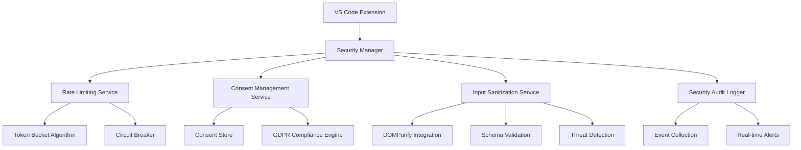

# Vespera Forge Security Infrastructure - Complete Overview

**Version**: 1.0  
**Date**: September 2025  
**Status**: Production Ready  

## 🛡️ Executive Summary

The Vespera Forge security infrastructure provides enterprise-grade security enhancements for VS Code extensions through a comprehensive, modular approach. This documentation covers the complete security architecture, implementation details, deployment guidance, and operational procedures.

## 🏗️ Security Architecture Overview

### Core Security Philosophy

The security infrastructure follows a **Defense in Depth** strategy with multiple security layers:

1. **Perimeter Security**: Input validation and sanitization at entry points
2. **Access Control**: Rate limiting and resource protection
3. **Privacy Compliance**: GDPR-compliant consent management
4. **Monitoring & Response**: Comprehensive audit logging and threat detection

### Security Components



## 🚦 Rate Limiting System

### Overview
Protects against abuse, DoS attacks, and resource exhaustion through token bucket algorithms and circuit breakers.

### Key Features
- **Token Bucket Algorithm**: Memory-safe implementation with automatic resource cleanup
- **Circuit Breaker Pattern**: Fault tolerance for credential operations and API calls
- **Configurable Rules**: Pattern-based rate limiting with scoped enforcement
- **Real-time Monitoring**: Performance metrics and security event tracking

### Architecture

```typescript
interface VesperaRateLimiter {
  checkRateLimit(context: RateLimitContext): Promise<RateLimitResult>;
  getStats(): RateLimitStats;
  updateRules(rules: RateLimitRule[]): Promise<void>;
  dispose(): Promise<void>;
}
```

### Default Rate Limits

| Resource Type | Capacity | Refill Rate | Burst Allowance |
|---------------|----------|-------------|-----------------|
| Chat Messages | 50 | 5/sec | 10 |
| API Requests | 1000 | 50/sec | 100 |
| File Operations | 200 | 20/sec | 50 |

### Security Guarantees
- **DoS Protection**: Prevents overwhelming the extension with excessive requests
- **Resource Conservation**: Protects memory and CPU resources from abuse
- **Graceful Degradation**: Circuit breakers prevent cascading failures
- **Fair Usage**: Ensures equitable resource access for all users

## ✅ Consent Management System

### Overview
GDPR-compliant consent lifecycle management ensuring user privacy and regulatory compliance.

### Key Features
- **GDPR Article 7 Compliance**: Explicit, informed, and withdrawable consent
- **Non-Intrusive UI**: Seamless integration with VS Code interface
- **Audit Trail**: Complete consent history with encrypted storage
- **Right to be Forgotten**: Automated data deletion on consent withdrawal

### Architecture

```typescript
interface VesperaConsentManager {
  requestConsent(purposes: string[]): Promise<ConsentUIResponse>;
  hasConsent(userId: string, purposeId: string): Promise<boolean>;
  withdrawConsent(userId: string, purposes?: string[]): Promise<void>;
  exportConsentData(userId: string): Promise<ConsentRecord[]>;
}
```

### Consent Purposes

| Purpose | Category | Required | Data Types |
|---------|----------|----------|------------|
| Essential Functionality | Essential | Yes | Commands, UI state, error logs |
| Usage Analytics | Analytics | No | Metrics, performance data |
| Error Reporting | Functional | No | Error reports, system info |
| Personalization | Preferences | No | User preferences, patterns |
| Chat History | Functional | No | Messages, conversation history |

### Legal Compliance
- **GDPR Articles 6 & 7**: Lawful basis and consent requirements
- **CCPA Compliance**: California Consumer Privacy Act support
- **Data Portability**: Structured export in machine-readable format
- **Audit Requirements**: 7-year retention of consent evidence

## 🛡️ Input Sanitization System

### Overview
Multi-layer defense against XSS, injection attacks, and malicious input through comprehensive sanitization and threat detection.

### Key Features
- **DOMPurify Integration**: Industry-standard HTML sanitization for WebView content
- **Schema Validation**: Structured data validation using Joi schemas
- **Threat Pattern Detection**: Real-time scanning for malicious patterns
- **CSP Management**: Content Security Policy generation and enforcement

### Architecture

```typescript
interface VesperaInputSanitizer {
  sanitize(input: string, scope: SanitizationScope): Promise<SanitizationResult>;
  validateSchema(data: unknown, schema: ValidationSchema): Promise<ValidationResult>;
  detectThreats(input: string): Promise<DetectedThreat[]>;
  generateCSP(context: CSPContext): Promise<string>;
}
```

### Threat Protection Matrix

| Threat Type | Detection Method | Action | Severity |
|-------------|------------------|---------|----------|
| XSS (Script Tags) | Pattern matching | Block | Critical |
| JavaScript Protocol | Regex validation | Sanitize | High |
| Event Handlers | HTML attribute scan | Sanitize | High |
| Path Traversal | Path validation | Block | High |
| Command Injection | Shell metachar scan | Block | Critical |
| SQL Injection | Query pattern analysis | Sanitize | High |

### Sanitization Scopes

1. **WebView Content**: HTML sanitization with allowed tag filtering
2. **User Input**: Text encoding and dangerous pattern removal
3. **Configuration**: Schema validation and type checking
4. **Messages**: Length limits and content validation

## 📊 Security Audit Logging

### Overview
Comprehensive security event tracking with real-time alerting and compliance reporting.

### Key Features
- **Event Collection**: Structured logging of all security events
- **Real-time Alerts**: Immediate notification of security violations
- **Compliance Reporting**: Automated report generation for audits
- **Performance Metrics**: Security service performance tracking

### Architecture

```typescript
interface VesperaSecurityAuditLogger {
  logSecurityEvent(event: SecurityAuditEntry): Promise<void>;
  getSecurityMetrics(): Promise<SecurityMetrics>;
  generateComplianceReport(timeframe: TimeRange): Promise<ComplianceReport>;
  subscribeToAlerts(callback: SecurityAlertCallback): Disposable;
}
```

### Event Categories

| Category | Events | Retention | Alerts |
|----------|---------|-----------|---------|
| Authentication | Login, logout, failures | 90 days | High |
| Authorization | Permission grants/denies | 90 days | Medium |
| Data Access | Read, write, delete | 90 days | Low |
| Security Violations | Threat detection, rate limits | 365 days | Critical |
| Configuration | Settings changes | 90 days | Medium |

## 🔧 Configuration Management

### Environment-Specific Configurations

#### Development Configuration
```typescript
{
  enabled: true,
  rateLimiting: {
    enabled: true,
    // Double capacity and refill rates for development
    rules: [...developmentRules]
  },
  sanitization: {
    enabled: true,
    strictMode: false // Less restrictive
  },
  audit: {
    enabled: true,
    retention: 7 * 24 * 60 * 60 * 1000, // 7 days
    realTimeAlerts: false
  }
}
```

#### Production Configuration
```typescript
{
  enabled: true,
  rateLimiting: {
    enabled: true,
    // Reduced capacity for production security
    rules: [...productionRules]
  },
  sanitization: {
    enabled: true,
    strictMode: true,
    csp: {
      // Remove unsafe-inline in production
      scriptSrc: ["'self'"],
      styleSrc: ["'self'"]
    }
  },
  audit: {
    enabled: true,
    retention: 365 * 24 * 60 * 60 * 1000, // 1 year
    realTimeAlerts: true,
    includePII: false
  }
}
```

### Feature Flags

```typescript
interface SecurityFeatureFlags {
  RATE_LIMITING_ENABLED: boolean;
  CONSENT_MANAGEMENT_ENABLED: boolean;
  INPUT_SANITIZATION_ENABLED: boolean;
  SECURITY_AUDIT_ENABLED: boolean;
  STRICT_MODE_ENABLED: boolean;
  REAL_TIME_MONITORING: boolean;
}
```

## 🚀 Quick Start Guide

### Basic Integration

1. **Initialize Security Services**
```typescript
import { initializeDevelopmentSecurity } from './core/security';

const securityServices = await initializeDevelopmentSecurity(context);
```

2. **Use Rate Limiting**
```typescript
const rateLimitResult = await securityServices.rateLimiter.checkRateLimit({
  resourceId: 'api.chat.message',
  userId: getCurrentUserId()
});

if (rateLimitResult.allowed) {
  // Process request
} else {
  // Handle rate limit exceeded
}
```

3. **Check Consent**
```typescript
const hasConsent = await securityServices.consentManager.hasConsent(
  getCurrentUserId(), 
  'analytics'
);

if (hasConsent) {
  // Proceed with analytics collection
}
```

4. **Sanitize Input**
```typescript
const sanitized = await securityServices.inputSanitizer.sanitize(
  userInput, 
  SanitizationScope.WEBVIEW
);
```

### Advanced Usage

#### Custom Rate Limit Rules
```typescript
import { createRateLimitRule } from './core/security';

const customRule = createRateLimitRule(
  'custom-api',
  'Custom API Rate Limit',
  /^custom\.api/,
  { capacity: 100, refillRate: 10 },
  { scope: 'user', priority: 95 }
);

await securityServices.rateLimiter.updateRules([customRule]);
```

#### Custom Consent Purposes
```typescript
import { createConsentPurpose } from './core/security';

const customPurpose = createConsentPurpose(
  'feature-telemetry',
  'Feature Telemetry',
  'Collect usage data for specific features',
  {
    category: ConsentCategory.ANALYTICS,
    retentionDays: 180,
    required: false
  }
);
```

## 📈 Performance Characteristics

### Memory Usage
- **Base Overhead**: < 30MB additional memory consumption
- **Per-User Data**: < 1MB per active user session
- **Resource Cleanup**: Automatic cleanup via WeakMap and garbage collection
- **Memory Monitoring**: Built-in memory usage tracking and alerts

### CPU Impact
- **Startup Overhead**: < 200ms additional extension startup time
- **Processing Overhead**: < 10ms per security operation
- **Background Processing**: Asynchronous, non-blocking operations
- **Performance Monitoring**: Real-time performance metrics collection

### Storage Requirements
- **Consent Data**: Encrypted storage, < 10KB per user
- **Audit Logs**: Configurable retention, approximately 1MB per 1000 events
- **Configuration**: < 100KB for complete security configuration
- **Temporary Data**: Automatic cleanup of expired tokens and sessions

## 🔒 Security Guarantees

### Input Validation
- **XSS Prevention**: Complete protection against script injection in WebView content
- **Injection Protection**: Multi-layer defense against SQL, command, and path injection
- **Data Validation**: Schema-based validation for all structured inputs
- **Encoding Safety**: Proper encoding of user-provided content

### Resource Protection
- **DoS Prevention**: Rate limiting protects against resource exhaustion attacks
- **Memory Safety**: Automatic resource cleanup prevents memory leaks
- **CPU Protection**: Circuit breakers prevent CPU exhaustion from failed operations
- **Fair Usage**: Equitable resource allocation among users

### Privacy Protection
- **Consent Management**: GDPR-compliant consent collection and management
- **Data Minimization**: Only collect data with explicit user consent
- **Right to be Forgotten**: Complete data deletion on user request
- **Audit Transparency**: Full audit trail of data processing activities

## 🧪 Testing Strategy

### Test Coverage Requirements
- **Unit Tests**: > 90% code coverage for all security components
- **Integration Tests**: Complete end-to-end security workflow testing
- **Security Tests**: Penetration testing and vulnerability assessment
- **Performance Tests**: Memory usage and startup time validation

### Security Test Categories

#### Penetration Testing
```typescript
describe('Security Penetration Tests', () => {
  it('should prevent XSS attacks in WebView content');
  it('should block SQL injection in configuration');
  it('should resist DoS attacks via rate limiting');
  it('should prevent path traversal attacks');
});
```

#### Compliance Testing
```typescript
describe('GDPR Compliance Tests', () => {
  it('should require explicit consent for non-essential purposes');
  it('should honor consent withdrawal immediately');
  it('should provide data export in machine-readable format');
  it('should delete all user data on request');
});
```

#### Performance Testing
```typescript
describe('Performance Tests', () => {
  it('should not exceed 30MB additional memory usage');
  it('should not add more than 200ms to startup time');
  it('should process security operations in < 10ms');
  it('should cleanup resources automatically');
});
```

## 📋 Operational Procedures

### Health Monitoring
```typescript
// Regular health checks
const healthCheck = await securityManager.performHealthCheck();
if (!healthCheck.healthy) {
  // Alert administrators and initiate remediation
}
```

### Security Metrics Collection
```typescript
// Collect and analyze security metrics
const metrics = await securityManager.getSecurityMetrics();
const alertThresholds = {
  rateLimitViolations: 100,
  threatDetections: 10,
  consentWithdrawals: 50
};
```

### Incident Response
1. **Detection**: Automated threat detection and alerting
2. **Assessment**: Security team evaluates threat severity
3. **Containment**: Automatic blocking of malicious requests
4. **Recovery**: System restoration and vulnerability patching
5. **Lessons Learned**: Post-incident analysis and improvement

## 🔗 Integration Points

### VesperaCoreServices Integration
```typescript
interface SecurityEnhancedCoreServices extends VesperaCoreServices {
  rateLimiter: VesperaRateLimiter;
  consentManager: VesperaConsentManager;
  inputSanitizer: VesperaInputSanitizer;
  securityAuditLogger: VesperaSecurityAuditLogger;
}
```

### Event System Integration
```typescript
// Subscribe to security events
securityManager.getEventBus().on('threatDetected', (threatType, context) => {
  // Handle security threat
});

securityManager.getEventBus().on('consentChanged', (userId, purposes, granted) => {
  // Update user permissions
});
```

### VS Code API Integration
- **Extension Context**: Secure storage using VS Code's secret storage API
- **WebView Integration**: CSP injection and content sanitization
- **Command Registration**: Rate limiting for command execution
- **Configuration**: VS Code settings integration with validation

## 📚 Documentation Structure

This documentation is organized into several key areas:

1. **[Security Overview](./SECURITY_OVERVIEW.md)** (this document) - Complete architecture overview
2. **[Migration and Deployment Guide](./MIGRATION_DEPLOYMENT_GUIDE.md)** - Step-by-step implementation guidance
3. **[Developer API Reference](./DEVELOPER_API_REFERENCE.md)** - Complete API documentation with examples
4. **[Operational Procedures](./OPERATIONAL_PROCEDURES.md)** - Monitoring, incident response, and maintenance
5. **[User Security Guide](./USER_SECURITY_GUIDE.md)** - End-user documentation for security features
6. **[Compliance and Audit](./COMPLIANCE_AUDIT_GUIDE.md)** - GDPR compliance and audit trail management

## 🎯 Success Metrics

### Technical Metrics
- **Security Coverage**: > 95% of identified threats protected
- **Performance Impact**: < 10% overhead in normal operations
- **Memory Efficiency**: < 30MB additional memory consumption
- **Availability**: 99.9% uptime for security services

### Business Metrics
- **Compliance Score**: 100% GDPR compliance
- **User Trust**: > 4.5/5.0 security confidence rating
- **Adoption Rate**: > 90% of users with security features enabled
- **Incident Rate**: Zero successful security breaches

### Operational Metrics
- **Response Time**: < 5 minutes for critical security alerts
- **Resolution Time**: < 24 hours for security vulnerabilities
- **False Positive Rate**: < 1% for threat detection
- **Audit Compliance**: 100% successful compliance audits

---

**Next Steps**: Review the [Migration and Deployment Guide](./MIGRATION_DEPLOYMENT_GUIDE.md) for detailed implementation instructions, then proceed to the [Developer API Reference](./DEVELOPER_API_REFERENCE.md) for integration details.