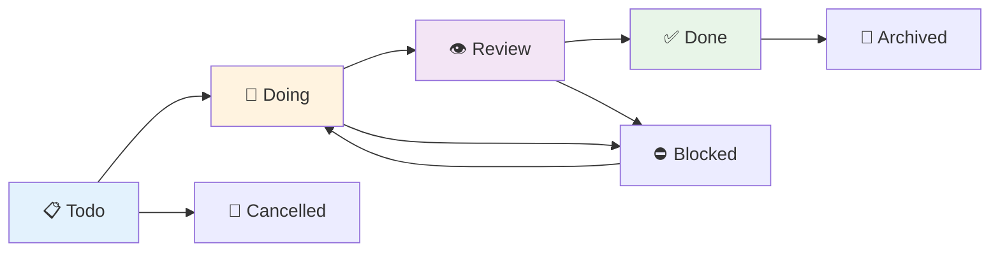

# Complete Features Overview

## Core Task Management Features

### Hierarchical Task Organization

**Multi-Level Task Trees**:
```
🏢 Project: E-commerce Platform
├─ 🔐 User Authentication System
│  ├─ 📝 Design authentication flow
│  ├─ ⚙️ JWT token implementation  
│  ├─ 🔒 Password security measures
│  └─ 🧪 Authentication testing
├─ 🛒 Shopping Cart Functionality
│  ├─ 💾 Cart data persistence
│  ├─ 🔄 Real-time cart updates
│  └─ 💳 Checkout integration
└─ 📊 Analytics Dashboard
   ├─ 📈 Sales reporting
   └─ 👥 User behavior tracking
```

**Advanced Hierarchy Features**:
- **Unlimited Nesting**: Create tasks within tasks without depth limits
- **Parent-Child Relationships**: Automatic dependency tracking
- **Completion Propagation**: Parent tasks show completion percentages
- **Bulk Operations**: Apply changes to entire subtask branches
- **Visual Indentation**: Clear hierarchy representation in Tree View

### Comprehensive Status System

**Task Status Workflow**:


**Status Descriptions**:
- **📋 Todo**: Ready to start, waiting for action
- **🔄 Doing**: Currently in progress, actively worked on
- **👁️ Review**: Completed work awaiting review/approval
- **✅ Done**: Successfully completed and verified
- **⛔ Blocked**: Cannot proceed due to dependencies/issues
- **🚫 Cancelled**: No longer needed or relevant
- **📁 Archived**: Completed tasks moved to long-term storage

### Priority-Driven Organization

**Five-Tier Priority System**:

| Priority | Icon | Description | Use Cases |
|----------|------|-------------|-----------|
| Critical | 🔴 | Urgent, system-breaking issues | Outages, security vulnerabilities |
| High | 🟡 | Important, time-sensitive work | Feature deadlines, customer requests |  
| Normal | ⚪ | Regular workflow items | Standard development tasks |
| Low | 🔵 | Nice-to-have improvements | Code refactoring, documentation |
| Someday | 🌫️ | Future considerations | Ideas, long-term planning |

**Priority Features**:
- **Visual Color Coding**: Instant priority recognition
- **Smart Sorting**: Automatic priority-based ordering
- **Filter by Priority**: Focus on urgent work
- **Priority Escalation**: Automatic promotion based on due dates

### Advanced Tagging System

**Tag Categories and Examples**:
```
🏷️ Technology Tags:
   frontend, backend, database, api, ui, mobile

🏷️ Feature Tags:  
   authentication, payment, search, analytics, reporting

🏷️ Workflow Tags:
   bug, feature, enhancement, refactor, documentation

🏷️ Team Tags:
   @john, @team-alpha, review-needed, blocked-by-design

🏷️ Context Tags:
   urgent, technical-debt, customer-request, experiment
```

**Tag Functionality**:
- **Multi-Tag Support**: Unlimited tags per task
- **Auto-Suggestions**: Based on existing tag history
- **Tag-Based Filtering**: Quick task subset identification
- **Tag Clouds**: Visual tag frequency in Dashboard
- **Smart Tag Inheritance**: Subtasks can inherit parent tags

## User Interface Components

### Task Tree View

**Advanced Tree Features**:
- **Lazy Loading**: Performance optimization for large task sets
- **Search and Filter**: Real-time task filtering
- **Drag & Drop Reordering**: Visual task organization (planned)
- **Multi-Select Operations**: Bulk task actions
- **Keyboard Navigation**: Full accessibility support

**Context Menu Actions**:
```
Right-Click Task Menu:
├─ Create Subtask
├─ Edit Task Details  
├─ Change Status →
│  ├─ Mark as Doing
│  ├─ Mark as Review
│  └─ Mark as Done
├─ Set Priority →
│  ├─ Critical
│  ├─ High
│  └─ Normal
├─ Add Tags
├─ Set Due Date
├─ Copy Task Link
├─ Export to Markdown
└─ Delete Task
```

**Visual Indicators**:
- **Animated Status Icons**: Spinning icons for "Doing" status
- **Progress Bars**: Subtask completion percentages
- **Due Date Warnings**: Overdue task highlighting
- **Assignment Indicators**: User avatar display
- **Tag Chips**: Inline tag visualization

### Task Dashboard

**Dashboard Sections**:

**📊 Analytics Overview**:
- Total task count with status breakdown
- Completion rate percentage and trends  
- Average task completion time
- Overdue task alerts
- Workload distribution charts

**📈 Performance Metrics**:
```
Weekly Summary:
├─ 15 tasks completed (+3 from last week)
├─ 2.3 days average completion time 
├─ 87% on-time completion rate
└─ 3 overdue tasks require attention

Priority Breakdown:
├─ Critical: 2 tasks (immediate action needed)
├─ High: 8 tasks (this week)
├─ Normal: 22 tasks (ongoing work)
└─ Low: 5 tasks (when time permits)
```

**🎯 Quick Actions Panel**:
- One-click task creation with templates
- Bulk status updates for multiple tasks
- Task import/export functionality  
- Archive completed tasks
- Generate progress reports

**📋 Task Editor**:
```html
┌─────────────────────────────────────────┐
│ 📝 Task Editor                         │
├─────────────────────────────────────────┤
│ Title: [________________________]      │
│                                         │
│ Description: (Markdown supported)       │
│ ┌─────────────────────────────────────┐ │
│ │ ## Implementation Notes            │ │
│ │                                    │ │  
│ │ - [ ] Research existing solutions  │ │
│ │ - [ ] Design API endpoints         │ │
│ │ - [ ] Implement core functionality │ │
│ │                                    │ │
│ │ **Dependencies:**                  │ │
│ │ - User authentication must be done │ │ 
│ └─────────────────────────────────────┘ │
│                                         │
│ Status: [Doing ▼]  Priority: [High ▼] │
│ Assignee: [@john ▼]  Due: [📅 Jan 20] │
│ Parent: [Authentication System ▼]       │
│                                         │
│ Tags: [api, backend, authentication  ] │
│                                         │
│ 📎 Attachments: [+ Add File]           │
│ 🔗 Related Tasks: [+ Link Task]        │
│                                         │
│ [Cancel] [Save Changes] [Save & Close]  │
└─────────────────────────────────────────┘
```

### Status Bar Integration

**Connection Status Indicators**:
```
Connection States:
✅ Bindery Connected    - Full functionality available
🔄 Connecting...       - Backend connection in progress  
❌ Bindery Offline     - Using mock mode
⚠️ Connection Error    - Communication problems detected
🔧 Configuration Needed - Bindery path not set
```

**Task Information Display**:
- **Active Task Count**: Non-completed tasks only
- **Priority Alerts**: Critical/High priority task count
- **Due Date Warnings**: Tasks due today or overdue
- **Progress Indicator**: Overall completion percentage

**Quick Action Buttons**:
- `+ New Task`: Instant task creation dialog
- `📊 Dashboard`: Open analytics dashboard
- `🔄 Sync`: Force synchronization with backend
- `⚙️ Settings`: Extension configuration panel

## Collaboration Features (Bindery Backend)

### Real-Time Collaborative Editing

**CRDT-Based Synchronization**:
- **Conflict-Free Editing**: Multiple users can edit simultaneously
- **Automatic Merging**: Changes merged without data loss
- **Real-Time Updates**: Instant synchronization across all clients
- **Offline Support**: Work continues without internet connection

**Collaboration Indicators**:
```
Task: Implement payment gateway
├─ 👤 @alice is editing the description
├─ ✏️ @bob updated priority 2 minutes ago  
├─ 💬 @charlie added a comment: "API key needed"
└─ 🔄 Last sync: 5 seconds ago
```

### User Management

**Team Features**:
- **Task Assignment**: Assign tasks to specific team members
- **User Avatars**: Visual representation of task ownership
- **Activity Streams**: Track who changed what and when
- **Permission Levels**: Reader, Editor, Admin role system
- **Notification System**: Alert users of relevant changes

**Assignment Workflow**:
```
Assignment Options:
├─ @username - Specific user assignment
├─ @team-name - Team assignment  
├─ @role:developer - Role-based assignment
├─ @auto - Automatic load balancing
└─ Unassigned - Available for anyone
```

### Version History and Audit Trail

**Change Tracking**:
- Complete edit history for every task
- User attribution for all changes
- Timestamp accuracy to the second
- Rollback capability to previous versions
- Visual diff display for content changes

**Audit Log Example**:
```
Task: Setup CI/CD Pipeline
├─ 2025-01-09 14:30 - @alice created task
├─ 2025-01-09 14:35 - @bob added description  
├─ 2025-01-09 15:20 - @alice set priority to High
├─ 2025-01-09 16:45 - @charlie started working (Doing)
├─ 2025-01-09 18:10 - @charlie completed task (Done)
└─ 2025-01-09 18:15 - @alice archived task
```

## Integration Capabilities

### VS Code Native Integration

**Command Palette Commands**:
```
Vespera Forge: Initialize
Vespera Forge: Create Task
Vespera Forge: Open Task Manager  
Vespera Forge: Open Dashboard
Vespera Forge: Configure Backend
Vespera Forge: Export Tasks
Vespera Forge: Import Tasks
Vespera Forge: Toggle Auto-Start
Vespera Forge: Show Connection Info
Vespera Forge: Reload Extension
```

**Workspace Integration**:
- **Settings Sync**: Configuration synced across workspaces
- **Project Context**: Tasks can be workspace-specific
- **File Associations**: Link tasks to specific files/directories
- **Git Integration**: Connect tasks to commits and branches (planned)

**Theme Compatibility**:
- Full support for VS Code light/dark themes
- Custom color schemes for different priorities
- High contrast mode accessibility
- Custom CSS support for advanced theming

### External System Integration (Planned)

**Version Control Integration**:
- Link tasks to Git commits and pull requests
- Automatic task updates on branch merges
- Commit message generation from task titles
- Pull request templates with task references

**Issue Tracker Sync**:
```
Supported Platforms:
├─ GitHub Issues - Bi-directional sync
├─ Jira - Import/export capabilities
├─ Linear - Real-time synchronization  
├─ Trello - Board-style task migration
└─ Asana - Project and task imports
```

**Calendar Integration**:
- Sync due dates with Google Calendar
- Outlook calendar appointment creation
- iCal export for task deadlines
- Meeting scheduling for task reviews

## Advanced Analytics and Reporting

### Performance Analytics

**Individual Metrics**:
- Task completion velocity (tasks/day, tasks/week)
- Average time to completion by priority level
- Most productive hours/days analysis
- Task complexity estimation vs. actual time
- Focus time analysis (time spent per task)

**Team Metrics** (Bindery backend):
```
Team Dashboard:
├─ Sprint Velocity: 24 tasks/sprint (↑15% from last sprint)
├─ Average Task Size: 2.3 days
├─ Completion Rate: 89% on-time delivery
├─ Blocked Task Rate: 5% (industry average: 12%)
└─ Team Load Balance: Well distributed

Individual Performance:
├─ @alice: 8 tasks completed, 2.1 days avg
├─ @bob: 6 tasks completed, 3.2 days avg  
├─ @charlie: 7 tasks completed, 1.8 days avg
└─ @diana: 9 tasks completed, 2.5 days avg
```

### Custom Reporting

**Report Generation**:
- **Weekly Summaries**: Automated progress reports
- **Project Status**: High-level project health metrics
- **Time Tracking**: Detailed time allocation analysis
- **Burndown Charts**: Sprint and project progress visualization
- **Custom Dashboards**: Configurable metrics display

**Export Formats**:
- PDF reports for stakeholder sharing
- CSV data for spreadsheet analysis  
- JSON for custom data processing
- Markdown for documentation integration
- HTML for web dashboard embedding

## Data Management and Security

### Data Storage Options

**Mock Mode (Local)**:
- In-memory storage during VS Code session
- Perfect for temporary task management
- No external dependencies required
- Data resets on VS Code restart
- Ideal for testing and demonstration

**Bindery Backend (Persistent)**:
- SQLite database with full ACID compliance
- Real-time synchronization across devices
- Automatic backup and recovery systems
- Encryption at rest and in transit
- Multi-user access with permission controls

### Backup and Recovery

**Automatic Backups**:
```
Backup Schedule:
├─ Continuous - Real-time change logging
├─ Hourly - Incremental data snapshots
├─ Daily - Full database backups
├─ Weekly - Archive to external storage
└─ Monthly - Long-term retention backups
```

**Manual Export Options**:
- **Full Database Export**: Complete task database
- **Project Export**: Specific project tasks only
- **Filtered Export**: Custom queries and filters
- **Incremental Export**: Changes since last export
- **Encrypted Export**: Password-protected backups

### Privacy and Security

**Data Protection**:
- **Local-First Architecture**: Your data stays on your devices
- **Optional Cloud Sync**: User-controlled synchronization
- **End-to-End Encryption**: Protected data transmission
- **Zero-Knowledge Backend**: Server cannot access task content
- **GDPR Compliance**: Full data portability and deletion

**Access Controls**:
```
Security Layers:
├─ Device Authentication - Local machine access only
├─ Extension Permissions - Limited VS Code API access
├─ Backend Authorization - User token validation
├─ Data Encryption - AES-256 encryption at rest
└─ Network Security - TLS 1.3 for all communications
```

## Performance and Scalability

### Performance Characteristics

**Response Times** (typical usage):
- Task creation: <100ms
- Tree view refresh: <200ms  
- Dashboard load: <500ms
- Search operations: <50ms
- Backend sync: <1000ms

**Scalability Limits**:
```
Recommended Limits:
├─ Tasks per workspace: <10,000
├─ Subtask depth: <20 levels
├─ Concurrent users: <50 (per Bindery instance)
├─ Tags per task: <50
└─ Task title length: <500 characters

Performance Impact:
├─ 1-100 tasks: Negligible impact
├─ 100-1,000 tasks: Minor UI delays
├─ 1,000-10,000 tasks: Noticeable but usable
└─ >10,000 tasks: Consider archiving old tasks
```

### Optimization Features

**Memory Management**:
- Lazy loading of subtasks
- Virtual scrolling for large lists (planned)
- Automatic garbage collection of cached data
- Memory usage monitoring and alerts
- Configurable cache size limits

**Network Optimization**:
- Request batching for multiple operations
- Compression of data transfers
- Delta synchronization (only changes)
- Offline queue for intermittent connections
- Automatic retry with exponential backoff

## Accessibility and Usability

### Accessibility Features

**Screen Reader Support**:
- Full ARIA label implementation
- Semantic HTML structure
- Keyboard navigation support
- High contrast theme compatibility
- Screen reader announcement for status changes

**Keyboard Accessibility**:
```
Global Shortcuts:
├─ Ctrl+Shift+V, T - Open Task Tree
├─ Ctrl+Shift+V, D - Open Dashboard  
├─ Ctrl+Shift+V, N - Create New Task
├─ Ctrl+Shift+V, S - Search Tasks
└─ Ctrl+Shift+V, H - Show Help

Tree Navigation:
├─ ↑/↓ - Navigate tasks
├─ →/← - Expand/collapse
├─ Enter - Open task details
├─ Space - Toggle completion
├─ Delete - Delete task
└─ F2 - Rename task
```

**Visual Accessibility**:
- High contrast mode support
- Customizable font sizes
- Color-blind friendly palettes
- Reduced motion options
- Focus indicators for all interactive elements

### Internationalization

**Language Support** (planned):
- English (US) - Primary language
- Spanish (ES) - Full translation
- French (FR) - Full translation  
- German (DE) - Full translation
- Japanese (JP) - Full translation
- Chinese Simplified (CN) - Full translation

**Localization Features**:
- Date/time format localization
- Number format adaptation
- Cultural color preferences
- Right-to-left text support (Arabic, Hebrew)
- Currency format for financial tasks

## Extensibility and Customization

### Configuration Options

**User Preferences**:
```json
{
  "vesperaForge.enableAutoStart": true,
  "vesperaForge.defaultPriority": "Normal",
  "vesperaForge.autoArchiveCompleted": false,
  "vesperaForge.showCompletedTasks": true,
  "vesperaForge.refreshInterval": 30000,
  "vesperaForge.maxTasksInTree": 1000,
  "vesperaForge.enableNotifications": true,
  "vesperaForge.taskTemplates": {
    "bug": {
      "title": "Bug: ",
      "priority": "High", 
      "tags": ["bug"]
    },
    "feature": {
      "title": "Feature: ",
      "priority": "Normal",
      "tags": ["feature"]
    }
  }
}
```

### Custom Themes and Styling

**Theme Customization**:
```css
/* Custom CSS support */
.vespera-task-item.priority-critical {
  border-left: 4px solid #ff4444;
  background-color: rgba(255, 68, 68, 0.1);
}

.vespera-task-item.status-doing {
  animation: pulse 2s infinite;
}

.vespera-dashboard .metrics-card {
  border-radius: 8px;
  box-shadow: 0 2px 8px rgba(0, 0, 0, 0.1);
}
```

### Plugin Architecture (Future)

**Planned Extension Points**:
- Custom task status definitions
- Additional priority levels
- Custom field types (checkboxes, dropdowns, etc.)
- Integration with external APIs
- Custom report generators
- Workflow automation hooks

---

Vespera Forge provides a comprehensive task orchestration platform that grows with your needs, from simple personal task management to complex team collaboration workflows. The combination of native VS Code integration, powerful backend capabilities, and extensive customization options makes it a versatile solution for any development workflow.