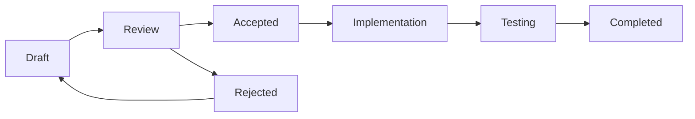

# GitHub Issue: Implement Spec-Driven Development System with Codex Integration

**Type:** Feature Planning / RFC
**Labels:** enhancement, architecture, planning, codex-integration, meta
**Priority:** Planning Phase (Not for immediate implementation)

## 🎯 Vision

Transform Vespera Forge's development process by adopting ideas from GitHub's spec-kit and integrating them with our existing Codex system. This creates a unified knowledge management system for both technical specifications and creative content.

## 🤔 Background & Motivation

After completing our massive TypeScript cleanup (431 → 0 errors), we've learned valuable lessons about the importance of structured planning. GitHub's spec-kit provides excellent patterns for managing technical specifications that align perfectly with Vespera's Codex philosophy.

**Key Insight:** Technical specs are just another type of content that can be managed through the Codex system, creating a unified approach to knowledge management across domains.

## 📐 Proposed Architecture

### 1. Specs as Codex Entries

```typescript
// Technical specifications become first-class Codex citizens
interface TechnicalSpecCodex extends CodexEntry {
  type: 'technical-spec';
  metadata: {
    specNumber: string;        // "VSF-001"
    status: 'draft' | 'review' | 'accepted' | 'implemented';
    category: 'feature' | 'architecture' | 'bugfix' | 'enhancement';
    implementationPR?: string;
    relatedIssues: string[];
    dependencies: CodexId[];
    estimatedEffort: 'small' | 'medium' | 'large';
    actualEffort?: {
      timeSpent: number;
      linesChanged: number;
    };
  };
  sections: {
    summary: string;
    motivation: string;
    design: string;
    implementation: string;
    testing: string;
    references: string[];
  };
}
```

### 2. Directory Structure

```
/vespera-forge/
├── specs/                      # Technical specifications
│   ├── implemented/           # Completed specs
│   ├── accepted/             # Approved, awaiting implementation
│   ├── review/              # Under review
│   └── draft/              # Work in progress
├── templates/
│   └── spec-template.codex.md  # Codex-compatible spec template
```

### 3. Spec Lifecycle



## 🔄 Integration Points

### With Existing Vespera Systems

1. **Task Orchestrator Integration**
   - Specs automatically generate tasks
   - Implementation tracked through task system
   - Progress visible in Discord-like interface

2. **Template System**
   - Spec template as a Codex template
   - Inheritable spec patterns
   - Custom fields per spec type

3. **Automation Rules**
   - Auto-transition spec status based on PR merges
   - Link commits to specs automatically
   - Generate implementation checklists

### With GitHub

1. **Issue Integration**
   - Bidirectional linking with GitHub issues
   - Status synchronization
   - Automatic PR descriptions from specs

2. **Actions Workflow**
   - Validate spec compliance
   - Check implementation completeness
   - Update spec status on merge

## 🚀 Phased Implementation Plan

### Phase 0: Planning & Design (Current)
- [ ] Gather feedback on this proposal
- [ ] Research other spec systems (ADRs, RFCs, etc.)
- [ ] Define spec categories and templates
- [ ] Create proof-of-concept

### Phase 1: Basic Structure (Week 1)
- [ ] Create spec directory structure
- [ ] Design spec template format
- [ ] Write specs for current outstanding issues
- [ ] Manual spec tracking

### Phase 2: Codex Integration (Week 2-3)
- [ ] Extend Codex types for technical specs
- [ ] Create spec viewer in VS Code
- [ ] Implement cross-referencing
- [ ] Add search and filtering

### Phase 3: Automation (Week 4-5)
- [ ] GitHub Actions for validation
- [ ] Auto-status updates
- [ ] Spec compliance testing
- [ ] Progress tracking

### Phase 4: Self-Hosting (Week 6+)
- [ ] Use Vespera to manage Vespera development
- [ ] Development channels in Discord interface
- [ ] Automated development workflows
- [ ] Continuous self-improvement

## 💡 Key Benefits

1. **Structured Planning** - Avoid chaos like the "12 issues at once" situation
2. **Knowledge Preservation** - Decisions documented and searchable
3. **Unified System** - Same tools for creative and technical content
4. **Dogfooding** - Vespera improves by using itself
5. **Transparency** - Clear progress tracking and dependencies

## 📊 Success Metrics

- Reduction in "scope creep" incidents
- Time from spec to implementation
- Spec compliance percentage
- Developer satisfaction scores
- Cross-reference accuracy

## 🤝 Prior Art & References

- [GitHub spec-kit](https://github.com/github/spec-kit)
- [Rust RFCs](https://github.com/rust-lang/rfcs)
- [Python PEPs](https://www.python.org/dev/peps/)
- [Architecture Decision Records](https://adr.github.io/)

## 💭 Open Questions

1. Should specs be stored in the main repo or a separate specs repo?
2. How much automation is too much for a small project?
3. Should we version specs independently or with the codebase?
4. How to handle specs that span multiple repositories?
5. What level of formality is appropriate?

## 🎪 Example: First Spec

**VSF-001: Rust File Operations Integration**
```yaml
specNumber: VSF-001
status: draft
category: feature
relatedIssues: ["#43"]
dependencies: ["VSF-003"]
estimatedEffort: large
```

This would be our first spec, converting the existing rust-file-ops integration work into the new format.

## 📝 Notes

This is a **planning document**, not an immediate work item. The goal is to establish a sustainable development process that prevents the chaos we experienced with the "12 issues + Discord UI" situation.

**Lesson Learned:** Structure and planning prevent 900 TypeScript errors.

---

## Discussion Points

Please comment with thoughts on:
- Is this over-engineering for our project size?
- Which phases are most valuable?
- Should we start simpler?
- Integration priorities?

/cc @EchoingVesper